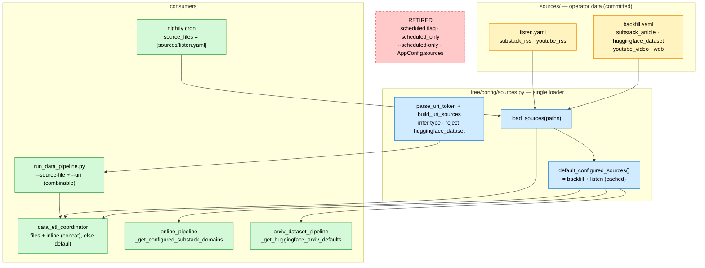

# ADR-003: Source Definitions as Operator Data

- **Status:** Accepted
- **Date:** 2026-06-27
- **Deciders:** Paul (project owner)
- **Context references:**
  - `tasks/083-sources-yaml-files.md` … `tasks/088-sources-split-live-e2e-acceptance.md` (this feature's task plan)
  - `ADR-002` §3 (data coordinator/worker topology — the consumer of the source set; unchanged here)
  - `apps/memory/src/tree/config/sources.py` (source schema + untyped-entry inference + loader)

## Context

`apps/memory/configs/default.yaml` currently mixes two unrelated concerns: **static
memory config** (models, extraction, query, dream, concurrency, prefect, mcp,
observability) and a `sources:` list of data-ingestion targets. The source list is loaded
as `AppConfig.sources` and read in three places — the offline data coordinator
(`data_etl_coordinator`), the online URL router's custom-Substack-domain set
(`_get_configured_substack_domains`), and the arxiv HF defaults
(`_get_huggingface_arxiv_defaults`).

Two problems follow. First, sources are **operator data** (they change with what we want to
ingest), but they live inside the application's static config object, so editing the ingest
list looks like editing app tuning. Second, the only way to select *which* sources a run
ingests is a per-source `scheduled: true` flag plus a `scheduled_only` coordinator param
(and a `--scheduled-only` CLI flag): the nightly cron ingests flagged sources, a manual run
ingests everything. The flag duplicates information that is really about *cadence* — RSS
feeds get polled repeatedly; articles/videos/datasets are ingested once.

We want: source definitions separated from app config; a flexible way to choose what a run
ingests (a file, several files, or ad-hoc URLs); and a cron whose source set is data, not a
boolean filter. The constraint is that the data coordinator reads sources **server-side**
at flow-run time (the cron has no trigger script), and the same code must work under local
serve and under a Prefect Cloud managed run that pulls the repo from git.

## Decision

1. **Source definitions are operator DATA, not central app-config.** They move out of
   `configs/default.yaml` into committed files under a new repo-root `sources/` directory,
   split by **cadence**: `sources/backfill.yaml` (one-shot — `substack_article`,
   `huggingface_dataset`, `youtube_video`, `web`) and `sources/listen.yaml` (polled RSS —
   `substack_rss`, `youtube_rss`). `default.yaml` keeps ONLY static memory config;
   `AppConfig.sources` is removed.

2. **One shared loader is the only way to materialise sources** —
   `tree/config/sources.py`: `load_sources(paths)` (read + `SourcesConfig`-validate +
   concatenate), the cached `default_configured_sources()` (= backfill + listen),
   `parse_uri_token(token)` (the `URL` / `URL=TYPE` CLI syntax — splits on the rightmost `=`
   ONLY when the suffix is a real type literal, so query-string URLs stay intact), and
   `build_uri_sources(specs)` (reuses the existing `_normalize_untyped_entry` inference for
   omitted types; **rejects `huggingface_dataset`**, which needs tuning fields only a YAML
   file carries). The `SourceEntry` discriminated union + inference helpers live in the same
   module, so all source-shaped logic sits in one file and `app_config.py` holds only static
   app tuning.

3. **The offline data coordinator selects sources dynamically.** The resolved set is
   `load_sources(source_files)` (when given) followed by the coerced inline `sources` (when
   given), in that order; when BOTH are absent it falls back to
   `default_configured_sources()` (= backfill + listen). Operator surface on
   `run_data_pipeline.py`: repeatable `--source-file` (paths) and repeatable `--uri` tokens
   of the form `URL` or `URL=TYPE` (type optional and inferred when omitted; subset typing
   supported; `huggingface_dataset` rejected). `--source-file` and `--uri` are **freely
   combinable** — the resolved set is the loaded files followed by the built URL sources;
   passing neither loads the backfill+listen default. The discriminated-union round-trip
   through `run_deployment` flow params (`model_dump` → JSON → `TypeAdapter`) is unchanged.

4. **The file IS the schedule selector.** The per-source `scheduled` flag, the
   `scheduled_only` coordinator param/filter, and the `--scheduled-only` CLI flag are
   retired. The nightly cron simply sets `schedule_parameters={"source_files":
   ["sources/listen.yaml"]}` (no `user_id` ⇒ all active users).

5. **Source files are read server-side, with two-strategy path resolution.** Relative paths
   resolve by trying the module-derived repo root AND the run's cwd, first-existing-wins —
   so `"sources/listen.yaml"` resolves under local serve (cwd=`apps/memory/`) and under a
   Prefect Cloud managed run (cwd=git-clone-root, where the full repo — including
   `sources/` — is present).

## Diagram

## Consequences

- **+** Clean separation: app config vs. ingest data. Editing what we ingest no longer
  touches `default.yaml`.
- **+** Cadence is explicit and self-documenting via the two filenames; the cron's source
  set is data (`listen.yaml`), not a boolean filter.
- **+** Flexible runs: one file, several files, ad-hoc URLs (with type inference), or any
  combination — without editing YAML for one-off ingests.
- **+** A single loader is the one place sources are materialised; the online + arxiv
  consumers and the coordinator share it, so they cannot drift.
- **−** "Ingest everything" becomes implicit (default = both files); operators must know the
  default loads both.
- **−** Relative-path resolution carries two strategies (cwd + module-repo-root). Documented
  and covered by the live E2E acceptance; the alternative (an absolute `APP_*`-style env
  path for the cron) was rejected as heavier for no gain.
- **−** Breaking change to the YAML surface (no `sources:` in `default.yaml`, no `scheduled`
  flag) with no compat shim — acceptable for a single-operator project.
- HuggingFace stays YAML-only by design: the `--uri` mode rejects it because dataset ingest
  needs `max_samples`/`batch_size`/`num_workers`/`concurrency` that a bare URL can't carry.
