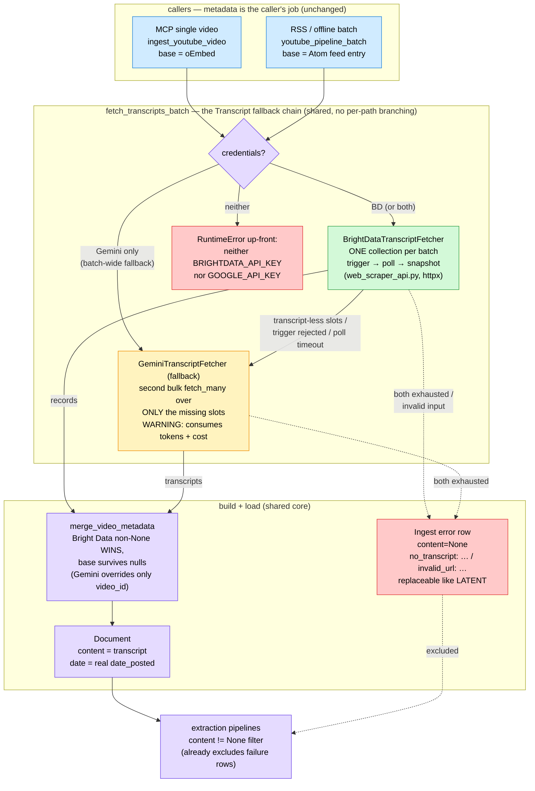

# ADR-004: Bright Data as Primary YouTube Transcript Backend, Gemini as Fallback

- **Status:** Proposed
- **Date:** 2026-07-24
- **Deciders:** Paul (project owner)
- **Context references:**
  - `tasks/089-document-ingest-error-field.md` … `tasks/093-brightdata-youtube-live-e2e-acceptance.md` (this feature's task plan)
  - `ADR-003` (source definitions as operator data — untouched; this ADR only adds a static `youtube:` app-config block)
  - `apps/memory/src/tree/data/youtube/gemini_transcript_fetcher.py` (the incumbent sole backend)
  - `apps/memory/src/tree/data/web/web_unlocker.py` (the existing Bright Data client this design mirrors)
  - `.agents/skills/bright-data-best-practices/references/web-scraper-api.md` (Web Scraper API reference)

## Context

`GeminiTranscriptFetcher` is the SOLE YouTube transcript backend. It costs Gemini video
tokens per call (the dominant data-pipeline model spend), returns no timestamps or
metadata beyond `video_id`, and leaves `build_document`'s publish date on a
`datetime.now(UTC)` fallback because neither oEmbed nor Gemini surfaces `date_posted`.
Meanwhile the project already pays for Bright Data, whose Web Scraper API has a
pre-built YouTube dataset (`gd_lk56epmy2i5g7lzu0k`) returning the actual caption
transcript (plain + timestamped-segment form) AND rich metadata (title, channel,
channel id, publish date, duration, description) at ~$0.70/1,000 records — orders of
magnitude cheaper than video-token transcription. A live probe measured ~173 s
collection time for a single video.

Failures are currently invisible: a transcript-less video is a WARNING that scrolls
away, and re-runs re-attempt nothing deliberately — there is no persisted record that a
video was tried and failed. We want cheap-first transcript fetching with a uniform
fallback, and ingest failures persisted as data so they are inspectable and retryable.

Constraint: this is code for a book — the committed test suite must never call Bright
Data or Gemini live.

## Decision

1. **Bright Data's Web Scraper API is the PRIMARY YouTube transcript+metadata backend,
   inside the existing YouTube ETL** (NOT by routing YouTube through the generic web
   ETL). `GeminiTranscriptFetcher` becomes the fallback. The chain is uniform on both
   paths — the single-video MCP flow and the RSS/offline batch flow run the same shared
   task (`fetch_transcripts_batch`); no per-path branching.

2. **Always-async collection: `/trigger` → poll `/progress` → download `/snapshot`,
   never the sync `/scrape` endpoint.** Measured collection was ~173 s for ONE video;
   the sync endpoint's 1-minute window would 202-fallthrough into the identical polling
   logic on virtually every call, making sync-first a second code path for nothing.
   The wait is bounded (`brightdata_timeout_seconds`, default 600 — the Bright Data CLI
   default; poll every `brightdata_poll_interval_seconds`, default 10); a poll timeout
   is just another fallback trigger, not a task failure.

3. **Fallback granularity is per-video; triggers can be batch-wide.** ONE Bright Data
   collection covers all URLs in a batch; only the slots that come back transcript-less
   go to Gemini, in a second bulk `fetch_many` over just those URLs. Batch-WIDE
   triggers — missing Bright Data credentials, trigger rejected, poll timeout — send
   the whole batch to Gemini. EVERY fallback logs a WARNING explicitly stating it
   consumes Gemini tokens and incurs cost.

4. **Module split mirrors the existing Bright Data layering.** The generic Web Scraper
   API client (trigger/poll/download, error classes, no config reads) lives in
   `tree/data/web/web_scraper_api.py` beside `web_unlocker.py`, reusing its error-class
   style (`BrightDataConfigurationError` / `BrightDataRequestError` imported, a new
   `BrightDataTimeoutError` added) and its REST-via-httpx approach (NOT the Node
   `brightdata` CLI). The YouTube-specific dataset id and record→`FetchedTranscript` /
   `VideoMetadata` mapping live in `tree/data/youtube/brightdata_transcript_fetcher.py`,
   mirroring `gemini_transcript_fetcher.py`'s shape. The two fetchers are COMPLETELY
   separate implementations sharing only the contract
   `async fetch_many(list[str]) -> list[FetchedTranscript | None]` — no base class, no
   inheritance, no restructuring of the Gemini fetcher. A formal interface waits for a
   real third backend.

5. **Metadata merges with Bright-Data-wins-on-non-None.** The caller's BASE metadata
   (oEmbed for single video, Atom feed entry for RSS) is resolved exactly as today and
   passed into whichever branch runs; a single pure `merge_video_metadata(base,
   override)` lets every non-None Bright Data field win, base surviving where Bright
   Data is null. The Gemini branch's transcript metadata carries only `video_id`, so
   base metadata survives intact there — one merge, zero branch-specific logic. Side
   effect: `build_document` now receives real publish dates (`date_posted`) instead of
   falling back to ingest time.

6. **Ingest failures are persisted data.** The shared `Document` ODM gains
   `ingest_error: str | None = None` (nullable → no migration). Failure rows carry
   `content=None`, which the extraction pipeline already excludes via
   `{"content": {"$ne": None}}` — no downstream change. Two normalized shapes (short
   stable prefix + message, never raw exception dumps): `no_transcript: …` keyed on the
   canonical `watch?v=` URL with whatever base metadata exists, and `invalid_url: no
   video id in input` keyed on the RAW input string. Load/DB failures stay WARNING-only
   (writing a DB-failure row to the failing DB is circular). An errored row is
   REPLACEABLE on a later run exactly like `SourceType.LATENT` (with a re-attempt
   WARNING); no attempt cap. Only the YouTube path writes the field in this feature.

7. **Credential presence IS the switch; config is two static knobs.** No `enabled`
   toggle, no new env vars — the Web Scraper API authenticates with the existing
   `BRIGHTDATA_API_KEY` and needs no zone. Only when NEITHER backend is configured does
   the shared task raise an up-front RuntimeError naming both `BRIGHTDATA_API_KEY` and
   `GOOGLE_API_KEY` (before any billable call); a Bright-Data-only setup runs and turns
   Gemini-less misses into `ingest_error` rows. The two timing knobs live in a new
   top-level `youtube:` block in `configs/default.yaml` (+ `YouTubeConfig` on
   `AppConfig`) — NOT under the sources surface, because ADR-003 made source entries
   operator DATA under `sources/` while these are static app tuning (like
   `concurrency:`); a per-source timeout on `YouTubeVideoSource` would be
   over-specification. `dataset_id` and the API base URL are module constants (API
   identity, like `_BRIGHTDATA_REQUEST_URL`).

8. **Committed tests are unit-only, never live.** Fully mocked HTTP at one thin
   patchable seam per layer (the client's HTTP helpers; the fetcher's single `collect`
   call — the same property as `GeminiTranscriptFetcher._call_gemini`), plus a
   committed fixture of the REAL captured Bright Data snapshot
   (`tests/unit/data/youtube/fixtures/brightdata_youtube_snapshot.json`) proving the
   record→types mapping against genuine data (millisecond→second segment conversion,
   tz-aware `date_posted`, `language` from `transcription_language` only — never from
   the `transcript_language` availability list). Live verification happens ONCE, as a
   cost-bounded operator acceptance task, not a committed test.

## Diagram

## Consequences

- **+** Transcript spend drops from Gemini video tokens to ~$0.70/1,000 Bright Data
  records on the happy path; Gemini spend becomes exceptional and every occurrence is
  an explicit cost WARNING in the logs.
- **+** Real metadata: publish date, channel id, duration, description, and true
  timestamped segments — `Document.date` stops lying (no more ingest-time fallback) on
  the Bright Data path.
- **+** Failures become inspectable, queryable data (`ingest_error` rows) instead of
  scrolled-away WARNINGs, and re-runs retry them for free via the LATENT-style replace.
- **+** One fallback chain, one merge function, no per-path branching — the RSS batch
  and the MCP single video cannot drift.
- **−** A Bright Data collection is slow (~173 s measured for one video) and the batch
  waits, bounded at 600 s, before a batch-wide timeout falls back to Gemini — a cold
  batch can spend 10 minutes before its fallback starts.
- **−** Two backends means two failure vocabularies to reason about; mitigated by the
  normalized `code: message` error strings and the batch-wide-vs-per-slot trigger split
  being written down here.
- **−** The record mapping depends on Bright Data's dataset schema (field names like
  `formatted_transcript`, millisecond units); a silent vendor schema change surfaces as
  mapping-test failures against the committed fixture, not compile errors. The fixture
  is the canary — refresh it if the dataset schema versions.
- **−** No attempt cap on errored rows: a permanently transcript-less video re-runs
  both backends on every batch that includes it (bounded, known cost; acceptable for a
  single-operator project — add a cap only if measured spend says so).
- Snapshots persist on Bright Data for 30 days — irrelevant to correctness (we download
  within the run) but useful for postmortems.
