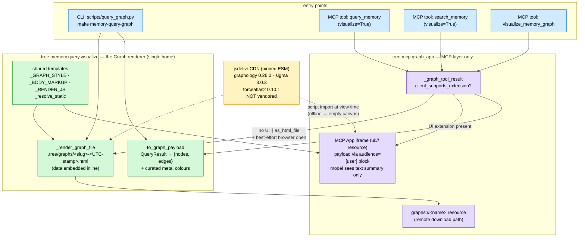

# ADR-005: Single Browser-Side Graph Rendering Stack

- **Status:** Accepted — Decision 3's module paths amended by [007](007_embedding_clusters_and_explicit_offline_phases.md) (renderer in `tree.memory.visualize.graph`, dual-delivery helper in `tree.mcp.viz_app`); the single-renderer decision stands and now also draws the Embedding map
- **Date:** 2026-08-26
- **Deciders:** Paul (project owner)
- **Context references:**
  - `tasks/103-single-graph-renderer.md`, `tasks/104-query-memory-graph-app.md` (this feature's task plan)
  - `apps/memory/src/tree/memory/query/visualize.py` (the renderer's single home after #103)
  - `apps/memory/src/tree/mcp/graph_app.py` (the MCP App layer: tools, `ui://` resource, dual-delivery helper)
  - `docs/glossary.md` — **Graph payload**, **Graph renderer** (added in this feature's grooming commit)

## Context

Two independent knowledge-graph renderers grew side by side. `tree.memory.query.visualize`
(networkx + pyvis, dark theme, `cdn_resources="in_line"` → offline-capable HTML) serves the
`query_graph.py` CLI and the `query_memory`/`search_memory` MCP tools' `visualize=True` path.
`tree.mcp.graph_app` (graphology 0.26.0 + Sigma 3.0.3 + graphology-layout-forceatlas2 0.10.1 as
pinned jsdelivr ESM, light brand theme) serves the `visualize_memory_graph` MCP App with a dual
delivery: inline iframe when the client supports the MCP Apps UI extension, else a self-contained
HTML file under `.tree/graphs/` plus a `graphs://` resource link for remote servers. A repo-wide
sweep confirmed these are the only two (the harness draws no graphs; `dashboard_app.py` writes
HTML but no graph).

Consequences of the duplication: two visual languages for the same graph (colours, tooltips,
physics), double maintenance on every metadata change, divergent output conventions
(`knowledge_graph.html` dumped into the CWD vs `.tree/graphs/<slug>-<stamp>.html`),
`render_html(open_browser=True)` popping a browser on whatever machine runs the SERVER (wrong for
remote Prefect Horizon deployments), and a container image shipping `pyvis` — which transitively
drags in `ipython`, `jinja2`, `jsonpickle`, `networkx` — solely to draw a graph. The Sigma stack is
the strictly richer renderer (curated hover metadata, search, legend, WebGL performance, MCP App
integration); pyvis's only edge is offline-capable output.

## Decision

Four related choices, one design:

1. **The browser-side graphology + Sigma + ForceAtlas2 stack is the ONE Graph renderer.** The
   networkx/pyvis renderer is deleted (`build_networkx_graph`, `render_html`, `_PYVIS_OPTIONS`,
   the dark palette), and `pyvis`/`networkx` leave `pyproject.toml`. Bias-to-least applied to the
   *count* of mechanisms: one rendering stack, one visual language, one place metadata surfacing
   evolves. (`networkx` remains in `uv.lock` only as a `torch` transitive — not our dependency.)

2. **JS libraries load as pinned ESM from jsdelivr CDN — NOT vendored.** Exactly as `graph_app.py`
   does today (`graphology@0.26.0`, `sigma@3.0.3`, `graphology-layout-forceatlas2@0.10.1` via
   `+esm`). Vendoring would mean committing ~MBs of bundles or adding a JS build step to a Python
   app for an operator-facing debug view. Accepted trade-off recorded in Consequences. What would
   justify upgrading: a real air-gapped deployment requirement, or a CDN/supply-chain policy —
   then vendor the three pinned bundles, nothing more.

3. **The renderer lives in the memory domain (`tree.memory.query.visualize`), not the MCP layer.**
   The payload builder (`to_graph_payload` + curated-meta helpers), the shared HTML/CSS/JS
   templates, the file writer (`_render_graph_file`), and the ONE output convention
   (`.tree/graphs/<query-slug>-<UTC-stamp>.html` via `_default_graph_path`) all live in
   `visualize.py`. `graph_app.py` keeps only MCP concerns: the tools, the `ui://` and `graphs://`
   resources, CSP wiring, the ext-apps iframe runtime CDN, and the iframe HTML variant. Dependency
   direction stays memory ← mcp (already established; never inverted). The CLI, the MCP tools,
   and any future surface consume the same **Graph payload** and templates — no per-surface
   rendering code.

4. **ALL graph-capable MCP tools deliver through one dual-path helper.**
   `_graph_tool_result(ctx, payload, summary, *, query, as_html_file)` in `graph_app.py` owns the
   `client_supports_extension(UI_EXTENSION_ID)` check and both branches: inline MCP App iframe
   (payload in an `audience=["user"]` content block, model sees only text — for `query_memory` /
   `search_memory` that text KEEPS the serialized query results, so the model never loses data) ∥
   self-contained file + best-effort `webbrowser.open` (try/except — never a hard browser
   dependency on the server host) + `graphs://` resource link. The three graph tools —
   `visualize_memory_graph`, `query_memory(visualize=True)`, `search_memory(visualize=True)` —
   ALL call it; from a visualization standpoint they behave identically, and new graph tools must
   go through the same helper, never reimplement a branch.

## Diagram

## Consequences

- **Offline regression (accepted).** pyvis inlined its JS (`cdn_resources="in_line"`); the Sigma
  file loads its three libraries from jsdelivr at view time. A generated `.html` opened with no
  network shows an empty canvas. Explicitly accepted; revisit only per Decision 2's upgrade
  triggers.
- **Dependency drop.** `pyvis` and `networkx` leave the manifest; `ipython`, `jinja2` (as a pyvis
  transitive), and `jsonpickle` leave the image — it no longer ships IPython to draw a graph.
  `networkx` persists in `uv.lock` solely under `torch`.
- **One output convention.** Every non-inline render lands at
  `.tree/graphs/<query-slug>-<UTC-stamp>.html` (gitignored); `make memory-query-graph` no longer
  writes `knowledge_graph.html` into `apps/memory/`. The CLI's `--output` still overrides.
- **No server-side browser surprises.** All browser opens are best-effort try/except; a remote
  (Prefect Horizon) server returns the `graphs://` resource instead of failing on `webbrowser`.
- **Single visual language.** One palette (brand `Colours`, light theme), one tooltip/legend/search
  UX across CLI, file, and iframe. The pyvis dark theme is gone.
- **Tool return types widen.** `query_memory` and `search_memory` return `str | ToolResult`
  (plain `str` unless `visualize=True` produces a graph); their model-visible text always retains
  the serialized results. Mechanical corollary (measured in #104): the union annotation drops
  FastMCP's generated `outputSchema`, so plain-string returns no longer carry the auto-wrapped
  `structuredContent={"result": …}`. Only a third-party client that ignores `content` text and
  parses `structuredContent.result` for these two tools would notice; no client in this repo does,
  and the graph path's `structured_content` (the **Graph payload**) is unaffected.
- **Future graph tools are cheap.** They build a **Graph payload** and call `_graph_tool_result`;
  adding a surface never adds a renderer.
