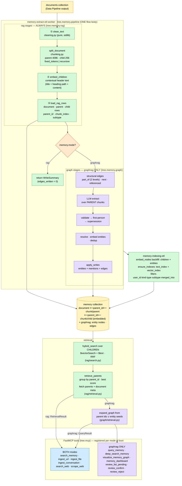

# ADR-006: Modular Memory — Vanilla RAG Mode and GraphRAG Mode over One `memory` Collection

- **Status:** Accepted
- **Date:** 2026-09-05
- **Deciders:** Paul (project owner)
- **Context references:**
  - `tasks/105-memory-mode-config-and-memory-collection.md` … `tasks/111-memory-graph-package-docs-and-e2e.md` (this feature's task plan)
  - `ADR-001` §1 (single `knowledge_graph` collection — SUPERSEDED on the collection NAME by this ADR; every other ADR-001 decision stands)
  - `ADR-002` (coordinator/worker fan-out, Voyage GCL — unchanged, the flows only move module)
  - `ADR-005` (single graph renderer — unchanged; its surfaces become graphrag-only)
  - `docs/glossary.md` — **Memory mode**, **Parent chunk**, **Child chunk**, **Parent-document retrieval**, **Contextual header**, **Clean step**, **`memory` collection**
  - Reference algorithm: https://www.mongodb.com/docs/atlas/ai-integrations/langchain/parent-document-retrieval/ (children carry the parent id + vector; parents carry no vector; search children, dedupe on parent id, fetch parents) — ported, NOT imported: no LangChain.

## Context

This codebase is the companion to a book. Chapter 4 builds the assistant on vanilla RAG
(clean → chunk → embed → load into MongoDB with a hybrid text+vector index; retrieval =
semantic + text search). Chapter 8 layers a knowledge graph on top (entity/relationship
extraction, resolution, dedup, structural edges, graph expansion at retrieval). Today the
code is graph-only: `tree/memory/extraction/pipeline.py` always runs six LLM-centred tasks;
chunking is a 512-token sliding window whose chunks are embedded directly; retrieval
(`query/core.py`) always expands a graph; the collection is named `knowledge_graph`; the MCP
server always registers 13 tools, seven of which presuppose edges. A reader cannot run the
Chapter-4 system, and cannot see what the graph layer adds.

Constraints: both modes must start from scratch (no migration); the Prefect free tier caps us
at the 5 deployments we already spend (ADR-002); Atlas Search/Vector indexes are created
programmatically (`ensure_indexes`); pipelines must stay idempotent, retried and `INPUTS`-cached;
no LangChain (the three `langchain-*` manifest entries are unused today).

## Decision

Eight related choices, one design:

1. **ONE collection, renamed `knowledge_graph` → `memory`, reused by both modes with the
   existing polymorphic row model.** `KnowledgeGraphEntry` becomes `MemoryEntry`
   (`tree/entities/memory.py`), `Settings.name = "memory"`, one exported constant
   `MEMORY_COLLECTION` replaces twelve per-module `_KG_COLLECTION` copies. `NodeType`,
   `EdgeType`, `build_node_id`, `build_edge_id`, deterministic `_id`s and dual-enforced
   multi-tenancy are unchanged. No compat shim. `KnowledgeGraphMetaState` /
   `knowledge_graph_meta_state` (dream watermark, graph-only) keep their names. **This
   supersedes ADR-001 §1's collection name only**; ADR-001's Status line gains
   "Decision §1 collection name superseded by [006](006_rag_graphrag_memory_modes.md)".

   **One ODM class, not a class hierarchy.** An abstract `MemoryEntry` with `RagEntry` /
   `KnowledgeGraphEntry` subclasses (Beanie single-collection inheritance) was considered and
   rejected: the rag/graph split is by MODE, not by row — every row the RAG layer writes
   (document, parent chunk, child chunk) is also a first-class graph node in graphrag with
   `part_of`/`next` edges, so the graph would be a mix of two classes; `kind: node | edge` is
   already the row discriminator and edges are graphrag-only, so a second axis would create an
   invalid "rag edge" combination; and search, retrieval, expansion and bulk upserts are raw
   pymongo aggregations/`bulk_write`, so subclasses would add a stored `_class_id` field
   without being on the code path the book explains. The distinction lives instead in the
   explicit constant `RAG_NODE_TYPES = frozenset({"document", "chunk"})` (the closed set of
   node types the RAG layer writes — consumed by the loader, the child-search filter and a
   "rag never writes anything else" test), in the typed property models per row type
   (`DocumentProperties`/`ChunkProperties` vs the entity property models), and in package
   ownership (`rag/load.py` builds RAG rows; `graph/` builds entity rows and edges).

2. **Two-level chunking with parent-document retrieval, expressed in the row model.**
   Hierarchy inside `memory`: `document` row (metadata root: `source_type`, `source_uri`,
   `title`, `date`; not embedded) → **Parent chunk** rows (`type: chunk, subtype: parent`,
   default 4096 tokens, not embedded) → **Child chunk** rows (`subtype: child`, default 256
   tokens, embedded). Every chunk row carries top-level `parent_id` (the `_id` of its parent
   row) and `chunk_index`. The level marker is the EXISTING `subtype` column (closed set
   `{parent, child}` on the `chunk` registry entry) rather than a new `level` field — it is
   already indexed (`user_kind_type_subtype`) and validated. Names are deterministic
   (`{uri}#parent-{i}`, `{uri}#parent-{i}#child-{j}`) so upserts stay idempotent, and the
   parent row `_id` replaces `uuid4()` as the LLM-provenance `chunk_id`. Retrieval
   (`tree.memory.rag.retrieval.retrieve_parents`): hybrid search (vector + text, RRF as
   today) over children only (`$vectorSearch.filter {user_id, kind, type:"chunk",
   subtype:"child"}` — `subtype` joins the vector index filter paths; the text `$match`
   carries the same keys), fetch `top_k × 4` children, group by `parent_id` in Python keeping
   the best fused score and the matched children, one `$in` fetch for parents and one for
   their documents, rank parents by best-child score, cut to `top_k`. Grouping is
   client-side because RRF already is; a server-side `$group`/`$lookup` would need the fused
   score in Mongo — rejected as a second mechanism. In graphrag the seed search also returns
   entity (and document) rows; child seeds are resolved to parents the same way, then
   `expand_graph` runs from parent ids ∪ non-chunk seed ids. Parents are never seeds
   (they have no vector; the text stage excludes them). Atlas Vector Search pre-filters
   accept equality on indexed `filter` paths of string/boolean/ObjectId/numeric type; `null`
   is not filterable, which is why `merged_into` exclusion stays a post-`$match` (as today).

3. **Structural edges (`part_of`, `next`) are written ONLY in graphrag, at both levels**
   (child `part_of` parent, parent `part_of` document, `next` between sibling children and
   between sibling parents). `mentions` (document→person) and `referenced` stay graphrag-only.
   In rag the collection holds node rows only; `parent_id` carries the hierarchy and is
   present in both modes so chunk rows are byte-identical across modes.

4. **Embeddings: children always; entities only in graphrag; parents/documents/edges never.**
   Children embed their **Contextual header** text (`"{title}\n{heading path}\n\n{content}"`,
   `tree.memory.rag.embedding.child_embedding_text`) — `title` and `heading_path` are
   denormalised onto the child row (as `source_type`/`source_uri`/`date` already are) so the
   indexing backfill rebuilds the identical text without a join. Child vectors are computed
   inline by the worker (`embed_children_task`, `INPUTS`-cached); `embed_nodes` in indexing
   backfills only unembedded children and LLM-extractable entity nodes. One vector index
   (filter paths `user_id, kind, type, subtype, merged_into`) and one text index; the
   dimension gate `assert_settings_match_live_vector_index` is unchanged. In graphrag the LLM
   extracts entities over PARENT chunks (one call per parent).

5. **One switch: `memory.mode: rag | graphrag`** (`AppConfig.memory`, YAML default
   `graphrag` so an unchanged checkout behaves as before; env override `TREE_MEMORY__MODE`
   through the existing hatch). The pipeline reads it once at flow entry, the MCP server once
   at import, the CLI once at start. MCP tool sets: both modes register `search_memory`,
   `ingest_url`, `ingest_file`, `ingest_conversation`, `search_web`, `scrape_web`; graphrag
   additionally `query_memory`, `deep_search_memory`, `visualize_memory_graph`,
   `memory_dashboard`, `review_list_pending`, `review_confirm`, `review_reject`.
   `search_memory` has a mode-specific signature — rag `(query, top_k) -> str` returning a
   `RetrievalResult` JSON, graphrag today's `(query, top_k, max_hops, max_results, visualize)`
   — instead of dead `max_hops`/`visualize` parameters that would be "ignored + logged".

6. **Chunking: structure-aware recursive splitting with contextual headers, in-house.**
   `memory.chunking.strategy: fixed_tokens | recursive` (default `recursive`), `parent {size
   4096, overlap 0}`, `child {size 256, overlap 32}`, tiktoken `cl100k_base` bounded,
   deterministic (Prefect `INPUTS` caching of task ① remains valid). `recursive` = markdown
   headings (tracking the heading stack) → paragraphs → sentences → tokens, greedy merge up
   to `size`; the same strategy at both levels, children never crossing parents; a child
   inherits its parent's `heading_path`. `fixed_tokens` is today's window (Chapter-4 first
   version). `extraction.chunk_size/chunk_overlap` are removed; `langchain-text-splitters`,
   `langchain-mongodb`, `langchain-google-genai` leave `pyproject.toml` (all unused).

7. **A deterministic Clean step is the FIRST memory stage, in a stdlib-only pure module**
   (`tree/memory/rag/cleaning.py`: strip control chars/surrogates — consolidating
   `embedding_text._sanitize_for_embedding`, normalise markdown, drop boilerplate lines,
   collapse intra-line whitespace). Pure so a future fine-tuning pipeline imports the SAME
   function (no train/serve drift); the data pipeline is untouched.

8. **Package layout `tree/memory/{rag,graph}/` + ONE flow module.** `rag/` = cleaning,
   chunking, embedding, load, search, retrieval, indexing (everything Chapter 4 needs; it
   never imports `graph/`). `graph/` = extraction (LLM), add_entity, dedup, validation,
   judge, first-person, supersession, sharding, resolution/, review/, consolidation/,
   retrieval (expansion + composition), nl_query, kgquery, visualize. `tree/memory/pipeline.py`
   holds the three Prefect flows with UNCHANGED names (`memory-extract-etl-worker`,
   `memory-extract-etl-coordinator`, `memory-indexing-etl`) — renaming deployments would
   orphan Cloud definitions for no gain — and the shard fan-out coordinator (ADR-002) intact:
   rag stages always, then `if mode == "graphrag":` the graph stages. Deployment count stays
   5. `run_extraction_for_documents` (no production caller) is deleted.

Bias-to-least notes: no `level` field (reuse `subtype`), no ODM class hierarchy (one
`MemoryEntry` + `RAG_NODE_TYPES`), no `child_fanout` knob (constant 4; a measured recall gap
would justify a knob), no server-side grouping, no per-request mode, no compat aliases, no
new deployments, no new index beyond one filter path.

## Diagram

## Consequences

- **Progressive, teachable split.** `tree/memory/rag/` is a complete Chapter-4 system with
  zero imports from `graph/` (asserted by a unit test); `graph/` is exactly what Chapter 8
  adds; `pipeline.py` shows the join in one `if`.
- **Retrieval output shape changes in graphrag.** Chunk seeds are returned as **Parent
  chunk**s (never children); `search_memory`/`query_memory`/`visualize_memory_graph` graphs
  show parent nodes with `part_of`/`next` edges at two levels. The `nl_query` prompt must
  describe `parent_id`/`chunk_index`/`subtype` so generated pipelines can walk the hierarchy.
- **Fewer, larger LLM calls.** Extraction runs once per 4096-token parent instead of once
  per 512-token window (~8× fewer calls per document); per-call context is bigger, so
  entity quality may shift — an extraction-quality spot check is part of the graphrag e2e.
- **Rows carry denormalised context.** `title` and `heading_path` are duplicated onto
  every chunk row (small strings) so the backfill needs no join; a title edit means
  re-ingesting the document — acceptable, both modes start from scratch anyway.
- **Vector index recreate on first indexing run.** Adding `subtype` as a filter path
  triggers the existing "missing filter path → drop + recreate" branch once per environment
  (a few seconds of `$vectorSearch` unavailability, as with any filter-path change).
- **Rag-mode MCP surface is narrower by design.** Seven graph tools are absent (not
  degraded); clients get the standard unknown-tool error. `search_memory` has two
  signatures across modes — documented in the README and the `tree-memory` skill.
- **Operational.** No new deployments, no renamed deployments, no mongot/docker config
  change, no migration. Operators switching modes drop the `memory` collection. The old
  `knowledge_graph` collection is simply no longer read.
- **Dependency drop.** Three unused `langchain-*` packages leave the manifest and the image.
- **What would justify upgrading.** A measured recall gap → make the `×4` child fan-out a
  knob; a need for server-side ranking → move grouping into a `$group`+`$lookup` pipeline;
  a second consumer of the cleaner (fine-tuning) that needs different rules → parametrise
  `clean_text`, never fork it; a row shape that genuinely differs between RAG and graph rows
  (not just which types appear) → revisit the single-ODM decision.
