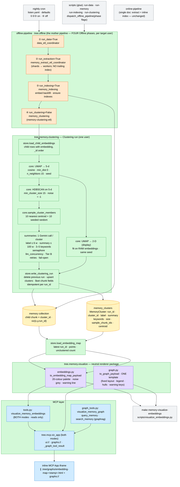

# ADR-007: Embedding Clusters, the Embedding Map, and Explicit Offline Phases

- **Status:** Accepted
- **Date:** 2026-09-06
- **Deciders:** Paul (project owner)
- **Context references:**
  - `tasks/114-explicit-offline-indexing-phase.md` … `tasks/119-embedding-map-mcp-tool-cli-docs-e2e.md` (this feature's task plan)
  - `ADR-002` §3 — its "ONE trailing index after the shards" rule (and the #066 restatement) is SUPERSEDED by Decision 5 below; every other ADR-002 decision (Voyage GCL, fan-out axis, retry placement/count, task-worthiness) stands and is applied here
  - `ADR-005` — the single renderer stands; Decision 3's module paths are AMENDED by Decision 7 below (`tree.memory.graph.visualize` → `tree.memory.visualize.graph`; `tree.mcp.graph_app` → `tree.mcp.viz_app`)
  - `ADR-006` — unchanged in substance; §8's layout is EXTENDED with two neutral packages and §5's tool sets gain one both-modes tool (Decision 8)
  - `docs/glossary.md` — **Memory cluster**, **Embedding map**, **Clustering run**, **Offline phase** (added in this feature's grooming commit)
  - Reference recipe: BERTopic (UMAP → HDBSCAN → per-cluster representation) — ported, NOT imported: no `bertopic`, no `hdbscan` package
  - Stacked on PR #41 (`feat/rag-graphrag-modes`); the branch targets that PR until it merges, then is rebased onto `main`

## Context

This codebase is the companion to a book. The book needs a way to SEE the memory's embedding
space: which topics the corpus holds, how big they are, and where a chunk sits relative to its
neighbours. Today every visual surface is a graph (nodes + edges, force layout), so `rag` mode —
which has no edges — cannot draw anything, and even `graphrag` shows structure, not semantics. We
want to cluster the child-chunk embeddings, draw them as a 2-D map coloured by cluster, and give
each cluster an LLM-written label and summary.

Two constraints from the current code shape the design. First, a pipeline-shape bug: indexing is
hidden inside the extraction Coordinator (`_fan_out_extraction` runs `memory_indexing` inline after
the shards) while the standalone `run_indexing_pipeline.py` runs the flow in-process, unlike every
other script — so "run only the indexing" and "add a sibling maintenance step" both have nowhere
natural to go. Second, the Prefect free tier's five deployment slots are all spent (ADR-002/006),
so nothing new may be a deployment. Others: Voyage embeddings are 1024-d cosine-normalised;
numpy/scipy are installed, `umap-learn`/`scikit-learn` are not; the codebase runs Python 3.14
(verified: `umap-learn 0.5.12` + `numba 0.67` + `scikit-learn 1.9` resolve against the pinned
numpy 2.4.2 / scipy 1.17.1; a cold `import umap` compiles numba kernels for ~40 s, ~3 s once
cached); ADR-005 allows exactly one browser renderer (Sigma.js has no native hull primitive).

## Decision

Nine related choices, one design:

1. **Clustering recipe = BERTopic's form, with the clustering step in a low-dimensional
   intermediate — never on the 2-D picture.** Input: all of one user's **Child chunk** rows
   (`type: chunk, subtype: child`) with a non-empty `embedding`, loaded in `_id` order. Step A:
   UMAP to `n_components=5` (`metric=cosine`, `min_dist=0.0`, `n_neighbors=15`, fixed
   `random_state`, `n_jobs=1`; `n_neighbors` explicitly clamped to `n-1`). Step B:
   `sklearn.cluster.HDBSCAN(min_cluster_size=15, min_samples=None)` on the 5-d space, noise = `-1`.
   Step C: a SEPARATE UMAP to `n_components=2` **fit on the raw 1024-d embeddings** with the same
   seed and knobs, used only for display. Every number is a YAML knob under `memory.clustering`
   (`umap`, `hdbscan`, `sampling`, `summaries`); there is NO automatic parameter search.
   *Why 5-d then cluster:* HDBSCAN on 1024-d cosine space finds almost nothing (distance
   concentration); UMAP to a handful of dimensions restores density contrast, which is the
   BERTopic finding we reuse. *Why not cluster on the 2-D projection:* two dimensions destroy
   neighbourhood structure to make a picture — clusters read off a t-SNE/UMAP plot are artefacts
   of the projection (`min_dist`, seed) rather than of the data, and the picture would then be
   circular evidence for its own labels. Rejected explicitly. *Why the 2-D fit is on the raw
   embeddings, not on the 5-d intermediate:* a projection of a projection compounds distortion and
   couples the picture to the clustering step; fitting both from the same input keeps them
   independent evidence at the cost of a second (cheap) fit. *Why `sklearn.cluster.HDBSCAN`
   over the `hdbscan` package:* same algorithm, already a maintained dependency with a stable API
   and no C-extension build risk on Python 3.14, and we need scikit-learn anyway (least new
   dependency).

2. **Display = a 2-D scatter in the EXISTING Sigma.js stack (ADR-005 stands: no 3D, no second
   library).** Points carry fixed `x`/`y` from the stored coordinates; ForceAtlas2 is skipped when
   the payload says `layout: "fixed"`. Colour = a 20-colour tableau-style categorical palette by
   cluster rank (`% 20`), noise `-1` mid-grey; chunks with no (or a stale) assignment are OMITTED
   from the map (they have no coordinates) and counted in the legend as light-grey
   "unclustered / stale (not shown)". A header toggle draws or hides a convex hull per cluster (≥ 3
   points): Sigma has no hull primitive, so it is a plain `<canvas>` overlay in viewport
   coordinates (`renderer.graphToViewport`), redrawn on Sigma's `afterRender` and `resize`
   events — no WebGL layer package, no plugin. Legend = cluster label + size; tooltip = document
   title, heading path, chunk snippet, cluster label. ONE template serves graphs and maps
   (optional payload keys, byte-identical output for graph payloads without them) — extended, not
   duplicated.

3. **Storage: a SEPARATE `memory_clusters` collection + two fields on the chunk; latest run
   only; no graph rows, no edges; identical in both modes.** `MemoryCluster` (`tree.entities.clusters`,
   `_id = "{user_id}:cluster:{cluster_id}"`): `user_id`, `run_id`, `cluster_id`, `label`, `summary`,
   `keywords`, `size`, `sample_chunk_ids`, `centroid {x, y}` (map space), `created_at` (UTC-aware).
   `MemoryEntry` (child rows only, validator-enforced) gains `cluster_id: int | None` and
   `viz: {x, y, run_id} | None`. A new run deletes the user's previous cluster rows and overwrites
   the chunk fields — no run history. Noise gets `cluster_id = -1` and coordinates but no row and no
   summary. *Why a separate collection rather than cluster nodes in `memory`:* clusters are derived,
   per-run, replaced-wholesale artefacts with their own lifecycle and shape; as `memory` nodes they
   would need edges to members (graphrag-only, contradicting mode-orthogonality), pollute
   `$vectorSearch`/`$text` results and the graph tools, and turn "delete the previous run" into a
   graph mutation. Membership lives on the chunk because the chunk is what the map draws.

4. **Summaries: ≤ 20 sampled chunks per cluster, one Gemini call per cluster, fail-open per
   cluster.** Sample = 10 nearest the cluster centroid (cosine, in the ORIGINAL embedding space) +
   10 random from the remainder, seeded (`random_state + cluster_id`) so a re-run samples the same
   evidence; ≤ 20 members → all. One `BaseLLM.generate_json` call returning `{label ≤ 6 words,
   summary ≤ 100 words, keywords 3–5}` validated by a Pydantic contract; bounded by an
   `asyncio.Semaphore(memory.clustering.summaries.llm_concurrency)` (its own knob — clustering is
   mode-orthogonal, `extraction.llm_concurrency` is graph-only in meaning). Retries follow ADR-002's
   Tier B (`2 × 5 s`, billable, capped) with an `INPUTS` cache keyed on the samples + a prompt
   version; a cluster whose summary fails after retries is stored as `Cluster {id}` with an empty
   summary and a WARNING — one bad cluster never fails the run. Prompt text lives in
   `tree/memory/clustering/summaries.py`.

5. **Pipeline shape: `offline_pipeline` becomes the mother pipeline with FOUR explicit,
   independently switchable Offline phases; indexing leaves the extraction Coordinator; no new
   deployment.** `run_data=True`, `run_extraction=True`, `run_indexing=True`, `run_clustering=False`.
   Phase 3 runs `memory_indexing` once per target user as an inline subflow; `_fan_out_extraction`
   no longer indexes (this SUPERSEDES ADR-002 §3's "ONE trailing `memory-indexing-etl` run after all
   shards finish" and its #066 restatement — the fan-out axis, partitioning, failure isolation and
   Voyage GCL are untouched). `online_pipeline` KEEPS its inline single-document indexing (a
   different shape: one document, one run, not phased). Phase 4 is the new `memory_clustering`
   sub-flow (`memory-clustering-etl`, in `tree/memory/pipeline.py` beside `memory_indexing`):
   tasks `load-child-embeddings` (`NO_CACHE`, 3 × 5 s), `reduce-and-cluster` (`NO_CACHE`, 1 × 5 s —
   task-worthy as long compute; the one retry covers a cold numba-cache race on a fresh
   container), `summarise-cluster` (per cluster, Tier B), `write-clustering-run` (`NO_CACHE`,
   3 × 5 s, idempotent for a given `run_id`). Per user; `user_id=None` fans across active users like
   the other phases; per-user failure isolation. The ONE switch is the `run_clustering` flow
   parameter — there is deliberately no `memory.clustering.enabled` YAML key (a second switch would
   let the YAML say "on" while the cron says "off", and the phase flags are already the pattern).
   Scripts are glue over `dispatch_offline_pipeline` with the other phases off
   (`run_indexing_pipeline.py` is made consistent — it no longer runs the flow in-process;
   `run_clustering_pipeline.py` is new); Make targets `memory-run-indexing-pipeline` (exists,
   rewired) and `memory-run-clustering-pipeline` (new). The nightly cron keeps the defaults:
   indexing yes, clustering no. Five deployments, as before.

6. **Dependencies: `umap-learn` and `scikit-learn` are MAIN dependencies, imported lazily.** They
   join `[project.dependencies]` (`uv lock`), but `umap`/`sklearn` are imported ONLY inside the
   function bodies that call them (`clustering/core.py::_umap_reduce`, `_hdbscan_labels`), never at
   module scope anywhere under `tree/memory/` (AST-enforced). So `run_clustering=False` paths — the
   nightly run, the MCP server, every other script — never pay the ~40 s cold numba compile or the
   ~3 s warm import, and `rag/` stays free of them. Not an optional extra: the Prefect Managed
   per-run `pip install ./apps/memory` must be able to run the phase without a second install step.

7. **Package layout: two NEUTRAL packages, `tree/memory/clustering/` and `tree/memory/visualize/`;
   the MCP App layer splits into a neutral module.** `visualize/graph.py` = today's
   `graph/visualize.py` moved (`git mv`, imports rewritten) and extended; `visualize/embeddings.py`
   = the map payload builder. `clustering/` = `types.py`, `core.py` (pure numpy/umap/hdbscan +
   sampling), `summaries.py` (prompt + call), `store.py` (Mongo reads/writes incl. latest-run and
   unclustered-count queries). Import rule, extending ADR-006 §8 and asserted by the layout test:
   `rag/` never imports `graph/`, `clustering/` or `visualize/`; `graph/` may import `visualize/`
   (and `rag/`); `clustering/` and `visualize/` may import `rag/` types and `entities` but never
   `graph/` or `pipeline.py`. On the MCP side, `tree/mcp/graph_app.py` becomes `tree/mcp/viz_app.py`
   — the mode-neutral `ui://` + `graphs://` resources, the iframe template and the one dual-delivery
   helper `_graph_tool_result` — and the `visualize_memory_graph` tool moves next to the other
   graphrag-only tools in `graph_tools.py`. This amends ADR-005 Decision 3's paths; its substance
   (renderer in the memory domain, MCP concerns in the MCP layer, one dual-path helper) is unchanged.

8. **Surfaces read; they never compute. Warning contract.** MCP tool
   `visualize_memory_embeddings(ctx, hulls=False, as_html_file=False)` in BOTH modes (7 rag / 14
   graphrag tools) and `make memory-visualize-embeddings` (new glue script — not a flag on
   `query_graph.py`, which is query-driven and mode-branching while the map is neither). Both load
   the stored coordinates/clusters. If any child chunk has `cluster_id is None` or `viz.run_id !=
   latest run_id`, the output STARTS with `"N of M chunks have no cluster assignment (or a stale
   one) — run make memory-run-clustering-pipeline"`, those chunks are omitted and counted in the
   legend. With no run at all: an explanatory message, never an empty map. Delivery is the graph's
   dual path through `_graph_tool_result` (ADR-005 Decision 4 now covers maps too).

9. **Branch/workspace.** Worktree `../building-agentic-systems-embedding-clusters-viz` branched from
   `feat/rag-graphrag-modes`; the PR targets `feat/rag-graphrag-modes` until #41 merges, then is
   retargeted to `main` and rebased. Task numbers 114–119 continue PR #41's sequence.

Bias-to-least notes: sklearn's HDBSCAN over a new package; a `<canvas>` overlay over a WebGL layer
plugin; one template with optional keys over a second template; a flow parameter over a YAML
switch; a separate flat collection over cluster nodes + edges; latest-run-only over run history;
no parameter search; no new deployment; no vendoring.

## Diagram

## Consequences

- **Indexing is now visible and independent.** `run_indexing_pipeline.py` dispatches like every
  other script (it needs served workflows / a registered deployment — the deployment runbook's
  "first indexing run" step still works because `offline-pipeline` is in `GROUPS=data`); the
  Coordinator does one thing; the Prefect UI shows extraction and indexing as sibling subflows.
  Behaviour of the nightly cron and of `run-memory-pipeline` is unchanged (defaults).
- **Cold-start cost, only when clustering runs.** The first `import umap` on a machine compiles
  numba kernels (~40 s; ~3 s afterwards from the on-disk cache). On Prefect Managed every run is a
  fresh container, so every clustering run pays it — acceptable for an off-by-default maintenance
  phase; lazy imports guarantee nobody else does. The unit suite pays it once per machine in the
  single `slow`-marked real-library test.
- **Determinism is by seed, not by contract.** Labels and coordinates are reproducible for a
  fixed input order (rows load in `_id` order) and seed; any change in the corpus reshuffles
  cluster ids, which is why cluster rows are replaced wholesale and never diffed across runs.
- **Small corpora cluster poorly or not at all.** Below `min_cluster_size` embedded children the
  run is skipped (previous run kept); an all-noise run is stored (coordinates, no cluster rows) and
  logged with the knob to lower. Operators use `TREE_MEMORY__CLUSTERING__HDBSCAN__MIN_CLUSTER_SIZE`.
- **Staleness is surfaced, not hidden.** Ingesting after clustering leaves new chunks unassigned;
  every surface says so up front and drops them from the map. There is no incremental assignment
  (UMAP `transform` of new points would be a second mechanism) — re-run the phase.
- **Schema growth.** Two nullable fields on child rows and one new collection; no index beyond
  `(user_id, run_id)`; no migration (everything defaults to `None`/absent).
- **Renderer paths change.** `tree.memory.graph.visualize` → `tree.memory.visualize.graph`,
  `tree.mcp.graph_app` → `tree.mcp.viz_app` (+ the graph tool in `graph_tools.py`); ADR-005 prose
  keeps the old paths as history. Rag-mode servers now register the `ui://` and `graphs://`
  resources (7 tools instead of 6).
- **LLM cost is bounded and cached.** One call per non-noise cluster per run (tens, not
  thousands), Tier B capped retries, `INPUTS`-cached on the sampled texts + prompt version.
- **What would justify upgrading.** A measured need to compare runs → keep `run_id` history
  instead of deleting; a corpus where `n_neighbors`/`min_cluster_size` must vary per user → a
  DBCV-scored sweep (explicitly out of scope now); hulls too noisy for elongated clusters →
  concave hulls (alpha shapes) in the same overlay; an air-gapped requirement → vendor the CDN
  bundles per ADR-005; a second consumer of the recipe (e.g. entity clustering) → generalise
  `load_child_embeddings`' filter, never fork `core.py`.
