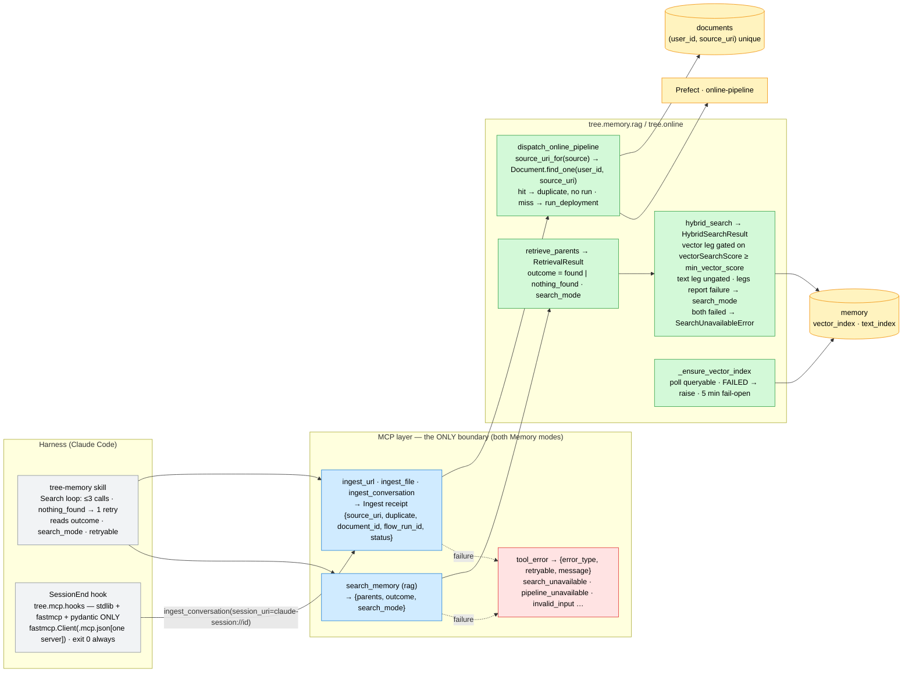

# ADR-008: Tool Receipts, Errors and Retrieval Outcomes; MCP as the Only Harness Boundary

- **Status:** Accepted
- **Date:** 2026-09-12
- **Deciders:** Paul (project owner)
- **Context references:**
  - `tasks/122-ingest-receipt-and-source-uri-helper.md` … `tasks/129-session-end-hook-mcp-client-and-e2e.md` (this feature's task plan)
  - `ADR-006` §2 (hybrid search + RRF, Parent-document retrieval) and §5 (per-mode tool sets) — unchanged in substance; the tool ANSWER shapes are amended here
  - `ADR-002` (retry placement; the online `Thin MCP flow`) — unchanged
  - `docs/glossary.md` — **Ingest receipt**, **Tool error envelope**, **Search mode**, **Retrieval outcome**, **Session-end hook** (added in this feature's grooming commit)

## Context

Chapter 4's assistant talks to memory only through MCP tools, and today those tools under-report.
An ingest answers `{status, flow_run_id}` — whether the source was new or a duplicate is buried in
a flow-run result the model never sees, and `Document._id` is a random ObjectId minted on insert.
Errors come in two dialects (`{"error", "detail"}` on some paths, raw FastMCP protocol errors on
others) with no hint whether a retry is sane. `hybrid_search` swallows a dead leg into `[]`, so
"Mongo is down" and "nothing matches" read the same, and RRF's rank-based scores give no bar for
"nothing found". The vector-index poll declares "ready" when the index merely exists. Session
persistence is a skill instruction asking the model to spawn a background agent — an unenforceable
rule that the skill's `disable-model-invocation: true` already contradicts.

Constraints: no migration and no `_id` change (every leaf already dedupes on
`(user_id, source_uri)`; the `document` row in `memory` is keyed by that pair); both Memory modes
must present the same surface; no in-process fallback when Prefect is down (ADR-002 / `online.py`);
the harness must never import pipeline code.

## Decision

Five related choices, one contract:

1. **The Ingest receipt carries the natural key, not a surrogate id.** All three ingest tools
   answer `{source_uri, duplicate, document_id, flow_run_id, status}`. `source_uri` comes from ONE
   helper per leaf (`source_uri_for`), shared by the leaf and the dispatcher so they cannot
   disagree (YouTube canonicalises, files are `file://…`, conversations are `session_uri` or a
   content hash). `dispatch_online_pipeline` does a pre-flight `Document.find_one` on
   `(user_id, source_uri)`: a non-LATENT hit answers `duplicate: true` with the existing
   `document_id` and dispatches nothing; a miss or LATENT dispatches. `document_id` is set iff
   `duplicate`. *Why not a deterministic `Document._id`:* the pair is already unique-indexed and is
   what every leaf, the `memory` row id and the operator's retry (`SOURCE_URIS=`) key on; a
   surrogate would be a second identity to keep in sync for a field no caller needs before the
   duplicate path. The submit-time race (two concurrent submits both reading `false`) is accepted:
   the worker's `DuplicateKeyError` path still dedupes.

2. **One Tool error envelope, both modes:** `{error_type, retryable, message}` from
   `tree.mcp.tools.tool_error`, with `retryable: true` meaning "the same call may succeed later"
   (transient infrastructure) and `false` "change the input or stop". Every tool in `tools.py` and
   `graph_tools.py` uses it; the legacy `error`/`detail` keys are dropped without alias. Retrieval
   exceptions (embedding provider, PyMongo, `SearchUnavailableError`) are caught at the tool
   boundary as `search_unavailable` (true), anything else as `internal_error` (false); Prefect
   unreachable on dispatch is `pipeline_unavailable` (true), an unregistered deployment
   `configuration_error` (false); a `PyMongoError` outside the retrieval legs (the ingest
   pre-flight lookup, the review tools) is `storage_unavailable` (true). A model reads `retryable`,
   not the code string.

3. **The retrieval contract names its mode and its outcome.** `hybrid_search` returns
   `HybridSearchResult(hits, search_mode ∈ {hybrid, text_only, vector_only})`: each leg reports its
   own failure, fusion decides the mode, both legs failing raises `SearchUnavailableError`.
   `retrieve_parents` copies `search_mode` and sets `outcome ∈ {found, nothing_found}`.
   **The bar sits on `vectorSearchScore`, never on the RRF score:** RRF sums `1/(k+rank)` — a
   rank statistic comparable only within one query — whereas Atlas's `(1 + cos)/2` is an absolute
   similarity. Vector hits below `query.min_vector_score` are dropped BEFORE fusion; `$text` hits
   are never gated (a lexical match is a match; `textScore` is not normalisable); the gate never
   runs on an unavailable leg (degraded ≠ filtered). graphrag consumes `.hits` and keeps
   `QueryResult` unchanged — Chapter 8's contract is Chapter 8's decision.

4. **`min_vector_score = 0.75` is provisional and evals-owned.** It is a YAML knob
   (`TREE_QUERY__MIN_VECTOR_SCORE`), pinned by two live queries (nonsense → `nothing_found`,
   on-topic → `found`) whose observed top scores are recorded in `tasks/125`'s log. Chapter 7's
   evaluation harness tunes it; nothing else does.

5. **MCP is the only harness↔memory interface.** The Session-end hook (`tree.mcp.hooks`,
   glue `scripts/hook_session_end.py`, wired on Claude Code's `SessionEnd`) persists a session by
   calling `ingest_conversation` with `session_uri="claude-session://<id>"` through the repo-root
   `.mcp.json` entry for one server. It imports stdlib + `fastmcp` + `pydantic` only — AST-enforced
   like `rag/cleaning.py`'s purity — and always exits 0. `SessionEnd` over `Stop` because
   first-write-wins on `session_uri` would keep only the first turn. The skill's "proactive
   background ingest" instruction is deleted; the vector-index poll waits for `queryable`
   (fail-loud on `FAILED`, fail-open at 5 min; a catalogue entry that reports neither `status` nor
   `queryable` — the local mongot container — is read as ready) so a not-yet-ready index shows up as `text_only`,
   not as an empty memory.

Bias-to-least notes: natural key over a new id; one helper over per-tool error handling; a
return-value mode over a retry framework; a YAML knob over a scoring model; a stdio MCP client over
a direct import; constants over knobs for the poll.

## Diagram

## Consequences

- **Duplicates are decided twice, cheaply.** One indexed `find_one` per ingest submit, plus the
  worker's insert-time dedupe as before. A model never needs to poll a flow run to learn "already
  in memory", and an operator retries by the same key the receipt printed (`SOURCE_URIS=`).
- **Errors are data, not protocol.** No tool raises through FastMCP any more; the log carries the
  traceback, the model carries a boolean. The cost is `except Exception` at every reader boundary —
  deliberately noqa'd and logged, never silent.
- **Degraded is visible, not broken.** A dead vector leg or a still-building index shows up as
  `text_only` plus one caveat line; two dead legs are `search_unavailable`. "No matches" now means
  no matches. graphrag keeps its old shape until Chapter 8 decides otherwise.
- **The empty answer costs a knob.** `min_vector_score` filters only the vector leg; a wrong value
  hides true positives (too high) or never says `nothing_found` (too low). It is pinned by two
  queries today and belongs to the evals chapter — nobody tunes it by feel.
- **The harness stays a client.** The hook cannot drift into the pipeline's internals; changing the
  memory app never breaks the hook unless the MCP contract changes — which this ADR now writes down.
  A spawned local server per session end (~seconds with `MCP_SKIP_INDEX_BOOTSTRAP=1`) is the price;
  the cloud server is an opt-in that needs OAuth.
- **Skill gets shorter.** Session persistence leaves the prompt; the search loop enters it as
  checkable rules. Net line count goes down.
- **What would justify upgrading.** A caller that needs the id BEFORE the duplicate path → a
  deterministic `Document._id` (with a migration); a second harness client → a shared receipt
  schema package; measured false negatives from the gate → a learned threshold or per-query
  calibration in evals; a `Stop`-time need (mid-session recall of the current session) → upsert on
  `session_uri`, explicitly rejected today.
