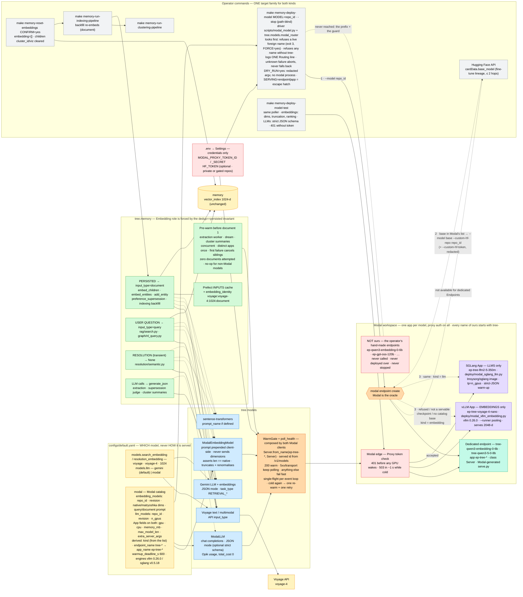

# ADR-009: Voyage 4, Embedding Roles, and a Catalog of Modal-Hosted Models (Embeddings and LLMs)

- **Status:** Accepted
- **Date:** 2026-09-19. Revised, always before the affected tasks shipped: (1)-(2) the same day — Dedicated endpoints added as the first Serving path; the optional Hugging Face token (Decision 9); (3) during task 138's QA — `voyageai/voyage-4-nano` is natively 2048-d, so Decision 3 gained client-side truncation and the response-length assertion; (4) 2026-09-20, after an accidental deploy during task 142's QA overwrote an operator's hand-made endpoint — the `tree-` name namespace, the existence guard, the ownership rule and the dry run (drafted, merged into revision 5); (5) 2026-09-20, by the owner's decision after a day of live results — **the Serving path left the configuration**: Decisions 2 and 3 rewritten as auto-routing with Modal as the oracle (endpoint first, App by kind: vLLM = embeddings, SGLang = LLMs); LLMs brought into scope (Decision 10); the warm-up design ported from the `pulse` codebase (Decision 11). Tasks 138-140 and 142 were already built on the earlier text; tasks 143-150 rework that code and task 141 proves it live.
- **Deciders:** Paul (project owner)
- **Context references:**
  - `tasks/134-voyage-4-embedding-upgrade.md` … `tasks/150-embedding-text-follow-ups-from-137-qa.md` (this feature's task plan; execution order 134 … 140 -> 142 -> 143 -> 144 -> 145 -> 146 -> 147 -> 148 -> 149 -> 150 -> 141)
  - `ADR-001` (embedding model + dimension pinned in config; its `voyage-3` example is superseded IN PRACTICE by the pin below — the ADR text is unchanged)
  - `ADR-002` §1 (the `voyage-embeddings` rate limit at the real POST; `_CachedSingleEmbedding` never reaches a client) — unchanged
  - `ADR-006` §4 (only Child chunks are embedded; backfill by empty `embedding`) and its `rag/` ↛ `graph/` import rule — unchanged, relied on
  - `ADR-007` (Clustering run, stale-map warning contract; §4 summaries fail open) — unchanged, relied on
  - `ADR-008` §4 (`min_vector_score` provisional, evals-owned) — AMENDED here on one point: what happens to the pin when the embedding model changes
  - `docs/glossary.md` — **Modal catalog** (formerly *Embedding catalog*), **Serving path**, **Dedicated endpoint**, **Embedding role**, **Embedding reset**, **Proxy token**, **Warm gate**, **Pre-warm**
  - Modal docs, read 2026-09-19: `modal.com/docs/guide/dedicated-endpoints.md`, `modal.com/docs/cli/latest/endpoint.md`, `modal.com/docs/guide/endpoints.md`, `modal.com/docs/guide/secrets.md`
  - The pinned Modal client's source (modal 1.5.5), read 2026-09-20: `modal/_utils/name_utils.py` (object-name rule), `modal/cli/app.py` and `modal/cli/endpoint.py` (`list --json` columns)
  - The four `serve.py` files Modal generates (Source view) for `Qwen/Qwen3-Embedding-0.6B`, `Qwen/Qwen3-Embedding-8B`, `openai/gpt-oss-120b`, `Qwen/Qwen3.6-35B-A3B-FP8`, read 2026-09-20 — the templates our two App scripts follow
  - The warm-up design of the `pulse` codebase (`pulse/warmup.py`, its ADR-0014 / ADR-0019), by the same owner — the SOURCE of Decision 11, with its measurements

## Context

Four things were true at once. (1) The Voyage API moved to the 4 series (`voyage-4-large` $0.12,
`voyage-4` $0.06, `voyage-4-lite` $0.02, `voyage-code-4` $0.12 per 1M tokens; 32K context; 1024-d
default with 256/512/2048 Matryoshka; ONE shared embedding space that also contains the open-weight
`voyageai/voyage-4-nano` — whose NATIVE served width is 2048, through a learned 1024->2048 linear
head; the API's "1024-d default" is an API default, and for nano 1024 is a Matryoshka truncation),
while we still embedded with legacy `voyage-3.5`. (2) Every vector — a
stored chunk and a user's question alike — was embedded the same way, although Voyage, Gemini,
Qwen3 and most modern retrievers are asymmetric. (3) The "Modal provider" was one hard-coded script
for one model behind an engine-level API key held in a Modal secret, with a client that hard-coded
the app name, ignored `dimensions`, and cited a manifest file that never existed. (4) Modal now
offers **Dedicated Endpoints**: `modal endpoint create --model <model> [--custom-hf-repo …
--custom-hf-revision … --custom-hf-token …]` — "Modal resolves the model, selects a compatible
serving recipe, and starts provisioning"; scale to zero by default, billed by GPU-second, proxy
tokens required by default, an OpenAI-compatible API, and a Source view whose generated `serve.py`
"you can copy and adapt … into your own Modal App when you need full control".

**What a day of live results showed (2026-09-20)** — and why the first design was rewritten:
- Modal has no "can you serve X?" API. `modal endpoint create --model X` for a model outside its
  catalog exits 1 with `'X' is not available for dedicated Endpoints.` followed by
  `Models available for dedicated Endpoints:` and a bullet list; nothing is created. That list held
  **44 models, exactly 2 of them embedding models** (`Qwen/Qwen3-Embedding-0.6B`, `-8B`) and 42 chat LLMs.
- "Custom weights" means a **same-architecture fine-tune, nothing else**: a different shape exits 1
  with `The custom model is not a servable checkpoint of base model '<base>':` and the mismatching
  `hidden_size` / `num_hidden_layers` / … ; nothing is created. `voyageai/voyage-4-nano` can never
  be an endpoint.
- So our own Apps are the GENERAL path for anything outside those 44 models, not a fallback
  curiosity — and a YAML field asking the operator to predict Modal's answer (`serving:`, plus a
  `base_model:` guess) was configuration about something only Modal knows.
- Hugging Face exposes fine-tune lineage: `GET /api/models/<repo>` -> `cardData.base_model` (a string
  on some cards, a list on others) and `base_model_relation`.
- A managed endpoint named `N` runs as the Modal app `ep-N` with ONE class `Server` (all four
  generated `serve.py` files + `modal app history`), so `modal.Server.from_name("ep-<N>", "Server")`
  resolves endpoints and our Apps alike when our Apps use the same shape.
- Modal's two embedding recipes disagree on Matryoshka: the 8B recipe passes
  `--hf-overrides {"is_matryoshka":true}`, the 0.6B recipe does not — server-side `dimensions`
  support differs between two managed recipes of the same family.
- A scaled-to-zero server answers `GET /health` with **HTTP 503 in about 1 s** (measured on
  `ep-qwen3-embedding-4b`; `pulse` measured 0.25 s / 0.74 s) — it never holds the request, and the
  polling itself is what boots the container. Our single long-held GET failed on every cold start.
- The driver printed its "set HF_TOKEN" hint under every failure (an architecture mismatch, a
  not-in-catalog refusal, a 503).

Constraints: `memory` rows carry no embedding-model stamp and the backfill only fills EMPTY
vectors; dedup compares the same vector it then persists (`pipeline.py`, "dedup vector == persisted
vector, computed once"); the vector index stays 1024-d; Modal re-imports a deploy script inside the
container, where the `tree` package is not installed; entry-point scripts hold no business logic;
a managed recipe exposes no engine flags, while `voyageai/voyage-4-nano` needs a custom
architecture (`VoyageQwen3BidirectionalEmbedModel` via `--hf-overrides`), MEAN pooling and
`--trust-remote-code`; vLLM answers 400 to an OpenAI `dimensions` parameter unless the model's HF
config is flagged Matryoshka (voyage-4-nano's is not); `BaseLLM.generate_json(prompt, *, system)`
carries no schema and every caller embeds its schema in the prompt; model objects are built PER
PREFECT TASK by the `get_model` factories, so any per-instance state (a lock, a "warmed" flag) is
not shared across tasks; the MCP server must bind its port within 60 s and must never import
`modal` on boot; the glossary already owns the word **Deployment** (a registered Prefect flow);
credentials live in `.env` / `Settings`, never in YAML; a Modal workspace also holds things this
repo did not create — an operator's hand-made Dedicated Endpoint for a model is the app
`ep-<slug of the model name>`, `modal deploy` onto an existing app name overwrites it without asking,
and `modal app rollback` is not available on every plan; the deploy driver logs the command it
runs, Modal image layers are cached and inspectable, and some models worth serving are private or
gated on the Hugging Face Hub (all four seeds are public).

## Decision

Eleven related choices, one design:

1. **`voyage-4` at 1024-d for BOTH `models.search_embedding` and `models.resolution_embedding`.**
   Same price as `voyage-3.5` ($0.06), same dimension, so the mongot `vector_index` is untouched.
   Dimension and price tables GAIN the 4 series and KEEP every legacy id (`voyage-3.x` is still
   served and the `TREE_MODELS__…` escape hatch must keep resolving).

2. **Auto-routing: Modal is the oracle; Dedicated endpoint first; otherwise our App, chosen by KIND.**
   The YAML names the Hugging Face model and the facts about it — never HOW it is served. There is
   no `serving:` and no `base_model:` field. `make memory-deploy-model MODEL=<repo_id>` runs:
   1. `modal endpoint create --name tree-<slug> --model <repo_id> --routing-region eu-west`.
      Success -> a **Dedicated endpoint**: zero code of ours, Modal picks recipe, GPU, engine, flags.
   2. Modal answers `… is not available for dedicated Endpoints` -> read the model's fine-tune
      lineage from the Hub (`cardData.base_model`, at most 2 hops, skipping `adapter` / `merge` /
      `quantized` relations) and, for the first ancestor that is IN the list Modal just printed, try
      `--model <base> --custom-hf-repo <repo_id> --custom-hf-revision <revision>` (+ the redacted
      token of §9).
   3. Modal answers `… is not a servable checkpoint of base model …`, or there is no ancestor in
      its list -> deploy the APP for the entry's kind: `embedding` -> `deploy/modal_vllm_embedding.py`,
      `llm` -> `deploy/modal_sglang_llm.py`.
   4. ANY OTHER failure (auth, quota, network, a text we do not know) -> abort with Modal's message.
      Never a silent fallback: an unknown failure is not evidence that a model is ineligible.
   The two "ineligible" verdicts are matched on stable SUBSTRINGS, unit-tested against the exact
   live texts; parsing Modal's bullet list is best-effort and degrades safely (unparsable -> skip
   step 2 -> App); a failed Hub call degrades the same way. ONE log line carries the decision and its
   reason, e.g. `Routing voyageai/voyage-4-nano: not in Modal's endpoint catalog, no catalog base →
   vLLM App`. What is already live stays on its route: a live App of ours is redeployed without an
   endpoint attempt ("stop it first to re-route"), a live endpoint refuses the deploy (§3, Names).
   `stop` needs no knowledge of the route: `modal endpoint stop -y tree-<slug>`, and if that fails,
   `modal app stop -y ep-tree-<slug>`. `SERVING=endpoint|app` survives ONLY as an ops escape hatch on
   the Make targets — never as configuration.
   - **The KIND comes from which catalog list the entry lives in** (`modal.embedding_models` vs
     `modal.llm_models`), not from guessing at the model.
   - **vLLM = embeddings only.** The script follows the `serve.py` Modal generates for its own
     embedding endpoints: CUDA 13.0.2 base, `vllm==0.26.0` (Modal's pin), `autoinference-utils`,
     `VLLMEndpoint`, `--runner pooling` baseline, `validate_embeddings_endpoint`; per-model extras
     (voyage's `--convert embed`, `--pooler-config`, the architecture override, `--trust-remote-code`)
     come from the entry's `extra_server_args`.
   - **SGLang = LLMs only.** The script follows Modal's LLM template: the official
     `lmsysorg/sglang:<tag>` image + `autoinference-utils`, `SGLangEndpoint(model_path=…, tp=n_gpus)`,
     `warmup_chat_completions` with a STRICT JSON-schema payload (a server that cannot do constrained
     JSON never reports healthy). Generic-safe flags only (`--served-model-name`,
     `--trust-remote-code`, `--mem-fraction-static`, `--context-length`; optional per-model
     `--reasoning-parser` / `--tool-call-parser`); Modal's speculative-decoding, mamba and multimodal
     flags are model-specific tuning and are excluded by test. Its former embedding mode is deleted.
   - Embedding models vLLM cannot serve and LLMs SGLang cannot serve are out of scope.
   - *Why the ladder and the `serving` field were dropped:* with 2 embedding models in a catalog of
     44 and custom weights limited to same-shape fine-tunes, the field asked the operator to predict
     an answer only Modal has, the "ladder" had exactly one rung that ever applied per model, and the
     planned "try voyage-4-nano as custom weights" experiment turned out to be a refusal Modal gives
     in one second. Asking first costs one CLI call and cannot be wrong.
   - The route is still called a **Serving path** (`endpoint` | `app`), never a *deployment*: a
     **Deployment** is a Prefect flow.
   - Two scripts rather than one abstraction: the engines differ in image, launcher, warm-up and
     flags, and they now also differ in PURPOSE. If a third engine arrives, that is the moment to
     extract a skeleton — not before.

3. **The Modal catalog: two YAML lists, one Modal app per model, one way to find it.**
   `modal.embedding_models` and `modal.llm_models` in `configs/default.yaml`, validated by Pydantic,
   read through `tree.models.modal_catalog` by BOTH the deploy driver and the clients
   (`ModalEmbeddingModel`, `ModalLLM`) — names, dimensions and prompts have one source. Everything
   about a model stays EXPLICIT per entry (`revision`; for embeddings `native_dimensions`,
   `matryoshka_dimensions`, `query_prompt`, `document_prompt`; the App fields `gpu`, `cpu`,
   `memory_mb`, `max_model_len`, `extra_server_args`, and `n_gpus` for LLMs) — only the ROUTE is
   discovered. The App fields are optional with defaults on every entry: the router needs them the
   moment Modal refuses, and a Dedicated endpoint simply does not read them. A `repo_id` (and a
   derived app name) is unique ACROSS both lists; an unknown id fails loudly listing both groups.
   Adding a model = one entry + `make memory-deploy-model MODEL=<repo_id>`. Seeds: embeddings
   `Qwen/Qwen3-Embedding-0.6B` (routes to an endpoint) and `voyageai/voyage-4-nano` (vLLM App); LLMs
   `Qwen/Qwen3.5-0.8B` (endpoint; chosen over the gated `google/gemma-3-1b-it`) and
   `LiquidAI/LFM2.5-350M` (SGLang App). Engine pins are per ENGINE (`modal.engines`).
   **One lookup, path-blind clients.** Both routes expose the same app name (`ep-tree-<slug>`), the
   same server class (`Server`) and the same auth, so every client resolves its model with
   `modal.Server.from_name(app_name, "Server")` and never learns the route. The served model id is
   discovered from `GET /v1/models`, because a managed recipe — not us — names it. H1 (an endpoint
   named `N` is the app `ep-N`, class `Server`) is supported by all four generated `serve.py` files
   and `modal app history`, and is confirmed for OUR names in `tasks/141`. If false: correct the
   name derivation; only if the app name is not derivable, resolve endpoint URLs from
   `modal endpoint list --json`. A `url:` field in the catalog is rejected (a workspace-specific URL
   in committed YAML).
   **Names: namespaced; deploys look first; we only ever stop what carries our prefix.**
   `endpoint_name` = `tree-<slug of the repo name>` — ONE constant (`MODAL_NAME_PREFIX = "tree"`) beside
   the ONE derivation — so `app_name` = `ep-tree-<slug>`: `voyageai/voyage-4-nano` -> `tree-voyage-4-nano` /
   `ep-tree-voyage-4-nano`, `LiquidAI/LFM2.5-350M` -> `tree-lfm2-5-350m` / `ep-tree-lfm2-5-350m`. Modal
   names a hand-made endpoint of the same model `ep-<slug>`; the prefix makes that collision impossible
   by construction and costs H1 nothing (H1 needs the `ep-<N>` SHAPE, not the same `N`). A derived app
   name longer than 63 characters is a load-time error (Modal's object-name rule). Before a `deploy`
   the driver reads `modal endpoint list --json` and `modal app list --json` and REFUSES (one line,
   exit 3) when the name is live as something the command would not merely update: anything at all
   before an endpoint create, a Dedicated endpoint before an App deploy. Redeploying our own live App
   is a normal update. `FORCE=yes` overrides a refusal; a list that cannot be read fails CLOSED.
   Independently, `deploy` and `stop` refuse (exit 2, `FORCE` or not) any name that lacks the prefix —
   the prefix IS the ownership mark; no tags, no registry. `DRY_RUN=yes` (`TREE_MODAL_DRY_RUN=1`,
   which the unit suite sets for every test) logs the redacted argv and starts NO `modal` process —
   the only way to exercise the driver without deploying; since Modal is the oracle, a dry run also
   says which command each verdict would lead to.
   For the App scripts the resolved entry crosses into the container as ONE JSON env var baked
   into the image (`EMBEDDING_DEPLOY_SPEC` / `LLM_DEPLOY_SPEC`), read under `not modal.is_local()` —
   the only way to honour both "catalog logic lives in `src/tree/`" and "`tree` is not importable in
   the container". That spec holds configuration only; a credential never enters the image env (§9).
   Weights come from a shared `huggingface-cache` Volume by `repo_id` + `revision`.
   ONE smoke test per kind (`tree.models.modal_server.smoke_test` / `chat_smoke_test`), run by the
   driver's `test` command, path-blind.
   **Dimensions: the embedding client never sends `dimensions`.** `native_dimensions` is the width the
   server returns when NO `dimensions` parameter is sent — a measured fact, not `hidden_size`
   (`voyageai/voyage-4-nano`: `hidden_size` 1024, served 2048; `Qwen/Qwen3-Embedding-0.6B`: 1024).
   `ModalEmbeddingModel` always requests the native width, ASSERTS every response is
   `native_dimensions` wide (`ExtractionError` otherwise), truncates + L2-renormalises client-side to a
   size listed in `matryoshka_dimensions` (`truncate_embedding`, one pure function shared with the smoke
   test), and asserts the width it returns. *Why not the OpenAI `dimensions` parameter:* Modal's 8B
   embedding recipe sets `is_matryoshka` server-side but its 0.6B recipe does NOT, vLLM needs that
   override per model, and a Dedicated endpoint cannot be given one — per-route, per-recipe behaviour
   against one function that is identical everywhere and keeps the client path-blind.
   Slice-then-normalise is what a server-side Matryoshka truncation does.

4. **Modal Proxy tokens are the only auth.** Dedicated endpoints require them by default; our
   Apps deploy with the literal `unauthenticated=False`; the driver never passes `--unauthenticated`.
   Clients send `Authorization: Bearer <MODAL_PROXY_TOKEN_ID>.<MODAL_PROXY_TOKEN_SECRET>`, which is
   exactly what `AsyncOpenAI(api_key=…)` emits, and the `/health` warm-up sends the same header. The
   engine-level `--api-key`, `MODAL_EMBEDDING_API_KEY` and the `vllm-embedding-api-key` Modal
   secret are retired. Why: the edge rejects unauthenticated traffic BEFORE a GPU container wakes
   (an engine key is only checked after a billed cold start), one workspace credential covers every
   catalog app — embeddings and LLMs — on either Serving path, and there is no per-app secret to bootstrap.

5. **The Embedding role is part of the embedding contract, and the role of every vector is forced.**
   `BaseEmbeddingModel.embed(texts, input_type: "query" | "document" | None = None)`.
   PERSISTED vectors (child chunks, entity nodes, preference/fact statements) are `document`;
   USER-QUESTION vectors (`rag/search.py`, `graph/nl_query.py`) are `query`; the transient
   resolution embedding (name-vs-name, never stored) is `None`. The persisted=document half is not
   a preference: dedup searches with the very vector it then writes, so a `query`-role dedup vector
   would either be persisted as a query vector or force a second embed call — both break the
   invariant. Providers map the role natively (Voyage `input_type`; Gemini `task_type`
   `RETRIEVAL_QUERY`/`RETRIEVAL_DOCUMENT`; sentence-transformers `prompt_name` when the model
   defines it; Modal prepends the catalog's `query_prompt`/`document_prompt` client-side because
   OpenAI-compatible `/v1/embeddings` has no role field — on either Serving path) and IGNORE a
   role they cannot honour.

6. **Caches carry the embedding identity.** The 90-day Prefect `INPUTS` cache on
   `embed-children` / `embed-entities` was keyed on texts alone; both tasks now take
   `embedding_identity` = `provider:model:dimensions:role` (`voyage:voyage-4:1024:document`), so a
   model or role change is a cache miss instead of a silent replay of old-space vectors. The
   resolution LRU only ever holds role-`None` vectors.

7. **Migration is an Embedding reset, not a model stamp.** `make memory-reset-embeddings`
   (per user, dry run unless `CONFIRM=yes`, idempotent) empties exactly the rows the backfill
   refills and clears the children's `cluster_id`/`viz`; the existing indexing phase re-embeds, the
   existing clustering phase re-maps. The backfill now embeds PREFERENCE/FACT on the same
   statement/object text as the inline path (one helper in `memory/embedding_text.py`), without
   which a reset would corrupt supersession. *Why not stamp rows with a model id:* it needs a
   schema field, a write on every row, a filter on every read and a policy for mixed collections —
   to automate an event that happens about once a year. The reset is ~40 lines and reuses two
   existing phases.

8. **A model change invalidates the similarity pins; re-pin, don't tune** (amends ADR-008 §4).
   `query.min_vector_score`, `extraction.resolution.semantic_threshold` and the dedup
   `auto_merge_threshold`/`flag_threshold` were observed on voyage-3.5. On a model or role change
   the SAME protocol is re-run live — ADR-008's two queries for `min_vector_score`; one
   true-duplicate and one distinct pair for the others — values move in 0.05 steps only on a
   recorded counter-example, and the evidence lives in the e2e task's log. The knobs remain
   provisional and owned by Chapter 7's evals.

9. **An optional Hugging Face token: one workspace credential — never in YAML, never in an image,
   never in a log.** `HF_TOKEN` (the variable `huggingface_hub`, vLLM and SGLang read natively) is an
   OPTIONAL `SecretStr` in `Settings` / `.env`, default empty = exactly the behaviour without this
   decision; nothing ever requires it. It is a weight-DOWNLOAD credential, not serving auth (§4 is
   unchanged), and it belongs to the workspace, not to a model — so it is not a Modal catalog field.
   - Dedicated endpoint: forwarded as `--custom-hf-token <token>` ONLY when the token is set AND the
     create is a custom-weights one (the router's step 2, §2) — Modal documents the flag as the token
     "for private --custom-hf-repo". The router's Hub lineage GET sends it as a Bearer header.
     `modal_cli_command` stays token-free; `hf_token_args` appends the pair at the `subprocess.run`
     boundary; EVERY logged argv passes through `redact_argv` (`--custom-hf-token ***`); the driver
     runs the CLI with `check=False`, because `CalledProcessError` prints its argv. The token value
     never reaches a log line, an exception message, a Make recipe or a task `## Log`.
   - Our Apps (vLLM / SGLang): the container downloads the weights, so it must see `HF_TOKEN`. It arrives
     as `secrets=[modal.Secret.from_dict(hf_token_env())]`, built under `modal.is_local()`, with
     `Secret.from_dict({})` on the in-container re-import — the shape Modal's secrets guide documents
     for sending a local secret to an app. NOT in the image `.env(...)` beside
     the deploy spec: image layers are cached and inspectable. NOT `Secret.from_name`: a
     named secret is a bootstrap step, which §4 just removed. The container logs only the boolean
     `HF_TOKEN set in container: True|False`.
   - A gated BASE model on a Dedicated endpoint is not covered by the flag → `SERVING=app`.
   - **Missing token:** no pre-flight Hub call. A gated download fails inside the engine at
     container start; the driver's last line says to set `HF_TOKEN` ONLY when the token is EMPTY and the failure LOOKS
     gated (`401` / `403` / `gated` / `GatedRepoError` in Modal's captured output or the smoke
     test's server-side error) — never under a catalog refusal, an architecture mismatch, a 503 or a
     wrong Proxy token, where it was printed before and only misled.
   - **Residual risk, accepted:** while a custom-weights `modal endpoint create` runs, the token is in the local
     process list (`ps`) of the operator's own machine, and either path hands the token to Modal
     (that is the feature). Modal documents no env-var form of the flag (its own example is
     `--custom-hf-token $HF_TOKEN`); if the pinned client's `--help` shows one, the driver uses it
     and the argv form — with `hf_token_args` / `redact_argv` — is deleted.

10. **LLMs on Modal: the same catalog, the same route, a `ModalLLM(BaseLLM)` client.**
    `models.llm: {provider: gemini | modal, model: …}` switches it exactly like the embedding blocks;
    Gemini stays the default. `ModalLLM.generate_json(prompt, *, system=None)` speaks the
    OpenAI-compatible chat API through **Proxy token** auth with JSON MODE
    (`response_format: {"type": "json_object"}`) — because `BaseLLM.generate_json` carries no schema
    and every caller embeds its schema in the prompt, exactly like Gemini's
    `response_mime_type="application/json"`. An optional `schema=` keyword (this class only) sends a
    STRICT `json_schema` instead, for callers that have one. Failures mirror `GeminiLLM`'s three
    `ExtractionError`s (call failed / empty response / invalid JSON) plus "JSON that is not an
    object", and carry `status_code`. Usage is recorded on the Opik span with `total_cost=0` under
    the catalog `repo_id`. The import is lazy in `get_model.py` (the MCP boot never imports `modal`).
    The client composes the **Warm gate** of §11 and is path-blind (§3). A chat smoke test — one strict
    JSON-schema completion through proxy auth + the 401 check — sits beside the embedding one behind
    the same `memory-deploy-model-test` target. ONE `memory-deploy-model*` target family serves both
    kinds (one lookup over two lists beats six targets and a `--kind`). *Not decided here:* that a
    small Modal LLM is good enough for extraction — the e2e proves plumbing (valid JSON back), not
    quality.

11. **Warm at use, not at t0** (ported from the `pulse` codebase's warm-up design, same owner).
    A scaled-to-zero Modal server answers `/health` with 503 in about a second and boots BECAUSE it
    is polled, so waiting is a poll loop, not a long timeout:
    - **One poller** (`tree.models.modal_warmup.poll_health`): first GET immediately, then 5 s x 1.5
      capped at 15 s, 10 s per GET, the deadline enforced by the loop clock. **Closed three-way
      classification:** 200 -> warm; 5xx and transport errors (refused, timeout) -> still booting;
      ANYTHING ELSE (401/403 bad Proxy token, 404 wrong URL, redirect/decoding errors) -> fail after
      ONE attempt naming the URL — a 4xx never becomes 200 by waiting. One INFO line per poll
      (`Still cold (HTTP 503) at <url> — 38s/600s`), `Warm: … after 113s` at the end; the token is
      never logged. No new exception type: fail-fast -> `ModelError`, spent deadline / still cold ->
      `ExtractionError(status_code=…)`.
    - **One gate, composed by BOTH Modal clients** (`WarmGate`): single-flight behind a lock that is
      per RUNNING EVENT LOOP; the `warmed` flag is a HINT with an expiry, set only after a
      successful warm. At call time a COLD error — the OpenAI SDK's `InternalServerError` (any 5xx)
      or `APIConnectionError` (incl. timeouts), nothing else; a 429 or 4xx is never cold — flips the
      flag, re-warms ONCE behind the same lock, retries the call ONCE; a second cold answer raises.
      ONE warning per cold period, not one per concurrent caller. The gate SUBSUMES the
      double-checked `_init_lock` task 140 added: URL resolution + poll + served-model discovery +
      client construction are one all-or-nothing single-flight body, re-run on a re-warm and on a
      loop change.
    - **One knob:** `modal.warmup_deadline_s: 600` (`ge=1`; `TREE_MODAL__WARMUP_DEADLINE_S`) replaces
      the client's 300 s and the smoke test's 1200 s; the smoke tests use the SAME poller, so
      `make memory-deploy-model-test` right after a deploy waits out the cold start.
    - **Pre-warm before document 1:** at the top of a run that fans out over Modal-backed models
      (the extraction worker, dream consolidation, cluster summaries) every DISTINCT Modal app is
      warmed CONCURRENTLY by a plain awaited helper, duck-typed on `ensure_warm` (a no-op for
      Voyage / Gemini / sentence-transformers / mock). The first failure cancels its siblings
      explicitly (`asyncio.gather` would let the survivor's 600 s poll run on) and fails the run
      with ZERO documents attempted. NOT a Prefect task: a cached "warm" is the t0 fallacy, task
      retries would multiply the deadline, and it must raise outside per-document handling. Cluster
      summaries keep ADR-007 §4: a dead LLM there is ONE warning and the fail-open labels. NOT
      pre-warmed: the indexing backfill (one model; whether there is work is known only inside),
      the MCP server's `app_lifespan` (a process that lives for hours must not boot a GPU that idles
      out in 5 minutes, nor spend its 60 s readiness window on it) and scripts — the gate covers them.
    - *Measured.* `pulse`, 2026-08-26/28: 503 in 0.25 s (embedding) / 0.74 s (LLM); 503 -> 200 at
      t = 113 s; slowest boot 199 s (a 35B LLM), hence 600 s ~ 3x; an endpoint warmed at 09:34
      answered 503 to the first ten real calls at 09:40 = ten failed documents — which is why "warm
      once at the start" is not enough. This repo, 2026-09-20: first poll 503 in ~1 s on
      `ep-qwen3-embedding-4b`; the single long-held GET failed in ~1 s on every scale-from-zero, for
      the smoke test and for the client's first `embed()` alike.

Bias-to-least notes: asking Modal over configuring a guess about Modal; a managed Dedicated endpoint
over our own serving code, and our Apps only where Modal refuses; two stable substrings over a
parser of Modal's prose, and a best-effort list parse that degrades to "skip"; one URL lookup for
both routes over a per-route resolver; a name prefix over ownership tags or a registry of what we
deployed; two YAML lists over a model registry service; one target family over one per kind; two
scripts over an engine interface; Modal's built-in proxy auth over our own key + secret; one
optional `HF_TOKEN` setting, two 3-line pure functions and an ephemeral `Secret.from_dict` over a
per-model token field or a named Modal Secret to bootstrap; one hint line over a pre-flight Hub
check; JSON mode matching the existing `BaseLLM` contract over threading schemas through every
caller; a composed gate over a base class for the two Modal clients; the existing `ModelError` /
`ExtractionError` pair over a `WarmupError`; a plain awaited pre-warm over a Prefect task; a task
input over a custom cache key function; a reset command + two existing phases over row stamping;
client-side prompt strings over a prompt-template engine; per-engine versions over per-model versions.

## Diagram

## Consequences

- **One re-embed per environment, per user, by hand.** Until an operator runs reset → indexing
  (→ clustering), a database holds voyage-3.5 role-less vectors queried with voyage-4 query
  vectors: scores are meaningless and `min_vector_score` may hide everything. Between reset and
  indexing, search runs on the text leg only. Nothing detects a forgotten migration — that is the
  accepted price of not stamping rows.
- **Roles change every persisted vector**, which is why they land before the reset: the feature
  pays for exactly one re-embed. Changing the role rule later costs another reset.
- **Retrieval gets asymmetric for free on every provider**, and symmetric comparisons
  (dedup in document space, resolution with no role) stay symmetric. A provider without roles
  silently behaves as before — by design, a role is a hint, never a correctness input.
- **Cached vectors can no longer cross a model or role boundary**; the cost is one cold cache after
  this feature merges (every `embed-children` / `embed-entities` call misses once).
- **Thresholds are re-pinned with evidence, not re-tuned.** If voyage-4's score distribution
  differs, up to four YAML defaults move by 0.05 steps with their scores in `tasks/141`'s log; the
  evals chapter still owns them.
- **The operator never chooses a route — and cannot read it off the YAML either.** Adding a model is
  one entry and one command; whether it became an endpoint or an App is in the `Routing …` log line
  and in `modal endpoint list` / `modal app list`, not in a file. Every deploy of a non-catalog
  model pays one refused `endpoint create` (about a second) and, for the custom-weights attempt, one
  Hub GET. The same command can route differently next month if Modal's catalog grows — by design:
  a model Modal starts supporting moves to an endpoint on its next deploy (after a `-stop`; a live
  App is redeployed in place). The smoke test is the guard either way.
- **Routing rests on two sentences of Modal's CLI output.** If Modal rewords
  `is not available for dedicated Endpoints` or `is not a servable checkpoint of base model`, the
  verdict becomes `other` and the deploy ABORTS with Modal's message — loud and safe, never a wrong
  fallback — until the substring is updated (`SERVING=app` is the same-day workaround). If the bullet
  list changes shape, the custom-weights attempt is silently skipped and fine-tunes go to the App:
  correct, only costlier. The fine-tune -> custom-weights route is unit-tested against the live
  texts but was NOT selected for the live e2e.
- **A managed endpoint costs no code and no image build; its price is control.** Modal picks the
  engine, its version and its flags (we cannot pin or reproduce them from the repo), hardware and
  min/max/buffer containers are dashboard-only, the served model id is Modal's choice (hence
  discovery), and an endpoint's behaviour can change when Modal updates a recipe. The entry's
  `revision` and App fields are NOT used by a plain endpoint (Modal pins its own snapshot); they
  matter the moment the model runs as an App or as custom weights.
- **The Apps are the general path, so they are kept boring.** Each script is Modal's own generated
  `serve.py` for its kind, parameterised by the catalog: glue over shared helpers, pinned by one
  static test file (literal `unauthenticated=False`, no stdout writes, `tree` imported only under
  `is_local()`, no speculative/mamba/multimodal defaults), proven live in `tasks/141`. They will
  drift from Modal's templates over time; the templates' facts are recorded in the task files so the
  next comparison is cheap. One purpose per engine also means an embedding model vLLM cannot serve,
  or an LLM SGLang cannot serve, has no home here.
- **One app name per model across routes** keeps the clients path-blind, and means an endpoint and
  an App of the SAME model cannot be live together — stop one before deploying the other (the guard
  refuses instead of letting one overwrite the other). It rests on Modal's naming rule (endpoint
  `N` → app `ep-N`, class `Server`), observed in four generated `serve.py` files but not documented;
  if Modal changes it, `resolve_server_url` is the single place that breaks and the single place to fix.
- **Name parity with Modal's own endpoint names was a hazard, and it bit once.** The first design
  derived `ep-<slug>` — deliberately the name Modal gives a hand-made endpoint — so that one lookup would
  resolve every route. On 2026-09-20 an accidental `modal deploy` of the SGLang script for Qwen3
  landed on `ep-qwen3-embedding-0-6b`, an endpoint the owner had created in the dashboard on 2026-08-24,
  and overwrote it silently (no rollback on the plan; restored by hand). The parity bought nothing: H1
  needs the shape, not the name. Lessons kept in the design: every name of ours is prefixed; a deploy
  looks before it writes; a stop is only ever issued for a prefixed name; the e2e task records a baseline
  of the workspace and asserts it unchanged; no agent runs a `modal` command outside that one task.
  What we pay: two read-only CLI calls (a few seconds) per deploy, a guard that depends on the pinned
  client's `list --json` columns (it fails closed when they change). A `tree-` thing created by hand
  by the operator is, by this rule, ours.
- **A `PATH` shim does not intercept `modal` under `make` / `uv run`** — `.venv/bin` comes first, which is
  how the accidental deploys happened during QA. `DRY_RUN=yes` is the safe path, and the unit suite runs
  with `TREE_MODAL_DRY_RUN=1` so an un-mocked driver test cannot reach the real CLI.
- **`SERVING=` is an escape hatch, not a record.** Nothing remembers that an operator forced a
  route; harmless to the clients (path-blind) and to `-stop` (it tries both).
- **The catalog can be wrong about a model — it already was.** voyage-4-nano's `native_dimensions`
  was first written as 1024 from `config.json` `hidden_size`; it missed a projection head that lives in
  the custom modeling code (`num_labels: 2048`, `linear.weight [2048, 1024]`) and is invisible in
  `modules.json`. The client's response-length assertion is the guard (a wrong entry raises before
  any vector is returned), the smoke test asserts the same, and `tasks/141` measures the wire width
  live. Nothing asserts the prompt.
- **Client-side truncation costs wire bytes, not correctness.** voyage-4-nano at 1024 moves 2048
  floats per text; in exchange both routes — and both of Modal's own recipes — behave identically
  and no seed needs a Matryoshka override.
- **A cold start is now waited out, visibly, and a dead server fails fast.** A 503 no longer fails
  anything in a second; a 401/403/404 no longer waits 600 s. What we pay: the first call after an
  idle period blocks for the boot (1-4 minutes measured) — inside an MCP tool call for the query
  path, where nothing is pre-warmed on purpose; a run with two Modal models waits for the slower
  boot, not the sum. Because models are built per Prefect task, every task's first use still pays
  one `get_url`, one 200 poll and one `/v1/models` call against an already-warm server; the
  single-flight is per instance, and the pre-warm is what keeps N cold tasks from each polling for
  600 s. The cold-call classification knows the OpenAI SDK's exception types — a second client
  family on another SDK would need its own pair.
- **LLMs on Modal are plumbing-complete, quality-unproven.** `ModalLLM` returns parsed JSON or one of
  four `ExtractionError`s; whether a given open model is good enough for extraction is an evals
  question. JSON mode does not make a small or a "thinking" model comply: an empty or `<think>`-led
  answer surfaces as `empty response` / `invalid JSON`, recorded live in `tasks/141`.
- **Whitespace-free server-arg values** are a constraint imported from `autoinference-utils`
  (it splits values into argv tokens); the config validator turns it into a load-time error instead
  of a container that dies on a mangled `--pooler-config`. It applies to the Apps only.
- **Auth moves from "a secret we mint" to "a credential Modal mints".** Unauthenticated requests
  never wake a GPU. Rotating the proxy token rotates access to every catalog app at once; there is
  no per-model credential. The CLI token that authorises `modal deploy` / `modal endpoint create`
  is separate and unchanged.
- **Private and gated repos work with one `.env` line, and cost nothing when unused.** An empty
  `HF_TOKEN` changes no argv and attaches an empty Secret. What we pay: redaction is a discipline,
  not a type — any NEW code that logs or raises the run argv, or Modal's captured output, re-opens
  the leak, which is why `modal_cli_command` stays token-free, `check=True` is banned in the driver,
  captured output passes through `redact_text`, and unit tests assert the secret is absent from
  captured output (including the failure path). The token is exposed in the local process list for
  the seconds a custom-weights create runs. A token rotated in `.env` reaches an App only on its
  next deploy, and an endpoint only on re-create. One token serves every model. The App half is
  proven live on PUBLIC weights (`tasks/141`: `HF_TOKEN set in container`, leak check); the endpoint
  half (`--custom-hf-token ***`) is unit-tested only since no selected e2e cycle is a custom-weights
  create. A missing token surfaces late (at container start) and is explained by a hint that now
  fires only for gated-looking failures (401 / 403 / `gated` / `GatedRepoError`), never under a
  catalog refusal, an architecture mismatch or a 503.
- **What would justify upgrading.** Modal shipping a "can you serve X" API or a machine-readable
  catalog → replace the two substrings and the list parse; routing flapping between deploys, or an
  audit need → record the last route in a state file (not in YAML); a second project deploying into
  the same workspace → a configurable prefix; a need to adopt an un-prefixed app → Modal app tags as
  the ownership mark; an embedding model vLLM cannot serve, or an LLM SGLang cannot serve → a second
  script for that kind, selected per entry; measured per-task first-use overhead → a per-process
  model cache in `get_model`; measured first-query latency after idle → a keep-warm ping or
  `min_containers > 0` on the Apps (an endpoint's is dashboard-only); a caller with a real schema →
  thread `schema=` through `BaseLLM`; thinking models eating the JSON budget → per-entry
  `chat_template_kwargs` / `max_tokens`; Modal shipping an env-var form of `--custom-hf-token` → drop
  the argv form and its redaction; a second Hub identity, or a team workspace → a named Modal Secret
  (`Secret.from_name`); repeated late failures on gated repos → a pre-flight `huggingface_hub` access
  check; measured payload pain from full-width responses → server-side truncation (an
  `is_matryoshka` override per App entry — never available on a managed recipe we do not control);
  a second embedding model live at the same time, or a resumable partial migration → an
  `embedding_model` stamp on rows plus filter-by-stamp reads; two models needing different engine
  versions → a per-entry `engine_version` override; measured retrieval regressions from a catalog
  prompt → per-task prompt variants owned by evals.
