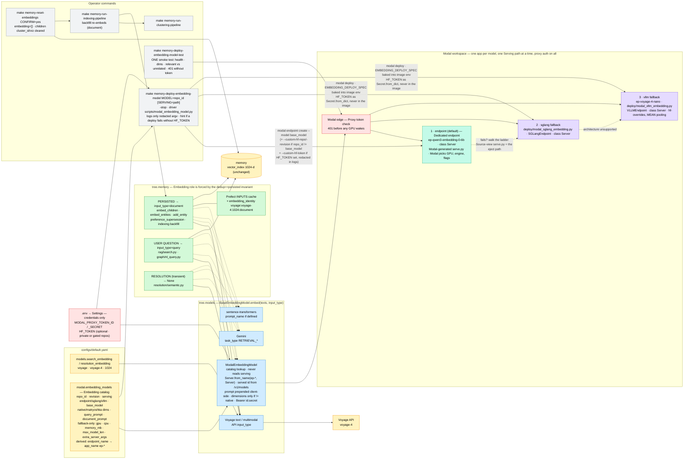

# ADR-009: Voyage 4, Embedding Roles, and a Catalog of Modal-Hosted Embedding Models

- **Status:** Accepted
- **Date:** 2026-09-19 (revised twice the same day, before tasks 138+ started: Dedicated endpoints added as the first Serving path — Decisions 2 and 3 rewritten; then the optional Hugging Face token brought into scope — Decision 9 added)
- **Deciders:** Paul (project owner)
- **Context references:**
  - `tasks/134-voyage-4-embedding-upgrade.md` … `tasks/142-modal-fallback-deploy-scripts-vllm-and-sglang.md` (this feature's task plan; execution order 134 … 140 -> 142 -> 141)
  - `ADR-001` (embedding model + dimension pinned in config; its `voyage-3` example is superseded IN PRACTICE by the pin below — the ADR text is unchanged)
  - `ADR-002` §1 (the `voyage-embeddings` rate limit at the real POST; `_CachedSingleEmbedding` never reaches a client) — unchanged
  - `ADR-006` §4 (only Child chunks are embedded; backfill by empty `embedding`) and its `rag/` ↛ `graph/` import rule — unchanged, relied on
  - `ADR-007` (Clustering run, stale-map warning contract) — unchanged, relied on
  - `ADR-008` §4 (`min_vector_score` provisional, evals-owned) — AMENDED here on one point: what happens to the pin when the embedding model changes
  - `docs/glossary.md` — **Embedding catalog**, **Serving path**, **Dedicated endpoint**, **Embedding role**, **Embedding reset**, **Proxy token** (added in this feature's grooming commits)
  - Modal docs, read 2026-09-19: `modal.com/docs/guide/dedicated-endpoints.md`, `modal.com/docs/cli/latest/endpoint.md`, `modal.com/docs/guide/endpoints.md`, `modal.com/docs/guide/secrets.md`

## Context

Four things were true at once. (1) The Voyage API moved to the 4 series (`voyage-4-large` $0.12,
`voyage-4` $0.06, `voyage-4-lite` $0.02, `voyage-code-4` $0.12 per 1M tokens; 32K context; 1024-d
default with 256/512/2048 Matryoshka; ONE shared embedding space that also contains the open-weight
`voyageai/voyage-4-nano`), while we still embedded with legacy `voyage-3.5`. (2) Every vector — a
stored chunk and a user's question alike — was embedded the same way, although Voyage, Gemini,
Qwen3 and most modern retrievers are asymmetric. (3) The "Modal provider" was one hard-coded script
for one model behind an engine-level API key held in a Modal secret, with a client that hard-coded
the app name, ignored `dimensions`, and cited a manifest file that never existed. (4) Modal now
offers **Dedicated Endpoints**: `modal endpoint create --model <base model> [--custom-hf-repo …
--custom-hf-revision … --custom-hf-token …]` — "Modal resolves the model, selects a compatible
serving recipe, and starts provisioning"; scale to zero by default, billed by GPU-second, proxy
tokens required by default, embedding models served through the OpenAI-compatible Embeddings API,
and a Source view whose generated `serve.py` "you can copy and adapt … into your own Modal App when
you need full control". The `serve.py` Modal generates for `Qwen/Qwen3-Embedding-0.6B` (app
`ep-qwen3-embedding-0-6b`, `class Server`, `VLLMEndpoint` from `autoinference-utils`,
`--runner pooling`) is exactly the template our own scripts were written from.

Constraints: `memory` rows carry no embedding-model stamp and the backfill only fills EMPTY
vectors; dedup compares the same vector it then persists (`pipeline.py`, "dedup vector == persisted
vector, computed once"); the vector index stays 1024-d; Modal re-imports a deploy script inside the
container, where the `tree` package is not installed; entry-point scripts hold no business logic;
a managed recipe exposes no engine flags, while `voyageai/voyage-4-nano` needs a custom
architecture (`VoyageQwen3BidirectionalEmbedModel` via `--hf-overrides`), MEAN pooling and
`--trust-remote-code`; SGLang 0.5.20 cannot serve it (onboarding PR sgl-project/sglang#18436 open
since April 2026) while vLLM serves it natively, and SGLang is the better-trodden path for
Qwen3-Embedding, BGE, E5, GTE-Qwen2 and EmbeddingGemma; the glossary already owns the word
**Deployment** (a registered Prefect flow); credentials live in `.env` / `Settings`, never in YAML;
the deploy driver logs the command it runs, Modal image layers are cached and inspectable, and some
embedding models worth serving are private or gated on the Hugging Face Hub (both seeds are public).

## Decision

Nine related choices, one design:

1. **`voyage-4` at 1024-d for BOTH `models.search_embedding` and `models.resolution_embedding`.**
   Same price as `voyage-3.5` ($0.06), same dimension, so the mongot `vector_index` is untouched.
   Dimension and price tables GAIN the 4 series and KEEP every legacy id (`voyage-3.x` is still
   served and the `TREE_MODELS__…` escape hatch must keep resolving).

2. **Three Serving paths per model, Dedicated endpoint first.** Every catalog entry names
   `serving: endpoint | sglang | vllm` (default `endpoint`).
   - `endpoint` — a Modal **Dedicated endpoint**, created by
     `modal endpoint create --name <endpoint_name> --model <base_model> --routing-region eu-west`,
     plus `--custom-hf-repo <repo_id> --custom-hf-revision <revision>` ONLY when the entry's
     `repo_id` differs from its `base_model` (custom weights). Zero code of ours: Modal picks the
     recipe, GPU, engine and flags.
   - `sglang` / `vllm` — our two FALLBACK scripts, `deploy/modal_sglang_embedding.py` and
     `deploy/modal_vllm_embedding.py`, same shape (`@app.server` on `class Server`, `@modal.enter`
     starts `SGLangEndpoint` / `VLLMEndpoint` from `autoinference-utils` then
     `validate_embeddings_endpoint`, `@modal.exit` stops it). They are Modal's own eject path — the
     Source-view `serve.py`, parameterised by the catalog — for what a managed recipe cannot take:
     an architecture override, a pooler config, `--trust-remote-code`, a pinned engine version.
   - **The ladder.** Try `endpoint`. If Modal has no compatible base model, the recipe fails to
     start, or the smoke test fails (wrong dimensions, relevant-vs-unrelated sanity, 401 check) →
     `sglang` if SGLang supports the architecture → else `vllm`. Record the path that worked in the
     YAML. `SERVING=<path>` on the Make targets walks the ladder for one command without editing
     YAML; the YAML stays the value the client reads.
   - Seeds: `Qwen/Qwen3-Embedding-0.6B` → `endpoint` (it IS in Modal's catalog). `voyageai/voyage-4-nano`
     → `vllm`, with `base_model: Qwen/Qwen3-Embedding-0.6B` so the e2e task can FIRST try it as custom
     weights on an endpoint; it flips to `endpoint` only if the endpoint's vectors match the vLLM
     script's (cosine ≥ 0.99 on three texts) — a wrong architecture returns well-shaped garbage.
   - The path is called `serving`, not `deployment`: a **Deployment** is a Prefect flow.
   - Two scripts rather than one abstraction: the engines differ in image, launcher and flags, and
     a second copy of ~60 glue lines is cheaper than an interface with two implementations. Both are
     kept by the owner's decision although no seed uses SGLang; the e2e task proves SGLang live via
     `SERVING=sglang` so it is not dead code. We do NOT vendor the unmerged SGLang PR.

3. **A YAML Embedding catalog, one Modal app per model, one way to find it.**
   `modal.embedding_models` in `configs/default.yaml`, validated by Pydantic, read through
   `tree.models.modal_catalog` by BOTH the deploy driver and the `ModalEmbeddingModel` client —
   names, native and Matryoshka dimensions and prompts have one source. Adding a model = one entry +
   `make memory-deploy-embedding-model MODEL=<repo_id>`; an unknown id fails loudly listing the
   catalog ids. `base_model` is required for `endpoint` (load-time error, and an override-time error
   for `SERVING=endpoint` without it). The fallback-only fields (`gpu`, `cpu`, `memory_mb`,
   `max_model_len`, `extra_server_args`) are OPTIONAL with defaults on every entry rather than
   forbidden on `endpoint` entries — the ladder needs them the moment an endpoint fails — and the
   driver logs that a Dedicated endpoint does not use them. The engine's embedding-mode flag
   (`--runner pooling` / `--is-embedding`) is builder-owned, so one entry can run under either script.
   One app per model (`ep-<endpoint_name>`), served by exactly ONE Serving path at a time, so a
   model is deployed, stopped and billed alone. **All three paths expose the same app name, the same
   server class (`Server`) and the same auth**, so the client resolves every model with
   `modal.Server.from_name(app_name, "Server")` and never reads `serving`. The served model id is
   discovered from `GET /v1/models`, because a managed recipe — not us — names it.
   *Assumed, not documented by Modal; proven in `tasks/141`'s log:* a Dedicated endpoint named `N`
   is the Modal app `ep-N` with class `Server`. If false: correct the name derivation; only if the
   app name is not derivable, resolve endpoint URLs from `modal endpoint list --json`. A `url:` field
   in the catalog is rejected (a workspace-specific URL in committed YAML).
   For the fallback scripts the resolved entry crosses into the container as ONE JSON env var baked
   into the image (`EMBEDDING_DEPLOY_SPEC`), read under `not modal.is_local()` — the only way to
   honour both "catalog logic lives in `src/tree/`" and "`tree` is not importable in the container".
   That spec holds configuration only; a credential never enters the image env (§9).
   Weights come from a shared `huggingface-cache` Volume by `repo_id` + `revision`.
   ONE smoke test (`tree.models.modal_server.smoke_test`), run by the driver, covers every path.

4. **Modal Proxy tokens are the only auth.** Dedicated endpoints require them by default; the
   fallback servers deploy with `unauthenticated=False`; the driver never passes `--unauthenticated`.
   Clients send `Authorization: Bearer <MODAL_PROXY_TOKEN_ID>.<MODAL_PROXY_TOKEN_SECRET>`, which is
   exactly what `AsyncOpenAI(api_key=…)` emits, and the `/health` warm-up sends the same header. The
   engine-level `--api-key`, `MODAL_EMBEDDING_API_KEY` and the `vllm-embedding-api-key` Modal
   secret are retired. Why: the edge rejects unauthenticated traffic BEFORE a GPU container wakes
   (an engine key is only checked after a billed cold start), one workspace credential covers every
   catalog app on every Serving path, and there is no per-app secret to bootstrap.

5. **The Embedding role is part of the embedding contract, and the role of every vector is forced.**
   `BaseEmbeddingModel.embed(texts, input_type: "query" | "document" | None = None)`.
   PERSISTED vectors (child chunks, entity nodes, preference/fact statements) are `document`;
   USER-QUESTION vectors (`rag/search.py`, `graph/nl_query.py`) are `query`; the transient
   resolution embedding (name-vs-name, never stored) is `None`. The persisted=document half is not
   a preference: dedup searches with the very vector it then writes, so a `query`-role dedup vector
   would either be persisted as a query vector or force a second embed call — both break the
   invariant. Providers map the role natively (Voyage `input_type`; Gemini `task_type`
   `RETRIEVAL_QUERY`/`RETRIEVAL_DOCUMENT`; sentence-transformers `prompt_name` when the model
   defines it; Modal prepends the catalog's `query_prompt`/`document_prompt` client-side because
   OpenAI-compatible `/v1/embeddings` has no role field — on all three Serving paths) and IGNORE a
   role they cannot honour.

6. **Caches carry the embedding identity.** The 90-day Prefect `INPUTS` cache on
   `embed-children` / `embed-entities` was keyed on texts alone; both tasks now take
   `embedding_identity` = `provider:model:dimensions:role` (`voyage:voyage-4:1024:document`), so a
   model or role change is a cache miss instead of a silent replay of old-space vectors. The
   resolution LRU only ever holds role-`None` vectors.

7. **Migration is an Embedding reset, not a model stamp.** `make memory-reset-embeddings`
   (per user, dry run unless `CONFIRM=yes`, idempotent) empties exactly the rows the backfill
   refills and clears the children's `cluster_id`/`viz`; the existing indexing phase re-embeds, the
   existing clustering phase re-maps. The backfill now embeds PREFERENCE/FACT on the same
   statement/object text as the inline path (one helper in `memory/embedding_text.py`), without
   which a reset would corrupt supersession. *Why not stamp rows with a model id:* it needs a
   schema field, a write on every row, a filter on every read and a policy for mixed collections —
   to automate an event that happens about once a year. The reset is ~40 lines and reuses two
   existing phases.

8. **A model change invalidates the similarity pins; re-pin, don't tune** (amends ADR-008 §4).
   `query.min_vector_score`, `extraction.resolution.semantic_threshold` and the dedup
   `auto_merge_threshold`/`flag_threshold` were observed on voyage-3.5. On a model or role change
   the SAME protocol is re-run live — ADR-008's two queries for `min_vector_score`; one
   true-duplicate and one distinct pair for the others — values move in 0.05 steps only on a
   recorded counter-example, and the evidence lives in the e2e task's log. The knobs remain
   provisional and owned by Chapter 7's evals.

9. **An optional Hugging Face token: one workspace credential — never in YAML, never in an image,
   never in a log.** `HF_TOKEN` (the variable `huggingface_hub`, vLLM and SGLang read natively) is an
   OPTIONAL `SecretStr` in `Settings` / `.env`, default empty = exactly the behaviour without this
   decision; nothing ever requires it. It is a weight-DOWNLOAD credential, not serving auth (§4 is
   unchanged), and it belongs to the workspace, not to a model — so it is not an Embedding catalog field.
   - `endpoint`: forwarded as `--custom-hf-token <token>` ONLY when the token is set AND the entry
     has custom weights — Modal documents the flag as the token "for private --custom-hf-repo".
     `modal_cli_command` stays token-free; `hf_token_args` appends the pair at the `subprocess.run`
     boundary; EVERY logged argv passes through `redact_argv` (`--custom-hf-token ***`); the driver
     runs the CLI with `check=False`, because `CalledProcessError` prints its argv. The token value
     never reaches a log line, an exception message, a Make recipe or a task `## Log`.
   - `sglang` / `vllm`: the container downloads the weights, so it must see `HF_TOKEN`. It arrives
     as `secrets=[modal.Secret.from_dict(hf_token_env())]`, built under `modal.is_local()`, with
     `Secret.from_dict({})` on the in-container re-import — the shape Modal's secrets guide documents
     for sending a local secret to an app. NOT in the image `.env(...)` beside
     `EMBEDDING_DEPLOY_SPEC`: image layers are cached and inspectable. NOT `Secret.from_name`: a
     named secret is a bootstrap step, which §4 just removed. The container logs only the boolean
     `HF_TOKEN set in container: True|False`.
   - A gated BASE model on a Dedicated endpoint is not covered by the flag → serve it through a
     fallback script.
   - **Missing token:** no pre-flight Hub call. A gated download fails inside the engine at
     container start; when the token is EMPTY and a deploy or the smoke test fails, the driver's last
     line says to set `HF_TOKEN`, and the README names the Hub's `401` / `403` / `GatedRepoError`.
   - **Residual risk, accepted:** while `modal endpoint create` runs, the token is in the local
     process list (`ps`) of the operator's own machine, and either path hands the token to Modal
     (that is the feature). Modal documents no env-var form of the flag (its own example is
     `--custom-hf-token $HF_TOKEN`); if the pinned client's `--help` shows one, the driver uses it
     and the argv form — with `hf_token_args` / `redact_argv` — is deleted.

Bias-to-least notes: a managed Dedicated endpoint over our own serving code, and our scripts only
where the managed recipe cannot go; one URL lookup for three Serving paths over a per-path
resolver; a YAML list over a model registry service; two scripts over an engine interface; Modal's
built-in proxy auth over our own key + secret; one optional `HF_TOKEN` setting, two 3-line pure
functions and an ephemeral `Secret.from_dict` over a per-model token field, a command/secret
structure or a named Modal Secret to bootstrap; one hint line over a pre-flight Hub check;
a task input over a custom cache key function; a reset command + two existing phases over
row stamping; client-side prompt strings over a prompt-template engine; per-engine versions over
per-model versions.

## Diagram

## Consequences

- **One re-embed per environment, per user, by hand.** Until an operator runs reset → indexing
  (→ clustering), a database holds voyage-3.5 role-less vectors queried with voyage-4 query
  vectors: scores are meaningless and `min_vector_score` may hide everything. Between reset and
  indexing, search runs on the text leg only. Nothing detects a forgotten migration — that is the
  accepted price of not stamping rows.
- **Roles change every persisted vector**, which is why they land before the reset: the feature
  pays for exactly one re-embed. Changing the role rule later costs another reset.
- **Retrieval gets asymmetric for free on every provider**, and symmetric comparisons
  (dedup in document space, resolution with no role) stay symmetric. A provider without roles
  silently behaves as before — by design, a role is a hint, never a correctness input.
- **Cached vectors can no longer cross a model or role boundary**; the cost is one cold cache after
  this feature merges (every `embed-children` / `embed-entities` call misses once).
- **Thresholds are re-pinned with evidence, not re-tuned.** If voyage-4's score distribution
  differs, up to four YAML defaults move by 0.05 steps with their scores in `tasks/141`'s log; the
  evals chapter still owns them.
- **The common case costs no code and no image build.** A model in Modal's endpoint catalog is one
  6-line YAML entry and one command. The price of the managed recipe: Modal picks the engine, its
  version and its flags (we cannot pin or reproduce them from the repo), hardware and
  min/max/buffer containers are dashboard-only (not in YAML, not reviewable), the served model id
  is Modal's choice (hence discovery), and an endpoint's behaviour can change when Modal updates a
  recipe — the smoke test is the only guard.
- **Custom weights are a bet, checked by vectors, not by shape.** "Closest supported base model"
  loads the weights under the base model's architecture; when that differs (voyage-4-nano's
  bidirectional attention) the endpoint answers 1024 well-formed floats that mean nothing. The
  smoke test's relevant-vs-unrelated assertion catches gross failures; promoting a custom-weights
  model to `endpoint` additionally needs the vector-equivalence evidence recorded in `tasks/141`.
- **The fallback scripts are the eject path, not a parallel product.** They exist for what a recipe
  cannot express and are where full control lives (GPU, engine pin, flags in YAML). They will drift
  unless kept boring: glue over shared helpers, pinned by one static test file, proven live through
  `SERVING=`; if a third engine arrives, that is the moment to extract the common skeleton — not before.
- **One app name per model across paths** keeps the client path-blind, and means an endpoint and a
  fallback of the SAME model cannot be live together — stop one before deploying the other. It also
  rests on an undocumented Modal naming rule (endpoint `N` → app `ep-N`, class `Server`); if Modal
  changes it, `resolve_server_url` is the single place that breaks and the single place to fix.
- **`SERVING=` can make the YAML lie for a while.** The override changes one command, not the
  catalog; harmless to the client (path-blind), but `-stop` needs the same `SERVING=`, and the YAML
  should be updated to the path that actually worked.
- **The catalog can still be wrong about a model** (a bad prompt, a wrong `native_dimensions`) —
  the smoke test asserts the vector length and a coarse sanity ordering, nothing asserts the prompt.
- **Whitespace-free server-arg values** are a constraint imported from `autoinference-utils`
  (it splits values into argv tokens); the config validator turns it into a load-time error instead
  of a container that dies on a mangled `--pooler-config`. It applies to the fallback paths only.
- **Auth moves from "a secret we mint" to "a credential Modal mints".** Unauthenticated requests
  never wake a GPU. Rotating the proxy token rotates access to every catalog app at once; there is
  no per-model credential. The CLI token that authorises `modal deploy` / `modal endpoint create`
  is separate and unchanged.
- **Private and gated repos work with one `.env` line, and cost nothing when unused.** An empty
  `HF_TOKEN` changes no argv and attaches an empty Secret. What we pay: redaction is a discipline,
  not a type — any NEW code that logs or raises the run argv re-opens the leak, which is why
  `modal_cli_command` stays token-free, `check=True` is banned in the driver and two unit tests
  assert the secret is absent from captured output (including the failure path). The token is
  exposed in the local process list for the seconds a create runs. A token rotated in `.env` reaches
  a fallback app only on its next deploy, and a Dedicated endpoint only on re-create. One token
  serves every model — two Hub identities are not supported. The path is proven live on PUBLIC
  weights only (`tasks/141`: redacted argv, leak check, `HF_TOKEN set in container: True`); that a
  token unlocks a gated download is Hugging Face's and Modal's contract. A missing token surfaces
  late (at container start) and is explained by a hint, not prevented.
- **What would justify upgrading.** Modal shipping an env-var form of `--custom-hf-token` → drop
  the argv form and its redaction; a second Hub identity, or a team workspace where the token should
  not live on laptops → a named Modal Secret (`Secret.from_name`) created once, optionally named per
  catalog entry; repeated late failures on gated repos → a pre-flight `huggingface_hub` access check
  in the driver; Modal exposing recipe flags or the SGLang voyage PR merging → move voyage-4-nano up
  the ladder by editing one YAML word; endpoint scaling knobs appearing in the CLI → catalog fields
  for them; a second embedding model live at the same time, or a partial migration that must be
  resumable across days → an `embedding_model` stamp on rows plus filter-by-stamp reads; two models
  needing different engine versions → a per-entry `engine_version` override; measured cold-start
  pain → weight snapshots / `min_containers > 0`; measured retrieval regressions from a catalog
  prompt → per-task prompt variants owned by evals.
