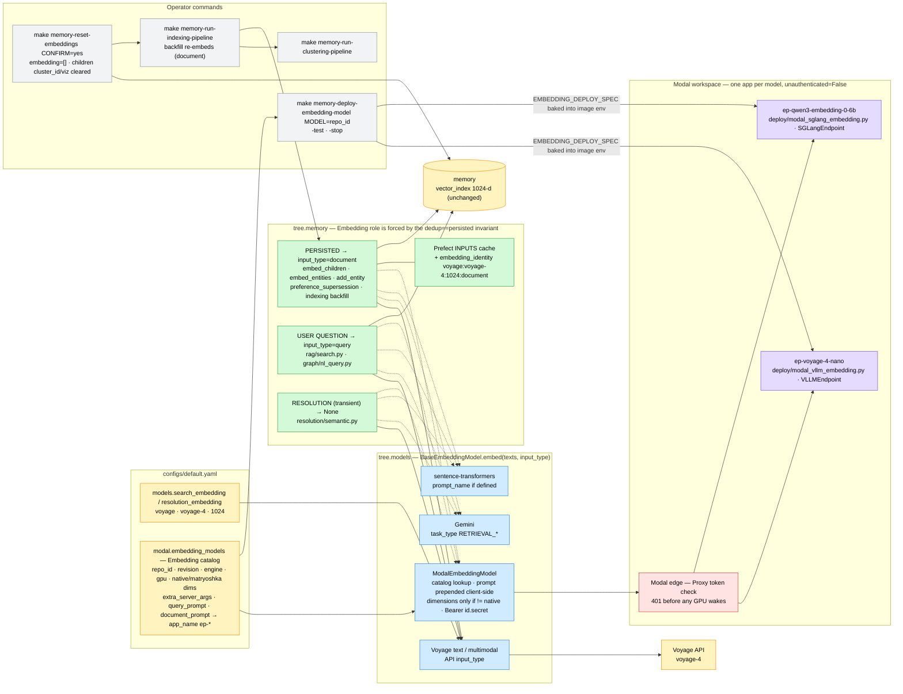

# ADR-009: Voyage 4, Embedding Roles, and a Catalog of Modal-Hosted Embedding Models

- **Status:** Accepted
- **Date:** 2026-09-19
- **Deciders:** Paul (project owner)
- **Context references:**
  - `tasks/134-voyage-4-embedding-upgrade.md` … `tasks/141-voyage-4-and-modal-e2e-threshold-repin.md` (this feature's task plan)
  - `ADR-001` (embedding model + dimension pinned in config; its `voyage-3` example is superseded IN PRACTICE by the pin below — the ADR text is unchanged)
  - `ADR-002` §1 (the `voyage-embeddings` rate limit at the real POST; `_CachedSingleEmbedding` never reaches a client) — unchanged
  - `ADR-006` §4 (only Child chunks are embedded; backfill by empty `embedding`) and its `rag/` ↛ `graph/` import rule — unchanged, relied on
  - `ADR-007` (Clustering run, stale-map warning contract) — unchanged, relied on
  - `ADR-008` §4 (`min_vector_score` provisional, evals-owned) — AMENDED here on one point: what happens to the pin when the embedding model changes
  - `docs/glossary.md` — **Embedding catalog**, **Embedding role**, **Embedding reset**, **Proxy token** (added in this feature's grooming commit)

## Context

Three things were true at once. (1) The Voyage API moved to the 4 series (`voyage-4-large` $0.12,
`voyage-4` $0.06, `voyage-4-lite` $0.02, `voyage-code-4` $0.12 per 1M tokens; 32K context; 1024-d
default with 256/512/2048 Matryoshka; ONE shared embedding space that also contains the open-weight
`voyageai/voyage-4-nano`), while we still embedded with legacy `voyage-3.5`. (2) Every vector — a
stored chunk and a user's question alike — was embedded the same way, although Voyage, Gemini,
Qwen3 and most modern retrievers are asymmetric. (3) The "Modal provider" was one hard-coded script
for one model behind an engine-level API key held in a Modal secret, with a client that hard-coded
the app name, ignored `dimensions`, and cited a manifest file that never existed.

Constraints: `memory` rows carry no embedding-model stamp and the backfill only fills EMPTY
vectors; dedup compares the same vector it then persists (`pipeline.py`, "dedup vector == persisted
vector, computed once"); the vector index stays 1024-d; Modal re-imports a deploy script inside the
container, where the `tree` package is not installed; entry-point scripts hold no business logic;
SGLang 0.5.20 cannot serve `voyageai/voyage-4-nano` (custom `VoyageQwen3BidirectionalEmbedModel`;
onboarding PR sgl-project/sglang#18436 open since April 2026) while vLLM serves it natively, and
SGLang is the better-trodden path for Qwen3-Embedding, BGE, E5, GTE-Qwen2 and EmbeddingGemma.

## Decision

Eight related choices, one design:

1. **`voyage-4` at 1024-d for BOTH `models.search_embedding` and `models.resolution_embedding`.**
   Same price as `voyage-3.5` ($0.06), same dimension, so the mongot `vector_index` is untouched.
   Dimension and price tables GAIN the 4 series and KEEP every legacy id (`voyage-3.x` is still
   served and the `TREE_MODELS__…` escape hatch must keep resolving).

2. **Two inference engines, chosen per model.** `deploy/modal_vllm_embedding.py` and
   `deploy/modal_sglang_embedding.py`, same shape (`@app.server` class, `@modal.enter` starts
   `VLLMEndpoint` / `SGLangEndpoint` from `autoinference-utils` then
   `validate_embeddings_endpoint`, `@modal.exit` stops it, a proxy-authenticated local smoke
   entrypoint). Each catalog entry names its `engine`. Two scripts rather than one abstraction:
   the engines differ in image, launcher and flags, and a second copy of ~80 glue lines is cheaper
   than an interface with two implementations. We do NOT vendor the unmerged SGLang PR; when it
   ships, moving voyage-4-nano is a one-word YAML edit.

3. **A YAML Embedding catalog, one Modal app per model.** `modal.embedding_models` in
   `configs/default.yaml`, validated by Pydantic, read through `tree.models.modal_catalog` by BOTH
   the deploy scripts and the `ModalEmbeddingModel` client — app name (`ep-<model>`), native and
   Matryoshka dimensions, server args and prompts have one source. Adding a model = one entry +
   `make memory-deploy-embedding-model MODEL=<repo_id>`; an unknown id fails loudly listing the
   catalog ids. One app per model so a model is deployed, stopped and billed alone. The resolved
   entry crosses into the container as ONE JSON env var baked into the image
   (`EMBEDDING_DEPLOY_SPEC`), read under `not modal.is_local()` — the only way to honour both
   "catalog logic lives in `src/tree/`" and "`tree` is not importable in the container". Weights
   come from a shared `huggingface-cache` Volume by `repo_id` + `revision`; no pre-baked snapshot.

4. **Modal Proxy tokens are the only auth.** Servers deploy with `unauthenticated=False`; clients
   send `Authorization: Bearer <MODAL_PROXY_TOKEN_ID>.<MODAL_PROXY_TOKEN_SECRET>`, which is exactly
   what `AsyncOpenAI(api_key=…)` emits, and the `/health` warm-up sends the same header. The
   engine-level `--api-key`, `MODAL_EMBEDDING_API_KEY` and the `vllm-embedding-api-key` Modal
   secret are retired. Why: the edge rejects unauthenticated traffic BEFORE a GPU container wakes
   (an engine key is only checked after a billed cold start), one workspace credential covers every
   catalog app, and there is no per-app secret to bootstrap.

5. **The Embedding role is part of the embedding contract, and the role of every vector is forced.**
   `BaseEmbeddingModel.embed(texts, input_type: "query" | "document" | None = None)`.
   PERSISTED vectors (child chunks, entity nodes, preference/fact statements) are `document`;
   USER-QUESTION vectors (`rag/search.py`, `graph/nl_query.py`) are `query`; the transient
   resolution embedding (name-vs-name, never stored) is `None`. The persisted=document half is not
   a preference: dedup searches with the very vector it then writes, so a `query`-role dedup vector
   would either be persisted as a query vector or force a second embed call — both break the
   invariant. Providers map the role natively (Voyage `input_type`; Gemini `task_type`
   `RETRIEVAL_QUERY`/`RETRIEVAL_DOCUMENT`; sentence-transformers `prompt_name` when the model
   defines it; Modal prepends the catalog's `query_prompt`/`document_prompt` client-side because
   OpenAI-compatible `/v1/embeddings` has no role field) and IGNORE a role they cannot honour.

6. **Caches carry the embedding identity.** The 90-day Prefect `INPUTS` cache on
   `embed-children` / `embed-entities` was keyed on texts alone; both tasks now take
   `embedding_identity` = `provider:model:dimensions:role` (`voyage:voyage-4:1024:document`), so a
   model or role change is a cache miss instead of a silent replay of old-space vectors. The
   resolution LRU only ever holds role-`None` vectors.

7. **Migration is an Embedding reset, not a model stamp.** `make memory-reset-embeddings`
   (per user, dry run unless `CONFIRM=yes`, idempotent) empties exactly the rows the backfill
   refills and clears the children's `cluster_id`/`viz`; the existing indexing phase re-embeds, the
   existing clustering phase re-maps. The backfill now embeds PREFERENCE/FACT on the same
   statement/object text as the inline path (one helper in `memory/embedding_text.py`), without
   which a reset would corrupt supersession. *Why not stamp rows with a model id:* it needs a
   schema field, a write on every row, a filter on every read and a policy for mixed collections —
   to automate an event that happens about once a year. The reset is ~40 lines and reuses two
   existing phases.

8. **A model change invalidates the similarity pins; re-pin, don't tune** (amends ADR-008 §4).
   `query.min_vector_score`, `extraction.resolution.semantic_threshold` and the dedup
   `auto_merge_threshold`/`flag_threshold` were observed on voyage-3.5. On a model or role change
   the SAME protocol is re-run live — ADR-008's two queries for `min_vector_score`; one
   true-duplicate and one distinct pair for the others — values move in 0.05 steps only on a
   recorded counter-example, and the evidence lives in the e2e task's log. The knobs remain
   provisional and owned by Chapter 7's evals.

Bias-to-least notes: a YAML list over a model registry service; two scripts over an engine
interface; Modal's built-in proxy auth over our own key + secret; a task input over a custom cache
key function; a reset command + two existing phases over row stamping; client-side prompt strings
over a prompt-template engine; per-engine versions over per-model versions.

## Diagram

## Consequences

- **One re-embed per environment, per user, by hand.** Until an operator runs reset → indexing
  (→ clustering), a database holds voyage-3.5 role-less vectors queried with voyage-4 query
  vectors: scores are meaningless and `min_vector_score` may hide everything. Between reset and
  indexing, search runs on the text leg only. Nothing detects a forgotten migration — that is the
  accepted price of not stamping rows.
- **Roles change every persisted vector**, which is why they land before the reset: the feature
  pays for exactly one re-embed. Changing the role rule later costs another reset.
- **Retrieval gets asymmetric for free on every provider**, and symmetric comparisons
  (dedup in document space, resolution with no role) stay symmetric. A provider without roles
  silently behaves as before — by design, a role is a hint, never a correctness input.
- **Cached vectors can no longer cross a model or role boundary**; the cost is one cold cache after
  this feature merges (every `embed-children` / `embed-entities` call misses once).
- **Thresholds are re-pinned with evidence, not re-tuned.** If voyage-4's score distribution
  differs, up to four YAML defaults move by 0.05 steps with their scores in `tasks/141`'s log; the
  evals chapter still owns them.
- **Any Hugging Face embedding model an engine supports is one YAML entry away**, and the client
  can no longer disagree with the deployment about app name, dimensions or prompts. The catalog
  can be wrong about a model (a bad prompt, a wrong `native_dimensions`) — the smoke entrypoint
  asserts the vector length, nothing asserts the prompt.
- **Whitespace-free server-arg values** are a constraint imported from `autoinference-utils`
  (it splits values into argv tokens); the config validator turns it into a load-time error instead
  of a container that dies on a mangled `--pooler-config`.
- **Auth moves from "a secret we mint" to "a credential Modal mints".** Unauthenticated requests
  never wake a GPU. Rotating the proxy token rotates access to every catalog app at once; there is
  no per-model credential. The CLI token that authorises `modal deploy` is separate and unchanged.
- **Two scripts will drift unless kept boring.** They are glue over shared helpers and are pinned
  by one static test file; if a third engine arrives, that is the moment to extract the common
  skeleton — not before.
- **What would justify upgrading.** A second embedding model live at the same time, or a partial
  migration that must be resumable across days → an `embedding_model` stamp on rows plus
  filter-by-stamp reads; the SGLang voyage PR merging → flip the entry's `engine`; two models
  needing different engine versions → a per-entry `engine_version` override; measured cold-start
  pain → weight snapshots / `min_containers > 0` per entry; measured retrieval regressions from a
  catalog prompt → per-task prompt variants owned by evals.
