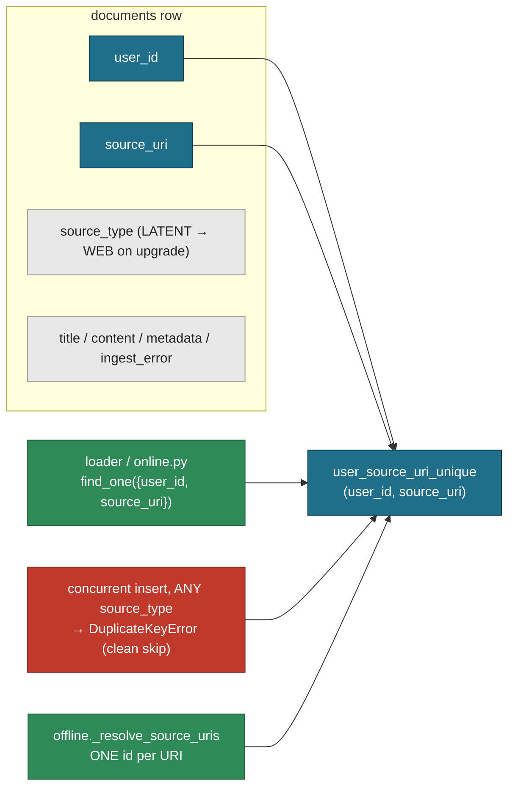

# ADR-010: The Document Natural Key Is `(user_id, source_uri)`

- **Status:** Accepted — supersedes [001](001_data_model_ontology.md) §2 Consequences and §4 on ONE point: the `documents` unique key. Every other ADR-001 decision stands.
- **Date:** 2026-10-01
- **Deciders:** Paul (project owner)
- **Context references:**
  - `tasks/161-document-unique-key-user-id-source-uri.md` (this feature's single task)
  - `ADR-001` §2 (multi-tenancy; its Consequences line named `(user_id, source_type, source_uri)`) and §4 (conversations; same key) — SUPERSEDED on the key only
  - `ADR-008` §1 (**Ingest receipt** carries `source_uri` as the Document's natural key; `duplicate` is a `(user_id, source_uri)` pre-flight) — unchanged, relied on
  - `docs/glossary.md` — **Document** ("Deduped on `(user_id, source_uri)`"), **Ingest receipt**
  - `apps/memory/src/tree/entities/documents.py` (`user_source_uri_unique`), commit `a1085c0` (where `source_type` entered the key)

## Context

Before multi-tenancy `Document.source_uri` alone was unique. Commit `a1085c0` (ADR-001 §2)
tenant-scoped the index and carried `source_type` into it, so the declared key became
`(user_id, source_type, source_uri)`. Nothing else ever treated `source_type` as part of the
key: every loader (`file`, `web`, `substack`, `youtube`, `arxiv`, `conversation`) and
`tree.online.dispatch_online_pipeline` dedupe with `find_one({"user_id", "source_uri"})`, and a
`SourceType.LATENT` placeholder is upgraded IN PLACE by rewriting its `source_type` to the
real one — a row's `source_type` changes over its life, which a key component cannot do.

The mismatch has one concrete cost: the `DuplicateKeyError` race guard in the loaders only
fires when the racing rows share a `source_type`, so a `LATENT` row and a `WEB` row for the
same URI can coexist under one tenant. `tree.offline._resolve_source_uris` then has to
return "all rows for a URI" and its docstring explains the two-`source_type` case — code
that exists only to tolerate the mismatch.

## Decision

1. **The Document natural key is `(user_id, source_uri)`.** The `documents` unique index
   `user_source_uri_unique` is declared on `[("user_id", 1), ("source_uri", 1)]` — same name,
   `source_type` removed. `source_type` is a row attribute (the LATENT upgrade rewrites it),
   never part of identity. This is the key the glossary, ADR-008's receipt and every dedup
   call site already use.
2. **No migration.** No startup index drop, no script, no `allow_index_dropping`. A database
   created on the old key is dropped by hand (local: one-shot `mongosh … dropDatabase()`,
   nothing committed) and recreated by `init_beanie` on next boot. Prod database changes are
   out of this feature's scope.
3. **One Document per URI, by construction.** `_resolve_source_uris` resolves ONE id per
   `source_uri`; the "several rows per URI" handling is deleted rather than kept "just in
   case" — the index now makes that state impossible.
4. **`source_uri` is stored clean.** A `Document` validator runs every URI through
   `tree.entities.documents.clean_source_uri`: for `http(s)` only, it lowercases the scheme and
   host, drops the `#fragment` and tracking params (`utm_*`, `fbclid`, `gclid`, `si`, …), and
   keeps identity params byte-identical (`watch?v=abc`, `item?id=4012`). Every lookup keys on
   the same function, so `https://x.com/p?utm_source=a` and `https://x.com/p` are ONE Document.

What would justify revisiting: a source whose identity genuinely needs `source_type`
(the same URI meaning two different things for one user). None exists; the LATENT upgrade
is evidence the opposite is wanted.

## Diagram

## Consequences

- The loaders' `DuplicateKeyError` guard now covers every race on the same URI, including a
  `LATENT` placeholder racing a real row; the "two rows for one URI" state cannot exist.
- `_resolve_source_uris` is simpler (`dict[str, str]`, one id per URI); the
  `offline-pipeline: resolved N source_uris to N document_ids` line keeps its shape.
- Any existing database must be dropped and re-ingested to pick up the new index — accepted
  for this project's size; there is deliberately no migration path.
- ADR-001's text is unchanged except its Status line; its §2/§4 mentions of the triple read
  as history. Docstrings and comments in `apps/memory/src`, `apps/memory/tests` and
  `docs/notes/conversations-storage-tradeoffs.md` are corrected in task 161.
