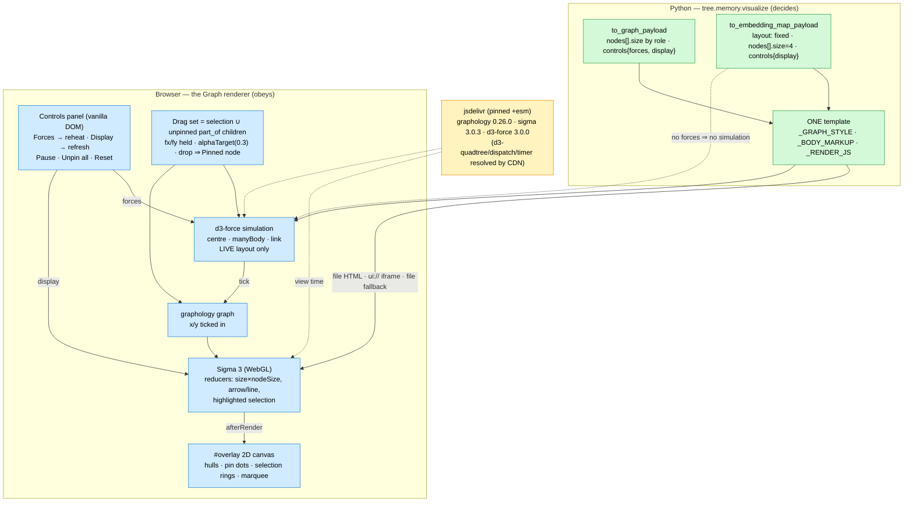

# ADR-011: Live d3-force Layout and Direct Manipulation in the Graph Renderer

- **Status:** Accepted — amends [005](005_single_graph_rendering_stack.md) Decision 1 (the layout library: graphology-layout-forceatlas2 → d3-force, one-shot → live) and Decision 2's import list; ADR-005's single-renderer and CDN decisions stand. Reaffirms [007](007_embedding_clusters_and_explicit_offline_phases.md) §2 (the Embedding map keeps its stored coordinates).
- **Date:** 2026-10-01
- **Deciders:** Paul (project owner)
- **Context references:**
  - `tasks/162-d3-force-live-layout-and-pin-on-drop.md`, `tasks/163-multi-select-group-drag-and-rigid-children.md`, `tasks/164-graph-controls-panel.md` (this feature's task plan)
  - `apps/memory/src/tree/memory/visualize/graph.py` (the renderer), `apps/memory/src/tree/memory/visualize/embeddings.py` (the map payload), `apps/memory/src/tree/mcp/viz_app.py` (the `ui://` variant + CSP)
  - Reference implementation: `pulse` (`/Users/pauliusztin/Documents/01-Projects/scrabble/scrabble/src/pulse/viz/static/graph.html`, `assets.py`, `render_html.py`) — ported, not shared code
  - `docs/glossary.md` — **Pinned node** (added), **Graph payload**, **Graph renderer**, **Embedding map** (amended in this feature's grooming commit)

## Context

Every graph surface — `make memory-query-graph`, the `visualize_memory_graph` / `query_memory` /
`search_memory` MCP App iframe, the `.tree/graphs/` file fallback — draws through the ONE template
in `tree.memory.visualize.graph` (ADR-005). That template lays a graph out ONCE with
`forceAtlas2.assign(graph, {iterations: 300})` and then freezes: dragging rewrites one node's
`x`/`y` and nothing reacts, nodes are all size 6, chunks' parent/child roles show only in tooltips,
there is no selection and no way to tune the picture. The author's other project, `pulse`, has the
interaction model the human wants: d3-force owns positions live, drag holds a node with `fx`/`fy`
under `alphaTarget(0.3)` so neighbours follow, sliders reheat the simulation, and a vanilla-DOM panel
seeds from Python. The Embedding map (ADR-007 §2) is the one surface whose coordinates MEAN
something (UMAP) — it must not be simulated, yet it should not be a second, dumber viewer.

Facts verified during grooming (2026-10-01): `https://cdn.jsdelivr.net/npm/d3-force@3.0.0/+esm`
is a 200 ESM bundle that imports `d3-quadtree@3.0.1`, `d3-dispatch@3.0.1`, `d3-timer@3.0.1` from
jsdelivr itself and exports `forceSimulation/forceLink/forceManyBody/forceCenter`; sigma 3.0.3
registers `arrow` and `line` edge programs by default and exposes `setCustomBBox`, `scaleSize`,
`doubleClickNode`, the captor's `mousemovebody`; sigma CORE does not ship `createNodeBorderProgram`
(that is `@sigma/node-border`); headless Chrome renders sigma's WebGL with
`--use-angle=swiftshader --enable-unsafe-swiftshader` but a d3 simulation does not settle inside a
`--virtual-time-budget`.

## Decision

Six related choices, one design:

1. **d3-force replaces graphology-layout-forceatlas2, and the layout is LIVE.** The renderer builds
   `forceSimulation(nodes)` with three forces — `forceCenter`, `forceManyBody` (slider × 30, pulse's
   `REPEL_SCALE`), `forceLink` (self-loops excluded) — ticks positions into graphology and lets sigma
   redraw; it cools to a stop on d3's default `alphaDecay`. Why d3-force over FA2's `supervisor`/
   worker: pulse's model is proven for exactly these gestures (hold with `fx`/`fy`, `alphaTarget`
   while dragging, `alpha(0.5)` reheat), it is ~8 KB, and it needs no WebWorker to feel live.
   Bias-to-least on the count of layout engines: FA2 is deleted, not kept as an option.

2. **Still pinned ESM from jsdelivr, now four imports: `graphology@0.26.0`, `sigma@3.0.3`,
   `d3-force@3.0.0` (+esm, its three deps resolved by the CDN), and the MCP ext-apps runtime.**
   ADR-005 Decision 2 stands (no vendoring, no SRI on generated `+esm` bundles, the CSP already
   allows jsdelivr). Upgrade trigger unchanged: an air-gapped deployment or a supply-chain policy.

3. **The Embedding map runs NO simulation but shares every interaction.** `layout: "fixed"` keeps
   ADR-007 §2's meaning (stored UMAP coordinates) and is now ALSO signalled by the payload's
   `controls` carrying no `forces`. Pin state, selection, group drag, rigid children, the overlay
   and the Display knobs are the same code on both layouts — the map simply never constructs a
   `forceSimulation`, so dragging moves only what the user holds.

4. **Direct manipulation semantics (the "pulse model", extended):** drag pulls unpinned neighbours
   live; a DROPPED node stays pinned (**Pinned node**, `fx != null`, dark centre dot); double-click
   unpins; Shift+click toggles selection, Shift+drag on the stage box-selects, Esc / stage click
   clears; dragging a selected node moves the whole selection keeping offsets; every dragged node
   carries its unpinned direct `part_of` children (one level, child → parent direction of the
   stored edge) by the same delta so a star keeps its shape, and those children resume settling on
   drop; user-pinned nodes are never carried. The first drag or marquee freezes the viewport with
   `setCustomBBox`, and it STAYS frozen after release so a dropped node lands where the cursor let
   go; only the zoom-fit button clears it (`setCustomBBox(null)` + `animatedReset`). A press must
   move 3 px before it pins, reheats or freezes; only the left button starts a drag.

5. **One 2D overlay canvas for everything sigma cannot draw.** The hull canvas (`#hulls-layer`)
   becomes `#overlay` and draws, per `afterRender`, in order: cluster hulls, pin dots, selection
   rings, the marquee. Chosen over `@sigma/node-border` (a fifth CDN import for a border ring) and
   over per-node sigma programs: the canvas already exists, is `pointer-events: none`, and is
   redrawn in viewport space anyway. Upgrade trigger: rings/dots on thousands of nodes measurably
   lag — then move markers into a node program.

6. **Python decides, the JS obeys.** `to_graph_payload` resolves a per-node `size` by role
   (`document 10 > parent chunk 7 > entities 6 > child chunk 4`) and ships
   `controls: {forces, display}` defaults; `to_embedding_map_payload` ships per-node `size: 4` and
   `controls: {display}`. The panel's sliders are multipliers/switches over those values; the
   template contains no default of its own. Nothing is persisted (no localStorage/URL state) —
   a reload is "Reset to defaults" + "Unpin all". Upgrade trigger for persistence: the human asking
   for a layout they can come back to, which would be a `graphs://`-side concern, not a template one.

**Verification stance (not a design choice, recorded so it is not re-litigated per task):** the
repo has no browser test suite and this feature does not add one. Unit tests pin the HTML/JS
contract (tokens in BOTH template variants, payload keys); the Tester runs a headless-Chrome
`--dump-dom` smoke that proves the page boots and the simulation starts
(`<body data-layout="live" data-sim="running">`, filled counts/legend); gestures and settling are
human checks recorded in the task Log.

## Diagram

## Consequences

- **Layouts are no longer deterministic and the view "breathes".** FA2 gave the same picture per
  seed; a live sim settles slightly differently each load, and sigma's auto-rescale refits the
  camera as the bounding box changes while settling (pulse accepts the same). Accepted — the pin /
  Pause / Unpin-all gestures exist precisely so the operator, not the layout, has the last word.
- **CPU while settling.** `forceManyBody` is O(n log n) per tick; a 3 000-node full graph is fine on
  a laptop and the sim stops by itself (`alphaDecay`). `Pause` is the escape hatch for larger graphs;
  a WebWorker layout stays a non-goal until a measured need.
- **Contract changes, all surfaces at once.** Node `size` and `controls` enter the **Graph payload**
  and the map payload (`nodeSize` leaves); `#hulls-layer` is renamed `#overlay`; tests that pinned
  the FA2 guard string move to the `forceSimulation` guard. The `ui://` iframe and the file variant
  stay token-identical except for the ext-apps runtime and the body height.
- **Offline regression unchanged.** Four CDN imports instead of three; no network → blank canvas,
  as ADR-005 accepted.
- **Headless evidence is bounded.** A DOM dump proves boot and "simulation running", not settling or
  gestures; those stay human checks until a browser automation dependency earns its keep.
- **The Embedding map gets richer without losing meaning.** Coordinates are untouched unless the
  user drags; pin dots, selection and the Display knobs come for free from the shared code.
- ADR-005's text is unchanged except its Status line; its Decision 1/2 mentions of
  `graphology-layout-forceatlas2` read as history.
