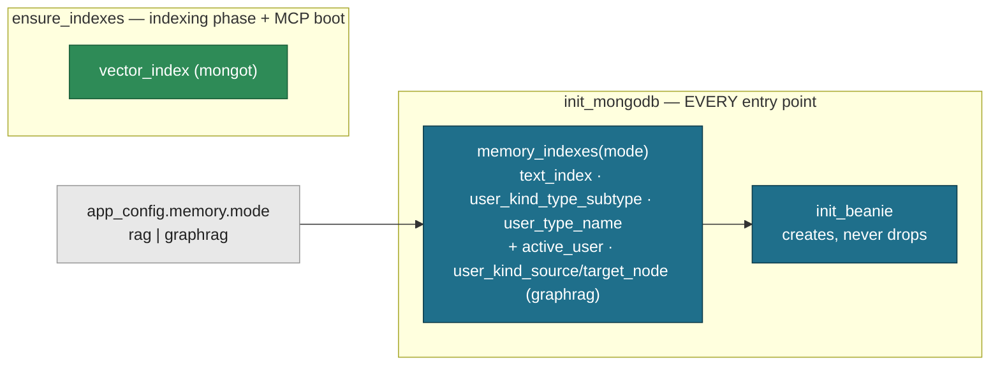

# ADR-012: A Mode-Aware Classic Index Set on the `memory` Collection, Owned by Beanie

- **Status:** Accepted — relies on [006](006_rag_graphrag_memory_modes.md) (one `memory.mode` per deployment; switching modes drops `memory`); every ADR-006 decision stands — `active_user` scoped to `graphrag` by task 170 (`tasks/170-rag-mode-without-person-self.md`) — §1–§2's `text_index` left the Beanie set: the lexical leg reads the mongot `text_search_index`, `ensure_indexes` owns BOTH mongot indexes and performs the one retirement drop of `text_index` (§3's "nothing drops" holds for every other index), per [015](015_atlas_search_text_leg_min_match_ratio.md) §1, §5–§7 (tasks 190–191).
- **Date:** 2026-10-02
- **Deciders:** Paul (project owner)
- **Context references:**
  - `tasks/169-mode-aware-memory-indexes.md` (this change's single task)
  - `docs/notes/plan_mongodb.md` (the code audit + local `explain` / `$indexStats` evidence behind every decision below)
  - `ADR-006` §5 (one `memory.mode` switch) and its Consequences ("Operators switching modes drop the `memory` collection") — relied on, unchanged
  - `docs/glossary.md` — **`memory` collection**, **Memory mode**
  - `apps/memory/src/tree/entities/memory.py` (`memory_indexes`, `ACTIVE_USER_FILTER`), `apps/memory/src/tree/db.py` (`init_mongodb`), `apps/memory/src/tree/memory/rag/indexing.py` (`ensure_indexes`)

## Context

The `memory` collection carried 11 classic indexes, declared in two places: four in
`MemoryEntry.Settings.indexes` plus `kind: Indexed(str)` (created by `init_beanie` on every boot), and
five more created by `create_index` calls in `ensure_indexes` (the indexing phase and MCP boot).
`user_type_semantic_type` was declared in both. A code audit (2026-10-02) against local
`explain("executionStats")` and `$indexStats` found:

- `user_kind_type` is a pure prefix of `user_kind_type_subtype`, and the planner picks the same plans with either.
- `user_type_semantic_type` and `user_canonical_name_index` serve no production query. No reader
  filters on `semantic_type` or `canonical_name`. Resolution matches names in Python over a
  `{user_id, kind, type, merged_into}` fetch.
- `user_kind_embedding` is MULTIKEY over the 1024-float vector: ~16 KB of index per embedded row
  locally (1.57 MB / 97 rows), on top of ~14 KB of BSON per row. On prod's Atlas M0 (512 MB for data
  plus indexes) that is ~230 MB at the ≥14k rows waiting for the first memory run. It serves one read,
  the embedding backfill, once per indexing run.
- `kind_1` is the only index the cross-tenant `select_active_user_ids` fan-out can use (it has no
  `user_id`): 103 keys / 103 docs examined locally for 1 result. Dropping it without a replacement
  turns the 03:00 UTC dream and data fan-outs into COLLSCANs.
- `user_kind_source_node` / `user_kind_target_node` serve the two `$graphLookup` passes of
  `expand_graph`, which exist only in `graphrag`. `rag` writes no edges, yet it carried both.

Prod `tree.memory` is empty, and M0 offers no Performance Advisor and denies `$indexStats`. So no
prod usage evidence exists, and the decision rests on the audit.

## Decision

1. **Beanie owns every classic `memory` index, bound per mode at boot.**
   `tree.entities.memory.memory_indexes(mode)` returns the set. `tree.db.init_mongodb` runs
   `MemoryEntry.Settings.indexes = memory_indexes(app_config.memory.mode)` immediately before
   `init_beanie`, so every entry point (flows, scripts, MCP, CLI, the unit-test session) creates
   exactly that mode's set. `Settings.indexes` is initialised from `app_config.memory.mode` at import
   (the YAML loads before any model; no database is needed) and re-bound by `init_mongodb` right before
   `init_beanie`, so a mode changed after import (tests) still binds the right set. This includes the
   `$text` `text_index` (an ordinary `IndexModel` with `"text"` keys; it moved here from
   `ensure_indexes` in commit `9925d86`, so lexical search works from the first boot, before any indexing run).
   `ensure_indexes` owns only what Beanie truly cannot express, the mongot `vector_index`.
   `MemoryEntry.kind` is a plain `str`.
   `Indexed(str)` would make Beanie recreate `kind_1` on every boot.
2. **The set is per mode.**

   | Index | Keys / options | `rag` | `graphrag` |
   |---|---|---|---|
   | `_id_` | `_id` | ✓ | ✓ |
   | `user_kind_type_subtype` | `(user_id, kind, type, subtype)` | ✓ | ✓ |
   | `user_type_name` | `(user_id, type, name)` | ✓ | ✓ |
   | `active_user` | `(properties.is_active_user)`, partial on `{"properties.is_active_user": true}` | — | ✓ |
   | `text_index` | `$text` on `name`, `aliases`, `properties.content`, `properties.aliases` | ✓ | ✓ |
   | `vector_index` | mongot (unchanged) | ✓ | ✓ |
   | `user_kind_source_node` | `(user_id, kind, source_node_id)` | — | ✓ |
   | `user_kind_target_node` | `(user_id, kind, target_node_id)` | — | ✓ |

   11 → 5 (`rag`) / 8 (`graphrag`), counting `vector_index`. Two different sets are safe because a deployment runs one mode
   and switching modes drops `memory` (ADR-006). A collection never holds the other mode's rows.
   Every compound index leads with `user_id`, and there is no standalone `user_id` index.
3. **No retirement code: databases start from scratch.** Nothing drops indexes. `init_beanie` only
   creates (`allow_index_dropping` stays off) and `ensure_indexes` only reconciles the vector index.
   A database that carries indexes from an older set is dropped and rebuilt, the same rule ADR-006
   already applies to a mode switch. (Task 169 shipped an in-code retirement list; it was removed once
   every environment was rebuilt from scratch.)
4. **Never a multikey index over `embedding`.** The backfill now reaches its rows through
   `user_kind_type_subtype` and examines every embeddable node of the user once per indexing run.
   That is fine at personal scale. Upgrade trigger, recorded and not built: when that scan measurably
   hurts, add a scalar `embedding_pending: true` marker, set on write and unset on embed, plus a
   partial index on it.
5. **`active_user` replaces `kind_1` for the graphrag fan-out.** It has one key per active user.
   The query (`select_active_user_ids`) and the index's `partialFilterExpression` share ONE constant,
   `tree.entities.memory.ACTIVE_USER_FILTER`, so the filter always covers the query. Its `$eq: true`
   satisfies the partial predicate, and FETCH filters `kind/type/name`, which add no selectivity:
   every active-user entry is `node/person/self`. In `rag` there is no
   `person:self` row (task 170): `select_active_user_ids` enumerates the `users` collection (every row
   is a tenant; served by its `_id_` index), so `rag` declares no `active_user` index. Upgrade trigger,
   recorded and not built: a `users.active` field + partial index if rag ever needs soft-disabled users.

What would justify revisiting:
- a new production read that filters on a dropped key (`semantic_type`, `canonical_name`), which
  re-declares that index in `memory_indexes`, never in `ensure_indexes`;
- a backfill scan that measurably hurts, which triggers (4)'s marker index;
- a third Memory mode, which extends the per-mode table.

## Diagram

## Consequences

- **Fewer indexes per write.** Each upsert maintains 4 classic indexes in `rag` and 7 in `graphrag` (`_id_` and `text_index` included),
  down from 11. The largest index (`user_kind_embedding`) never reaches prod. M0 capacity before the
  first prod memory run still needs its own measurement, because ~200 MB of embedded rows remains.
- **Changing the set means rebuilding.** Nothing drops a stale index, so removing an index from
  `memory_indexes` takes effect only on a database rebuilt from scratch.
- **Single source of truth per index.** Classic indexes, `$text` included, are declared ONLY in
  `memory_indexes`, and the mongot vector index ONLY in `ensure_indexes`. The double declaration of `user_type_semantic_type` is
  gone.
- **Slower backfill read.** Backfill docs-examined rises from "rows still missing a vector" to "every
  embeddable node of the user". (4) records the upgrade path.
- **The mode is read from one source.** `Settings.indexes` and `init_mongodb` both read
  `app_config.memory.mode`.
