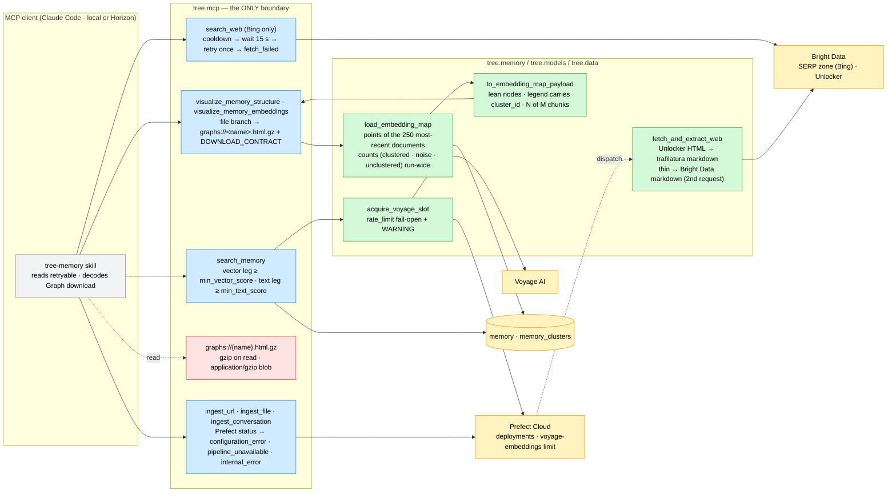

# ADR-013: The MCP Surface at Horizon Scale — Bing-Only Web Search, Gzip Graph Downloads, One Whole-Memory Cap, Honest Prefect Failures, and Main-Content Web Ingestion

- **Status:** Accepted — amends [002](002_pipeline_concurrency_and_voyage_rate_limiting.md) §1 (the Voyage slot acquire fails open), [005](005_single_graph_rendering_stack.md) Decision 4 and [007](007_embedding_clusters_and_explicit_offline_phases.md) §7–§8 (the `graphs://` download is a gzip blob; the map plots a capped document set), [008](008_mcp_tool_contract.md) §2–§3 (`search_web` loses `engine`; the dispatch boundary maps Prefect's HTTP status; the `$text` leg gains a provisional bar), [011](011_live_force_layout_and_direct_manipulation.md) §7 (the cap value 500 → 250). Everything else in those ADRs stands.
- **Date:** 2026-10-03
- **Deciders:** Paul (project owner)
- **Context references:**
  - `tasks/176-search-web-bing-only-and-cooldown.md` … `tasks/183-min-text-score-gate.md` (this feature's task plan, `feature: horizon-mcp-fixes`)
  - `tutorials/4_x_x_deploying_mcp_server.md` (the live Horizon smoke test that found every defect)
  - `docs/glossary.md` — **Graph download**, **Main-content extraction** (added in this feature's grooming commit); **Tool error envelope**, **Retrieval outcome**, **Embedding map**, **Full graph**, **Memory structure**, **Graph renderer**, **Clean step** (amended)
  - `apps/memory/src/tree/data/web/web_serp.py`, `tree/mcp/viz_app.py`, `tree/mcp/tools.py`, `tree/models/voyage_*_embedding.py`, `tree/memory/clustering/store.py`, `tree/data/web/web.py`, `tree/memory/rag/search.py`

## Context

The first live smoke test of the `tree-memory` FastMCP server on Prefect Horizon (and the same server
locally) found five defects the unit suite cannot see, because each lives at a boundary with a live service:

- **`search_web` answers `[]` for every query.** Google now wraps every organic link in an encrypted
  `/goto?url=<token>` redirect in ALL Bright Data formats, `brd_json=1` collapses to `{general, input}`,
  and no Bright Data zone resolves `/goto`. The engine-agnostic `h3`-inside-`a` parser therefore keeps
  nothing. Bing's `li.b_algo h2 a` results are direct or `bing.com/ck/a?…&u=a1<base64url>` and decode to
  real URLs (9/9 verified). Bright Data also answers HTTP 200 with a plain-text cooldown sentence ("…try
  again later, after a minimum of 15 seconds") that today reads as an empty SERP.
- **The embedding map cannot be downloaded from Horizon.** `graphs://{name}` is a TEXT resource; the
  17,306-chunk map is 11.4 MB of HTML and the read fails with JSON-RPC -32603 after ~440 ms (no server
  traceback); 0.06–0.7 MB structure views read fine, the same 11 MB reads fine locally. Measured payload:
  node `meta` 5.8 MB (snippet + a `document` field duplicating `name`), `name` 1.5 MB, `id` 1.3 MB, `x`/`y`
  0.6 MB, `color` 0.16 MB; gzip → 2.4 MB, gzip + base64 → 3.3 MB.
- **Prefect failures are mis-reported.** A stale `PREFECT_API_KEY` makes dispatch answer 401, which
  `_ingest` reports as `pipeline_unavailable` "unreachable — try again"; the model retries a call that an
  operator must fix. The same 401 inside the Voyage clients' `rate_limit("voyage-embeddings")` acquire
  (Prefect wraps it as `ConcurrencySlotAcquisitionError`) killed `search_memory` with `search_unavailable`
  — a courtesy limiter took retrieval down.
- **`ingest_url` stores site chrome.** Bright Data's whole-page markdown of a docs page is mostly menu
  links; the **Clean step** removes repeated lines, not one-off menus.
- **`search_memory` fuses an ungated `$text` leg.** A lexical hit on "vector" (a particle-physics paper)
  interleaved with the real answers at `1/61, 1/62, …` for a quantization query; ADR-008 §3 gated only
  the vector leg.

Constraints: Horizon redeploys from `main` and exposes no resource-size knob we control; the server's
filesystem is unreachable from clients; ADR-008's envelope and the `ERROR_CONTRACT` anchor stay; ADR-005's
single renderer and ADR-007's "surfaces read, never compute" stay; ADR-002's Tier-B budget (billable Bright
Data requests) is accounted for, not silently spent; RAG mode only.

## Decision

Seven related choices, one amendment set — each the least mechanism that makes the live surface honest:

1. **`search_web` is Bing-only.** The `engine` parameter (and the `"engine"` answer key) is removed from
   the MCP tool, the CLI and the Make target; `country`/`language` map to Bing's `cc`/`setLang`; the
   parser is Bing-specific (`li.b_algo` → `h2 a`, `.b_caption p` snippet) and decodes `/ck/a` redirects
   (`u=a1<base64url>`). Bright Data's cooldown body (HTTP 200, "This query recently failed…") is waited
   out ONCE (15 s, a module constant) and retried; a second cooldown answers **`fetch_failed`**
   (retryable) — not `search_unavailable`, which ADR-008 §2 reserves for the memory retrieval legs. A
   genuinely empty SERP stays `[]`. *Why not keep Google behind a flag:* a parameter that always yields
   `[]` is a trap, and the `/goto` tokens are opaque by design. *Upgrade trigger:* a Bright Data format
   that resolves `/goto` → reintroduce `engine` with Google as a tested path.
2. **The `graphs://` download is a gzip BLOB, one code path.** `graphs://<name>.html.gz` answers
   `gzip.compress(file)` as an explicit `ResourceResult([ResourceContent(bytes, mime_type="application/gzip")])`
   (FastMCP base64-encodes bytes into `BlobResourceContents`; a 3.2.0 TEMPLATE drops the decorator's
   `mime_type` for a bare `bytes` return and answers `application/octet-stream`, so the mime is set on the
   content — task 181), compressed on read — no `.gz` on disk, no second template; the plain `.html`
   name is rejected so there is one way to download. The file-branch tool text, the five tool docstrings
   and the resource docstring share ONE decode contract (`DOWNLOAD_CONTRACT`, test-anchored like
   `ERROR_CONTRACT`): `base64 -d < blob.b64 | gunzip > <name>.html` (stdin form — macOS's BSD `base64`
   rejects a file argument). The inline `ui://` iframe path is
   unchanged. *Why not chunked resources or a signed URL:* the protocol already carries blobs; chunking
   adds a client-side protocol.
3. **One cap on every whole-memory view, and a leaner map node.** `query.full_graph_max_docs` becomes 250
   (was 500) and now governs the **Embedding map** too: the map plots only the chunks whose document is
   among the 250 most-recent (`rank_recent_documents`, the structure view's ranking), while clusters,
   labels, legend sizes, the noise row and the stale warning keep describing the WHOLE run (`unclustered`
   is computed from counts, never from the plotted set); the header says `N of M chunks (the P
   most-recent of D documents)`. Map nodes drop what the renderer can derive — `meta.document` (= `name`),
   the empty `label`, the per-node `color` (the legend rows carry `cluster_id`; the template resolves
   `n.color ?? colourByCluster`, then a negative id without a legend row → noise grey, else `#d5d8de`;
   only a point of a cluster with no `memory_clusters` row — a partially written run — still ships
   `color = cluster_colour(id)`) — and round `x`/`y` to 3 decimals; the tooltip is rebuilt identically. The
   graph payload is untouched. *Why one knob:* two views, one question ("how much of the memory does a
   whole-memory picture embed?"); *upgrade trigger:* the day the two need different values, split the key.
   *Fallback recorded, not built:* if the Horizon read still fails after 1–3, the cap drops to 100.
4. **The ingest dispatch boundary maps Prefect's HTTP status.** `PrefectHTTPStatusError` 401/403 →
   `configuration_error` (not retryable; the message names `PREFECT_API_KEY`, the `PREFECT_API_URL`
   workspace, and says rotate + update the environment + redeploy); 404 (and `ObjectNotFound`) →
   `configuration_error` with the one "deployment not registered" sentence; 429/5xx →
   `pipeline_unavailable` (retryable, status named); other 4xx → `internal_error` (not retryable);
   `ConnectError`/timeout → `pipeline_unavailable` "unreachable". Every branch logs the status with the
   traceback.
5. **The Voyage rate-limit acquire fails open.** One helper (`acquire_voyage_slot`) wraps
   `rate_limit("voyage-embeddings", occupy=1, strict=False)` for BOTH Voyage clients; on
   `ConcurrencySlotAcquisitionError` / `AcquireConcurrencySlotTimeoutError` / `PrefectHTTPStatusError` /
   `httpx.HTTPError` it logs ONE WARNING ("Prefect rate limiter 'voyage-embeddings' unavailable: <cause> —
   embedding without throttle") and the POST proceeds; any other exception still fails the call. Voyage's
   own 429 backoff (ADR-002 §1's retry placement) remains the quota guard. ADR-002 §1's "acquire one slot
   per POST" stands as the happy path.
6. **Web ingestion keeps the main content.** `fetch_and_extract_web` fetches HTML through the Unlocker and
   runs **Main-content extraction** with `trafilatura` (a MAIN dependency: Prefect Managed installs the
   package per run) to markdown — headings, links, lists, tables kept; nav/sidebar/footer dropped; title
   from the page metadata. When the extraction has fewer than 300 non-whitespace characters, it falls back
   to today's Bright Data markdown — a SECOND billable Tier-B request, accepted because it happens only on
   thin pages and is logged as a WARNING; `Document.metadata.extraction` records the path. `scrape_web` is
   unchanged (it shows the page as fetched). *Upgrade trigger:* a measured fallback rate worth a free
   `favor_recall` rung before the billable one.
   *Implementation decision (task 182, 2026-10-03, orchestrator under the owner's pre-authorisation),
   after a live probe showed the spec-exact call drops every code block on Mintlify docs pages:*
   - **Best of two, no site-specific logic.** "B′" strips `class`/`id` from each `<pre>` and its
     ancestor chain (stopping below `<body>`). Neither run is right everywhere:
     - On the Mintlify pages the default run keeps 0 of 5 and 0 of 11 code blocks; B′ keeps them.
     - On the simonwillison.net blog B′ drops the 2 code blocks; on the GitHub README it mangles one.
   - **The rule.** Run the default first. If the HTML has ≥1 `<pre>` and the markdown has fewer fenced
     code blocks than there are `<pre>` elements, also run B′ on a copy of the HTML. Keep whichever has
     MORE fenced code blocks; a tie keeps the default.
     - Both runs happen in one `asyncio.to_thread` call, with no extra Unlocker request.
     - `Document.metadata.extraction_variant` records the winner (`default` | `pre_unwrapped`) next to
       `extraction: trafilatura`.
   - When the markdown has no H1, prepend `# {title}`: the page's first `<h1>` text, else the metadata
     title.
   - Title on BOTH paths = page metadata title → first markdown H1 → URL tail. On the fallback the HTML
     is already fetched, so the title costs nothing.
   - A LATENT placeholder promoted by `load_web_document` merges `metadata`.

   *Known limitations:*
   - Mintlify's `` paragraphs repeat a few sentences and glue link tails to the next
     word: 6 duplicates and 3 glued on `/deployment/prefect-horizon`. There are no site-specific hacks.
   - Code that trafilatura emits WITHOUT fences puts `# comment` lines at line start, which read as an H1.
     Example: 2 of 4 code blocks on the simonwillison.net post. The same page's first `<h1>` is its site
     header.
   - The fence count is a proxy. Pages whose code is all inline `<pre>` snippets always pay the second
     (CPU-only) run.

   *Upgrade trigger:* missing code samples or a heading misfire that users notice. The fix would be
   per-generator preprocessing or a different extractor.
7. **A provisional bar on the `$text` leg.** `query.min_text_score` (`0.0` = off) gates `textScore` BEFORE
   fusion exactly as `min_vector_score` gates the vector leg — never on an unavailable leg, gated-to-nothing
   is `[]` with `search_mode: hybrid` — and its value is pinned by a six-query live eval (three on-topic,
   three off-topic) recorded in `tasks/183`'s Log, in `default.yaml`'s evidence-comment style. `textScore`
   is unnormalised (a sum of per-term field-weighted frequencies), so the pin is corpus-relative and owned
   by the evals chapter; the task is the last in the plan and may be dropped.

Bias-to-least notes: one engine over a flag that cannot work; gzip-on-read over a second file or a chunked
protocol; one cap over two; a status switch over a retry framework; a WARNING over a circuit breaker; a
library call over a boilerplate model; a YAML knob over a learned threshold.

## Diagram

## Consequences

- **Web search works, and says when it cannot.** One engine, one parser, one cooldown rule. The cost is
  Bing-only results and a 15 s stall on a cooled query; the gain is results instead of `[]`, and an
  envelope the skill already knows how to act on.
- **Any graph downloads from Horizon.** gzip + base64 takes the worst case from 11.4 MB to ~3 MB on the
  wire before the cap, less after it; clients pay one decode line. The old text name is gone — a client
  that hard-coded `graphs://…html` must switch (none exists outside this repo).
- **Whole-memory pictures are smaller and say so.** 250 documents cap every no-query view; the map's
  header counts the plot while its legend counts the run — a reader sees both numbers. A map that needs
  "everything" is a query view's job, not the cap's.
- **Errors tell the operator what to do.** A stale key stops the model and names the variable; a 503
  says 503; the limiter never takes retrieval down. The cost is one more boundary helper and a WARNING
  per failed acquire on a mis-configured server — visible on purpose.
- **Web documents are articles.** trafilatura joins the main dependencies (lxml, ~8 MB); thin pages cost a
  second Unlocker request, logged. Already-stored chrome is not re-ingested.
- **The text leg can be gated — provisionally.** A wrong bar hides lexical true positives; `0.0` turns it
  off; the pin lives in a Log and a comment until the evals chapter owns it.
- **What would justify upgrading.** A Bright Data format that resolves Google's `/goto` → `engine` returns;
  a client that cannot read blobs → a signed download URL; the two views needing different caps → a
  second key; a measured fallback rate on web ingestion → a `favor_recall` rung; a learned text threshold
  → evals.

## Amendments to apply (Status-line notes on the amended ADRs; body text untouched)

- **ADR-002** Status: append "— §1's per-POST `voyage-embeddings` slot acquire FAILS OPEN since [013](013_horizon_scale_mcp_surface.md) §5 (task 178): an unreachable limiter warns once and the call proceeds; Voyage's 429 backoff remains the quota guard."
- **ADR-005** Status: append "— Decision 4's `graphs://` resource link is a gzip BLOB (`graphs://<name>.html.gz`, `application/gzip`) since [013](013_horizon_scale_mcp_surface.md) §2 (task 181); the text download is retired."
- **ADR-007** Status: append "— §7's `graphs://` resource answers a gzip blob and §8's map plots the chunks of the `query.full_graph_max_docs` (250) most-recent documents while counting the whole run, per [013](013_horizon_scale_mcp_surface.md) §2–§3 (tasks 179–181)."
- **ADR-008** Status: append "— amended by [013](013_horizon_scale_mcp_surface.md): §2's `search_web` loses `engine` (Bing only) and answers Bright Data's cooldown as `fetch_failed` (task 176); §2's dispatch boundary maps Prefect's HTTP status (401/403 `configuration_error`, 429/5xx `pipeline_unavailable`, other 4xx `internal_error`; task 177); §3's "`$text` hits are never gated" becomes a provisional `query.min_text_score` bar, `0.0` = off (task 183)."
- **ADR-011** Status: append "— §7's cap `query.full_graph_max_docs` is 250 (was 500) and also governs the Embedding map, per [013](013_horizon_scale_mcp_surface.md) §3 (task 180)."
