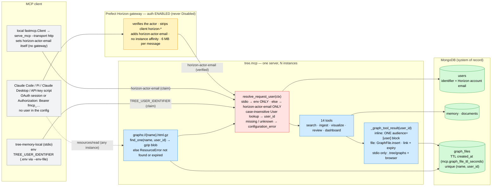

# ADR-014: Request-Scoped User Identity and Stateless Graph Downloads

- **Status:** Accepted — amends [013](013_horizon_scale_mcp_surface.md) §2 (the `graphs://` blob is the gzip of a MongoDB **Graph file**, compressed at write time and read per **Request user**, not a server file compressed on read) and [005](005_single_graph_rendering_stack.md) Decision 4 (the file branch writes a server file on stdio only; the inline payload rides in the `content` block alone). Everything else in those ADRs stands. — §5/§6 amended by task 196 (`tasks/196-bug-mcp-apps-no-graph-data-on-horizon.md`): the capability gate is THREE-state (`viz_app._ui_capability`) — **supported** (the client's `initialize` params advertise `io.modelcontextprotocol/ui`) → the `audience=["user"]` payload block only; **declined** (params known, extension absent) → the **Graph file** only; **unknown** (`client_params is None`: every `tools/call` on stateless streamable-http, i.e. Horizon, whose fresh per-request session never saw `initialize`) → the payload block AND the `graphs://` **Graph download** link in ONE response (the payload still travels once; a resource link is not a copy, so §5 holds). §6's deferred "file fallback in the Horizon `client_supports_extension` check" is resolved: it was real — the two-state check ALWAYS took the file branch on Horizon — and it, not a host dropping `content` blocks, is why the host-mounted iframe showed "No graph data in tool result."; §5's restore rule was NOT triggered and `structured_content` stays off. Measured cost (Claude Code 2.1.295 against a local stateless server): a text-only client shows the `audience=["user"]` block to its model unless it passes `as_html_file=true` (which every app tool's description now asks of it; haiku and sonnet each chose it in one natural-prompt run — encouraging, not proof), and a whole-memory result (≈280 KB) overflows Claude Code's tool-result limit, so its model sees nothing — not even the summary or the link. The Consequences clause "a file fallback in the Horizon `client_supports_extension` check → session capabilities carried in the request (follow-up task)" — that follow-up task is `tasks/197-persist-mcp-client-capabilities-per-horizon-session.md`.
- **Date:** 2026-10-05
- **Deciders:** Paul (project owner)
- **Context references:**
  - `tasks/185-graph-file-odm-and-ttl.md` … `tasks/189-request-user-docs-and-horizon-e2e.md` (this feature's task plan, `feature: request-scoped-users`)
  - `data/notes/mcp_server_design.md` (the design note: why the download broke on Horizon, the three ideas)
  - `docs/glossary.md` — **Request user**, **Graph file** (added in this feature's grooming commit); **Graph download**, **Graph payload**, **Graph renderer**, **Embedding map**, **Tool error envelope** (amended)
  - ADR-001 Consequences ("Per-request MCP `user_id` sourcing … deferred post-Phase-1") — implemented here; ADR-007 §7 (the `graphs://` resource) — amended through 013 §2
  - `apps/memory/src/tree/mcp/{server,request_user,tools,graph_tools,viz_app,dashboard_app,client}.py`, `tree/entities/graph_files.py`, `tree/db.py`, `scripts/serve_mcp.py`, `scripts/signup.py`
  - Horizon docs: gateway.md "Actor context" (after authentication the gateway "removes any client-supplied `horizon-*` identity headers and adds trusted actor context": `horizon-actor`, `horizon-actor-type`, `horizon-actor-email` "when the actor has one", …; "Requests to a hosted server with Horizon authentication disabled do not receive verified Horizon actor context"); platform/authentication.md (Horizon Authentication "is either enabled or disabled"; OAuth sessions and `Authorization: Bearer fmcp_…` API keys owned by users or service accounts); platform/compute-model.md ("No affinity guarantee", "Ephemeral filesystem"); limits.md (6 MB per MCP message). FastMCP 3.2.0 `Context.transport`, `get_http_headers`, `read_resource`'s error masking; Beanie 2.0.1 `init_indexes`; MongoDB `collMod` `index.expireAfterSeconds`

## Context

The first client runs against the `tree-memory` server on Prefect Horizon found two design assumptions
that hold for one local stdio process and break for a stateless, multi-instance, shared deployment:

- **One user pinned at boot.** `server.py` resolves `--user-id` / `TREE_USER_IDENTIFIER` ONCE and every
  tool reads `lifespan_context["user_id"]` (19 reads). Everyone holding the deployment's access reads,
  searches and ingests into the same memory; a rendered graph carries no owner. ADR-001 deferred
  "per-request sourcing … to a context-var"; Horizon makes it due — and already hands the server a
  verified identity on every authenticated request (`horizon-actor-email`) that nothing reads.
- **A file written in one request is read in another.** The file branch writes
  `/tmp/.tree/graphs/<slug>-<stamp>.html` during `tools/call`; `graphs://{name}` reads it during a LATER
  `resources/read`. Horizon: "A later request may be handled by a different instance", "Do not rely on
  files written during one request being available to another request". The read lands on an instance that
  never saw the file → `FileNotFoundError` → the masked "Error reading resource" a Codex client hit twice.
  Gzip (ADR-013 §2) solved size, not affinity; this is the ONLY cross-request dependency in the
  visualization surface — the inline MCP App path is one request.
- **The UI payload is sent twice** — a `content` block marked `audience=["user"]` AND `structured_content`
  — so the inline view meets Horizon's 6 MB cap at half the payload the file path does.

Constraints: no login of our own exists and none is wanted while the server lives on Horizon; the gateway
verifies the caller (OAuth session or API key, org membership) and attaches the actor's email only while
Horizon Authentication is enabled; ADR-008's envelope and `ERROR_CONTRACT` stay; ADR-005's single renderer
and ADR-013's gzip blob + `DOWNLOAD_CONTRACT` shape stay; no new infrastructure or credential; tool
signatures and client configs unchanged (the model and the client config never name a user).

## Decision

Six related choices, one amendment set — each the least mechanism that makes the shared server honest:

1. **One seam: the Request user.** `tree.mcp.request_user.resolve_request_user(ctx) -> PydanticObjectId`
   replaces every read of the boot-pinned id. Every tool (all 14, `scrape_web` and `search_web` included —
   a misconfigured caller fails loudly on its first call) and the `graphs://` resource call it per request;
   nothing else reads the identifier. It resolves a user identifier with a CASE-INSENSITIVE lookup of
   `User.identifier` (anchored, escaped `$regex … i` — Horizon's docs do not promise the email's case; no
   migration of existing rows; `signup` stores new identifiers stripped + lowercased and refuses a
   case-insensitive collision) — one read per request, no cache. The lifespan no longer resolves or pins a
   user (`set_server_user_id`, `get_server_user_id`, `_resolve_server_user_id`, `_resolve_user_id_from_env`
   and `_SERVER_USER_ID` are deleted; `serve_mcp.py` loses `--user-id` / `--identifier`); `ensure_indexes`
   takes an OPTIONAL `user_id` (it only logged it — the indexes are global). *Why a seam and not a `user`
   tool argument:* the model must never carry identity; if the identity source ever changes, only this
   function's body changes.
2. **Exactly one identifier source per transport, no cross-fallback, always an error when absent.**
   `ctx.transport == "stdio"` → the process env `TREE_USER_IDENTIFIER` ONLY (set by the client's
   `.mcp.json` `env` / loaded from `.env` through `--env-file`); any other transport (`streamable-http`,
   `sse`, and `None` outside a server context) → the `horizon-actor-email` request header ONLY
   (`get_http_headers()`, lowercased, `{}` without an HTTP request). On Horizon the gateway injects it after
   Horizon authentication succeeds and strips any client-supplied `horizon-*` header, so a Horizon user's
   `User.identifier` IS their Horizon account email and giving someone access = inviting them to the org
   + `make memory-signup` with that email; against a local `serve_mcp.py --transport http` there is no
   gateway, so the local CLIENT sets the header (`fastmcp.Client(StreamableHttpTransport(url,
   headers={"horizon-actor-email": …}))`); `get_cloud_client()` sends no header — it targets Horizon.
   A server-side `TREE_USER_IDENTIFIER` is ignored on HTTP even if set; no client config carries an
   identity. Errors reuse the **Tool error envelope** `configuration_error`, `retryable: false` — no new
   code — with three fixed messages: missing header → Horizon authentication must be enabled (Access mode
   not "Disabled"), the actor must have an email (a service account may have none), and locally set the
   header on the client; empty stdio env → names `TREE_USER_IDENTIFIER` and the client `env` block;
   unknown identifier → names the email, `make memory-signup`, and that the signed-up identifier must
   equal the Horizon account email. The resource cannot return an envelope, so it raises
   `fastmcp.exceptions.ResourceError` with the same text — the one exception class FastMCP's
   `read_resource` forwards unmasked whatever `mask_error_details` says. *Why no fallback:* two sources is
   two ways to be wrong, and "which one won?" is the question an operator should never have to ask.
3. **Trust model.** On Horizon the identity is VERIFIED — by the gateway, as an authenticated org member
   (OAuth session or a personal API key resolve to the same actor). Horizon's docs do not state which
   sign-in providers it uses or how it verifies an account's email; the server trusts the gateway's
   authenticated actor, not a proof of email ownership. On a local HTTP server or stdio the identity is a
   CLAIM on the developer's own machine, which is fine. The corollary is a hard constraint: **the server
   must never be reachable over HTTP without Horizon's gateway with authentication enabled** — with it
   disabled the gateway neither verifies nor strips `horizon-*` headers, so the header would be forgeable
   by any caller. A service-account key carries no email and answers `configuration_error`; mapping
   `horizon-actor` ids to users is a follow-up only if a machine client ever needs memory.
4. **Graph files live in MongoDB with a TTL (the Graph file).** A Beanie `GraphFile` in
   `tree.entities.graph_files`: `{user_id, name, html_gz, created_at}`; indexes declared ON the model —
   a TTL on `created_at` (`mcp.graph_file_ttl_seconds`, 300, `TREE_MCP__GRAPH_FILE_TTL_SECONDS`) and the
   unique compound `{name, user_id}` — so `init_beanie` creates them at every boot, Horizon's
   `MCP_SKIP_INDEX_BOOTSTRAP` notwithstanding. `init_mongodb` reconciles a changed TTL with `collMod`
   BEFORE `init_beanie` and never crashes boot on it (Beanie re-submits every declared index and Mongo
   rejects a same-name index with a different `expireAfterSeconds`, code 85). The file branch of
   `_graph_tool_result` (now async, taking the Request user) renders the HTML, gzips it at WRITE time and
   inserts one row under `secrets.token_urlsafe(16) + ".html.gz"` — flat, unguessable, no user or tool in
   the URI (the link is the capability, the TTL bounds its life); the text states "expires in about N
   minutes" and, on HTTP, names no server path. `graphs://{name}` resolves the Request user and reads
   `{name, user_id}`; not found, another user's row and expired are ONE message. The blob,
   `application/gzip`, the `.html.gz`-only rule and `DOWNLOAD_CONTRACT` (reworded without the "path on your
   machine" preamble) stay. **stdio convenience:** only when `ctx.transport == "stdio"` the branch ALSO
   writes `.tree/graphs/<slug>-<stamp>.html` and opens it best-effort, naming the path — two names, zero new
   naming code. *Why not object storage + a presigned URL:* a bucket is new infrastructure and a new
   credential; MongoDB is already the system of record and the bytes (~2.4 MB worst case) fit a plain
   document. *Upgrade trigger:* a gzip approaching the 6 MB response cap → a bucket and an `https://`
   resource link.
5. **The UI payload is sent once.** `_graph_tool_result` (inline branch) and `memory_dashboard` drop
   `structured_content`; the payload rides ONLY in the `content` JSON block marked `audience=["user"]`,
   and the two iframes' `structuredContent` fallback is deleted. Halves the inline response at no cost to
   the model. The channel is the one the module docstrings record as working on real hosts; the MCP Apps
   spec's preference for `structuredContent` is NOT adopted without a live test. *Restore rule:* if Claude
   Desktop renders an empty iframe (task 188's manual check), flip BOTH tools to `structured_content`-only
   and record the host behaviour here.
6. **Facts verified live, not assumed** (task 189, post-merge): the exact `horizon-actor-email` value (and
   case) our account receives; a client-forged `horizon-actor-email` on an authenticated request resolves
   to the gateway's value, not the forged one; a personal API key resolves to the same user as the OAuth
   session; a `graphs://` read succeeds from a request a different instance may serve; and whether
   `client_supports_extension` holds on stateless Horizon (~5 Claude Desktop calls) — a file fallback
   there is a follow-up task, not this feature.
7. **What would change the identity source: public self-serve sign-up.** Horizon's gateway admits only
   org members (invite, Directory Sync or SSO; authorization.md: "An actor in another organization cannot
   use that organization's servers"), so the gateway IS the login for as long as every user is an org
   member. The day strangers must sign themselves up, the gateway's auth is DISABLED (Developer /
   Enterprise plans; servers/hosted.md: "the server owns authentication and authorization") and a FastMCP
   auth provider (Google / GitHub / WorkOS / Auth0) issues the tokens; the seam's HTTP branch then reads
   the email from the verified token (`get_access_token()`) and MUST ignore `horizon-actor-email` entirely
   — with gateway auth off it is neither injected nor stripped, i.e. forgeable. Only the seam's BODY
   changes; tools, the resource, the Graph file and the error contract do not. Leaving Horizon altogether
   is the same change with the same provider.

Bias-to-least notes: one function over a context-var plus middleware; the gateway's verified header over a
custom client header or a tool argument; one source per transport over a fallback chain; a regex over a
migration; a Mongo row over a bucket; one TTL knob over per-tool lifetimes; a reused envelope code over a
new one; one copy of the payload over two.

## Diagram

## Consequences

- **One deployment, many memories, no client-side identity.** The gateway names the user; the server pins
  nothing; client configs stay as they are. The cost is one `users` read per request and a sign-up per org
  member; the gain is that a shared Horizon URL stops being one shared memory.
- **Access is two steps and both are visible.** Invite to the org + `make memory-signup` with the Horizon
  email; a member who skipped the second step gets a `configuration_error` naming exactly that. Service
  accounts cannot use memory until someone maps actor ids.
- **Misconfiguration is loud and specific.** No actor email (auth disabled, a service account, a local
  client without the header), an empty stdio env or an unknown email each name their fix in the envelope
  the skill already acts on; the boot can no longer fail on a missing user.
- **The gateway is now load-bearing for security.** Horizon Authentication must stay enabled and the HTTP
  server must never be exposed without the gateway; the runbook says so. Identity is as strong as Horizon's
  account verification, which its docs do not describe — accepted for a personal / small-team deployment.
- **Downloads survive instance hops and clean themselves up.** The bytes sit in `graph_files` for N minutes
  and expire; no `/tmp` write on HTTP, no orphaned files. The cost is one Mongo insert (~2.4 MB worst case)
  per non-inline render and a minute of TTL slack; a changed TTL is a `collMod`, never an index drop.
- **The inline view fits Horizon at twice the payload.** One copy of the payload; a host that forwards
  only `structuredContent` would render empty — the restore rule in §5 covers it after one live test.
- **The local developer loses nothing.** stdio still reads `.env`, still writes `.tree/graphs/`, still
  opens the browser; `make memory-serve-mcp` needs no `USER_ID`; a local HTTP test sets one header.
- **What would justify upgrading.** Public self-serve sign-up (or leaving Horizon) → gateway auth off, a
  FastMCP auth provider, and the seam reading `get_access_token()` while ignoring `horizon-actor-email`
  (§7); a machine client that needs memory → an actor-id → user mapping; a gzip near 6 MB → object storage
  + `https://` link; a measured latency cost of the per-request lookup → a short-lived cache; a second host
  that forwards only `structuredContent` → the restore rule; a file fallback in the Horizon
  `client_supports_extension` check → session capabilities carried in the request (follow-up task).

## Amendments to apply (Status-line notes on the amended ADRs; body text untouched — task 189)

Exactly the two ADRs the Status line names. ADR-001's deferred "per-request sourcing" and ADR-007 §7 are
reached through this ADR's Context references, not edited.

- **ADR-005** Status: append "— Decision 4's file branch stores a **Graph file** in MongoDB (`graphs://<token>.html.gz`, TTL) and writes a server file on stdio only; the inline payload rides in the `audience=["user"]` content block alone, per [014](014_request_scoped_users_and_stateless_graph_downloads.md) §4–§5 (tasks 187–188)."
- **ADR-013** Status: append "— §2's blob is now the gzip of a MongoDB **Graph file** compressed at WRITE time and read per **Request user** (not a server file compressed on read), expiring after `mcp.graph_file_ttl_seconds`, per [014](014_request_scoped_users_and_stateless_graph_downloads.md) §4 (task 187)."
