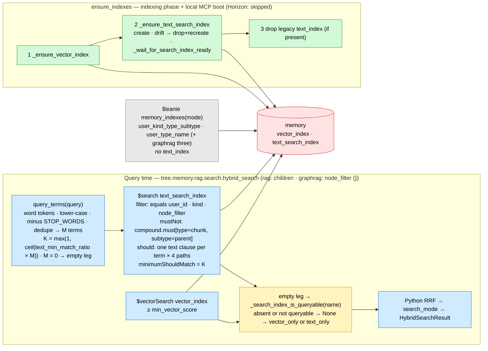

# ADR-015: An Atlas Search Text Leg Gated by a Minimum Match Ratio, Not a Score

- **Status:** Accepted — amends [008](008_mcp_tool_contract.md) §3 (the text leg's rule is "K of M query terms", there is no text score bar), [012](012_mode_aware_memory_index_set.md) §1–§2 (`text_index` leaves the Beanie set; `ensure_indexes` owns BOTH mongot indexes and performs one retirement drop) and [013](013_horizon_scale_mcp_surface.md) §7 (`query.min_text_score` is replaced by `query.text_min_match_ratio`). Everything else in those ADRs stands. — §2's K is computed as `min(M, max(1, ceil(round(ratio × M, 9))))` (never above M; the product rounded so a binary float cannot overshoot a step) and §3's M is capped at the FIRST 64 distinct terms (`_MAX_QUERY_TERMS`: mongot's 1024 `maxClauseCount` ÷ 4 text paths, with margin), per task 191. — §3's query-side tokenizer is `re.findall(r"\w+(?:\.\w+)*", query.lower())`, not `\w+`: decimal / dotted tokens (`4.1`, `0.70`, `e.g`) stay ONE term, as the index's standard (UAX#29) tokenizer keeps them, so `"gpt-4.1 pricing"` cannot match rows through the phantom terms `4` and `1`; one module constant shared with the unit-test fake (`TOKEN_PATTERN` in `search.py`); §6's filter-path constant is the public `TEXT_INDEX_FILTER_PATHS` (a two-module contract with `search.py`, so no underscore), per task 194.
- **Date:** 2026-10-08
- **Deciders:** Paul (project owner)
- **Context references:**
  - `tasks/190-text-search-index-and-shared-mongot-helpers.md` … `tasks/192-text-leg-docs-and-ratio-repin.md` (this feature's task plan, `feature: atlas-search-text-leg`)
  - `tasks/done/183-min-text-score-gate.md` (the `textScore` eval that found no separating value) and ADR-013 §7's recorded outcome
  - `docs/glossary.md` — **Minimum match ratio**, **Text search index** (added in this feature's grooming commit); **`memory` collection**, **Retrieval outcome**, **Search mode** (amended)
  - ADR-006 §2 (hybrid search + RRF, Parent-document retrieval) and ADR-008 §3 ("the bar never sits on the RRF score") — relied on, unchanged
  - `apps/memory/src/tree/memory/rag/search.py` (`_text_search`, `_search_index_is_queryable`), `tree/memory/rag/indexing.py` (`ensure_indexes`, `_ensure_text_search_index`, `_wait_for_search_index_ready`), `tree/entities/memory.py` (`memory_indexes`), `tree/config/{default.yaml,app_config.py}`
  - MongoDB docs (verified 2026-10-08): `$search` must be the first stage and takes `index`; `compound` — `filter` / `must` / `mustNot` / `should` arrays, `minimumShouldMatch` ≤ the number of `should` clauses (default 0; a `should`-only compound needs ≥ 1 match); `text` — `query` and `path` accept arrays, multi-term strings are OR-ed per term, scored BM25 with the field's index analyzer; `equals` — `objectId`, `token`-indexed strings, booleans, numbers, dates; static mappings: `{"type": "string", "analyzer": "lucene.english"}`, `{"type": "token", "normalizer": "lowercase|none"}`, the `objectId` field type per the Index Reference table (its dedicated page is gone; the exact `{"type": "objectId"}` mapping is confirmed by task 190's spike), nested fields through `{"type": "document", "fields": {...}}`; `$listSearchIndexes` entries carry `status`, `queryable`, `latestDefinition`; `{"$meta": "searchScore"}`. Local: `mongodb-community-search:0.60.1` (mongot) with `mongodb-community-server:8.2.5`. Prod: Atlas M0, 3 search indexes per cluster (`search` + `vectorSearch` counted together).

## Context

The lexical leg of `hybrid_search` runs `$text` on a classic `text_index` and reads `textScore`. Task 183
tried to gate it (`query.min_text_score`) and measured why it cannot be gated: on MongoDB 8.0 `textScore`
is ≈ 0.5 per distinct matched term, inflated by repetition (one term ×5 = 0.993 ≈ two terms ×1 = 1.005;
×20 saturates at 1.1), with stop words dropped and stemming on. An 8-word off-topic query scored 1.524
while one-word on-topic queries scored ~1.0–1.1, so no bar separates them — the gate shipped at `0.0`
(ADR-013 §7's outcome) and "MongoDB Atlas Vector Search scalar binary quantization int8" still seeds a
particle-physics paper through the single shared word "vector".

What the leg should express is word overlap — "at least K of the question's M content words" — which a
score cannot. Atlas Search's `compound.should` + `minimumShouldMatch` expresses exactly that, and the
deployment already runs mongot for `vector_index` (ADR-012), so a `search`-type index costs no new
infrastructure. Constraints: Atlas M0 allows 3 search indexes per cluster, `search` and `vectorSearch`
counted together (Tree will use exactly 2); the Horizon MCP server boots with
`MCP_SKIP_INDEX_BOOTSTRAP=true`, so prod indexes come only from `make memory-run-indexing-pipeline`; the
readiness helpers (`_wait_for_vector_index_ready`, `_vector_index_is_queryable`) are vector-only; ADR-012
says Beanie owns every classic index and nothing retires one; RRF stays in Python (ADR-006 §2); the
graphrag seed search shares the same leg with `node_filter={}`.

## Decision

Seven related choices, one amendment set:

1. **Replace outright — no switch, no dual path.** `_text_search` runs `$search` on `text_search_index`;
   `$text` and the classic `text_index` are gone: `TEXT_INDEX_NAME` / `TEXT_INDEX_FIELDS` and the
   `IndexModel` leave `memory_indexes()` (ADR-012 §1–§2 amended), and `ensure_indexes` performs ONE
   idempotent retirement — `drop_index("text_index")` when `index_information()` lists it — because
   Beanie only creates. ADR-012 §3's "no retirement code" stands for every other index. *Why not a
   config switch:* two lexical paths with different semantics is a trap; the old one has nothing to
   recommend it.
2. **The rule is a ratio of distinct content terms.** `query.text_min_match_ratio` (`[0, 1]`, provisional
   `0.5`, override `TREE_QUERY__TEXT_MIN_MATCH_RATIO`); `K = max(1, ceil(ratio × M))`, `0.0` = any one
   term; `M` = the number of DISTINCT content terms after stop-word removal. A ratio over an absolute
   count because questions are 1–10 words long and one K cannot serve both ends.
3. **Tokenisation: `lucene.english` in the index, a vendored stop list in Python.** The index analyzer
   keeps stemming on the corpus side. The query side is `re.findall(r"\w+", query.lower())` → drop
   `STOP_WORDS` (Lucene's 33 English stop words — a term the analyzer drops can never match and must not
   count toward M — ∪ question / pronoun / auxiliary / function words, roughly NLTK's English list; NO new
   dependency) → dedupe → one `text` clause per term over all four text paths. An all-stop-word query
   answers `[]` without a query (the leg ran; `search_mode` stays `hybrid`). Accepted trade-off: dedupe
   is pre-stemming (`agent` / `agents` are two terms) — a stemmer dependency is not worth two terms.
4. **No score bar at all; one log line.** `query.min_text_score` and `_gate_text_candidates` are deleted
   (field, YAML block and tuning comment, fixture, env-override docs); `searchScore` (BM25) is never
   compared — RRF reads rank only (ADR-008 §3's principle, now with nothing on the text side to bar).
   Every text leg that RAN logs `text leg: N candidate(s), M query term(s), min_should_match=K` (also
   for `0 … 0 … 0`); a raised leg logs its WARN and no line.
5. **Missing or not-ready index = unavailable leg, through the SAME helpers as the vector leg.**
   `_vector_index_is_queryable` → `_search_index_is_queryable(collection, index_name)` (search.py) and
   `_wait_for_vector_index_ready` → `_wait_for_search_index_ready(collection, index_name)` (indexing.py),
   no copies: probe only on an empty leg; absent / `queryable: false` → `None` → `vector_only`; a raising
   probe or a readiness-less entry (local mongot) → `[]`. `_ensure_text_search_index` mirrors
   `_ensure_vector_index`: create if missing; definition drift (`dynamic`, a text path's type / analyzer,
   a filter path's type — a subset comparison on the declared paths, never whole-dict equality, so
   server-echoed defaults are not drift) → drop + recreate; wait ready (300 s cap, FAILED raises, timeout
   WARN + fail-open). `ensure_indexes`'s docstring says it owns both mongot indexes.
6. **The index definition and the query shape.** `text_search_index`, `mappings.dynamic: false`; text
   paths `name`, `aliases`, `properties.content`, `properties.aliases` as `{"type": "string", "analyzer":
   "lucene.english"}` (nested paths declared through `properties: {type: document, fields: …}`); filter
   paths `_TEXT_INDEX_FILTER_PATHS = {user_id: objectId, kind: token, type: token, subtype: token}`;
   `merged_into` NOT included (no reader needs it). Query: `compound.filter` = `equals user_id`, `equals
   kind "node"`, one `equals` per `node_filter` key (a key outside the filter paths, or a non-scalar
   value, raises `ValueError` before any aggregate); `mustNot` = `[{compound: {must: [equals type
   "chunk", equals subtype "parent"]}}]` — the Parent-chunk invariant, unconditional, in the leg (ADR-006
   §2); `should` = per-term `text` clauses with `path` = the four text paths; `minimumShouldMatch = K`;
   then `$addFields _search_score: {$meta: "searchScore"}`, `$limit`. `$search` is the first stage; no
   `$sort`.
7. **Rollout.** `ensure_indexes` order: `vector_index` → `text_search_index` create + wait ready → drop
   the legacy `text_index` (only if present). Between a deploy and the first indexing run, prod's text
   leg reads as absent → `vector_only` (graceful, one WARN, the skill's caveat line); the runbook step is
   "run `make memory-run-indexing-pipeline` against prod right after deploy" (also in the PR
   description). A `create_search_index` failure (e.g. `MAXIMUM_INDEXES_FOR_TENANT_EXCEEDED`) raises a
   `RuntimeError` naming the M0 3-index cap with the driver error chained. No data migration.
8. **Verification.** Task 190 opens with a live `$search` spike on the local community mongot (`equals`
   on objectId + token, nested-`compound` `mustNot`, `minimumShouldMatch`, `lucene.english`, the
   catalogue entry's shape, absent-index behaviour) so unsupported features surface before anything
   builds on them. Unit tests per `squid-testing-python` pin the tokenizer, K, the exact pipeline, the
   `ValueError`, the `vector_only` paths, drift → drop + recreate, and the ensure order. Task 192's e2e
   (run-pipelines-e2e, local) re-pins the ratio: off-topic "dark photon vector-like fermions", "recipe
   for sourdough bread", "zxqv plorb wumbus", "MongoDB Atlas Vector Search scalar binary quantization
   int8"; on-topic "context engineering", "structured outputs pydantic", "ReAct agent tool calling",
   "pydantic", "ReAct", "Gemini"; the lowest 0.1 step at which every off-topic text leg keeps 0 and every
   on-topic keeps ≥ 1 is recorded as evidence in `default.yaml`'s comment; if no step separates them, the
   provisional value ships and the Log says so.

Non-goals (recorded, not built): fuzzy matching, autocomplete, per-field boosts, synonyms, any BM25
gate, native `$rankFusion`, a `merged_into` filter path, any change to the vector leg or
`min_vector_score`, a stemmer dependency.

Bias-to-least notes: a platform operator (`minimumShouldMatch`) over a Python post-filter on matched
terms; a vendored frozenset over NLTK; two renamed helpers over two copies; a subset drift check over a
definition-version scheme; one log line over a metric; a YAML ratio over a learned threshold.

## Diagram

## Consequences

- **The text leg means "shares K of my M words".** An off-topic question with one shared word (the
  physics paper on "vector") is no longer a lexical candidate at `0.5`; a one-word question still finds
  every row naming it. The cost: a question whose only on-topic word is rare but whose other words are
  generic can lose its lexical hit at a high ratio — the vector leg still carries it; the re-pin protocol
  is what sets the trade.
- **Two mongot indexes, zero classic text index.** Writes maintain one fewer classic index; prod uses 2
  of the M0's 3 search indexes — a third index of any kind in Atlas will fail the next indexing run with
  a message naming the cap. Index builds are out-of-band: the leg is `vector_only` until mongot is ready,
  exactly as the vector leg is `text_only` while `vector_index` builds.
- **Deploy needs an indexing run.** Horizon skips index bootstrap, so the first query after a deploy
  that adds or changes a search index answers `vector_only` (one WARN, the skill's caveat) until `make
  memory-run-indexing-pipeline` runs against prod — the runbook and the PR description say so.
- **The retirement drop is the one exception to ADR-012 §3.** Nothing else drops; the drop is idempotent
  and logged once.
- **The stop list is ours to keep.** A word in `lucene.english`'s set but missing from `STOP_WORDS`
  would inflate M (and K) silently; the frozenset lists Lucene's 33 verbatim and the unit test pins
  them. Adding words is a code change with a good/bad example, per AGENTS.md.
- **Dedupe before stemming.** `agent` and `agents` are two terms of M; the index still matches either.
  Upgrade trigger, recorded and not built: a measured case where plural/singular pairs push K past the
  on-topic hits — then stem in Python (a dependency) or lower the ratio.
- **graphrag seeds share the rule.** The ratio applies to the seed search with `node_filter={}`; entity
  rows qualify through `name` / `aliases` (a one-word entity name needs K = 1, which it gets whenever the
  question has ≤ 2 content words at `0.5`).
- **What would justify upgrading.** A corpus where no 0.1 step separates the eval sets → per-field
  boosts or `matchCriteria`; a second lexical consumer needing fuzziness → `fuzzy` on the `text` clauses;
  an Atlas tier with `$rankFusion` and a measured win → native fusion (ADR-006 §2 revisited); a third
  search index → an M2+ cluster.

## Amendments to apply (Status-line notes on the amended ADRs; body text untouched — task 192)

- **ADR-008** Status: append "— §3's text-leg rule is "at least K of the query's M content terms" on an Atlas Search `text_search_index` (`compound.should` + `minimumShouldMatch`, `query.text_min_match_ratio`); there is no text score bar and `$text` is gone, per [015](015_atlas_search_text_leg_min_match_ratio.md) §1–§4 (task 191)."
- **ADR-012** Status: append "— §1–§2's `text_index` left the Beanie set: the lexical leg reads the mongot `text_search_index`, `ensure_indexes` owns BOTH mongot indexes and performs the one retirement drop of `text_index` (§3's "nothing drops" holds for every other index), per [015](015_atlas_search_text_leg_min_match_ratio.md) §1, §5–§7 (tasks 190–191)."
- **ADR-013** Status: append "— §7's `query.min_text_score` is deleted and replaced by `query.text_min_match_ratio` (K of M query terms on Atlas Search), re-pinned by the 10-query protocol in `tasks/192`, per [015](015_atlas_search_text_leg_min_match_ratio.md) §2–§4, §8 (tasks 191–192)."
