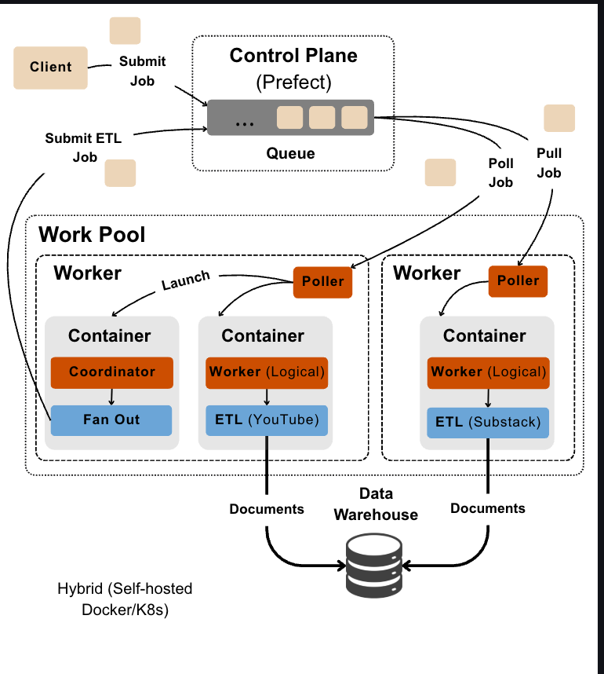
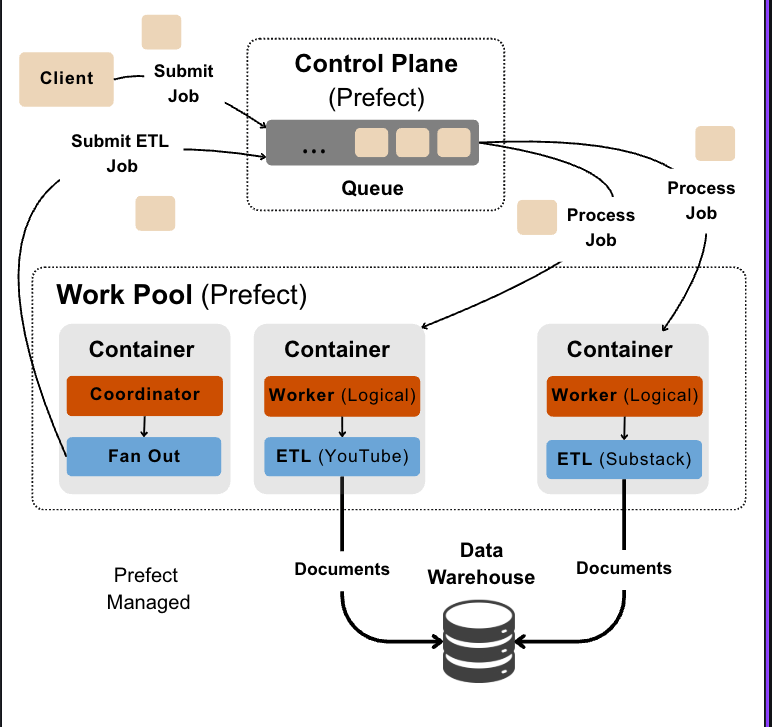

# Prefect execution topologies — Hybrid vs Push vs Managed vs local serve

Handoff note on **how a triggered job actually reaches a running container** in Prefect,
across the three production options Prefect offers plus the local dev path — and which one
`tree` actually ships (**Managed**). Written as a walkthrough of the control-plane → work-pool
→ worker/poller → container dynamics, with the submission-vs-polling mechanics and the
trade-offs of each.

Grounding: Prefect theory from the research wiki (`prefect-server`, `prefect-work-pools`,
`prefect-workers`, `prefect-deployments`, `deployment-decoupled-scaling`,
`concurrency-control-layers`); code from `apps/memory/src/tree/orchestrator.py`,
`apps/memory/deploy/prefect_pipelines*.py`, `docker-compose.yml`, `configs/default.yaml`.
Companion: `deployment-runbook.md` (the ordered prod bring-up), ADR-002 (concurrency).

---

## TL;DR — the four topologies

| | Who runs the exec layer | Poll or push | Who creates the container | Scale-to-zero | Ops burden | We use it? |
|---|---|---|---|---|---|---|
| **Hybrid** (self-hosted Docker/K8s) | **you** (`prefect worker start`) | **poll** (worker pulls) | your worker | no (idle worker) | high | no |
| **Push** (serverless) | the provider (ECS/Cloud Run/Modal) | **push** (control plane submits) | your serverless provider | yes | medium | no |
| **Managed** (Prefect-hosted) | **Prefect** (invisible) | poll, but Prefect-internal | Prefect's exec service | yes | ~zero | **yes** |
| **local `serve()`** | **you** (one process) | poll (runner pulls own deployments) | n/a — a **subprocess**, no container | n/a | ~zero (dev) | dev only |

The flow code is **byte-for-byte identical** across all four — the only thing that changes is
`serve(...)` vs `flow.deploy(work_pool_name=...)` and which pool type. "What runs" is fixed;
"where it runs" is a deployment-config swap (`deployment-decoupled-scaling`).

---

## Shared vocabulary (true in every topology)

Three layers, and the load-bearing rule that they never collapse into each other:

- **Control plane** = the Prefect **server/API** (Prefect Cloud in prod; the local
  `prefecthq/prefect:3-latest` container in dev). A database + REST API + scheduler + UI. It
  **queues runs and tracks state but NEVER executes flow code.** It holds: the state DB, the
  scheduler (mints flow runs from crons/API calls), the deployment registry, the **work pool +
  queue** (just typed rows in that DB), Blocks/Variables, and concurrency limits.
- **Work pool** = a **typed database queue**, not a process. A "pub/sub topic." Its *type*
  (`process`/`docker`/`kubernetes`/`prefect:managed`/push variants) decides *what infra* a run
  gets. Every pool has a default queue; extra queues add priority + per-queue concurrency.
- **Worker (= poller)** = the execution-layer component that **polls the pool and provisions
  the flow-run infrastructure**. The worker *is* the poller — not a thing that contains one.
  Polls every ~15s, prefetches ~10s early. **Whether a worker exists at all is the entire
  difference between the topologies below.**

Two naming traps that caused real confusion — pin them down:

1. **Prefect "Worker" (the poller)** vs **our `data-etl-worker` (a flow)**. The latter is
   business logic that runs *inside a container the Prefect worker launched*. In the diagrams
   it's labelled **"Worker (Logical)"** to keep them apart.
2. **A worker never creates workers — it creates containers.** One worker launches *many*
   containers (one per flow run, capped by its `--limit` / the pool limit). Scaling *containers*
   (per-run fan-out) and scaling *workers* (fleet size) are orthogonal levers.

### What is actually "queued", and the lifecycle

**The queued unit is a FLOW RUN — never a task.** Tasks run *inside* a flow-run's process.
A run enters the queue at three moments: (a) a schedule/cron fires, (b) an operator calls the
API (`create_flow_run_from_deployment`), or (c) a **coordinator fans out** via `run_deployment`,
which mints *new* worker flow runs that go **back onto the same queue**.

```
scheduler ─mints─▶ flow run [Scheduled]  (stamped: pool + deployment_id)
                        │
   worker/poller pulls due runs (poll)  ─OR─  control plane submits (push)
                        │
        provision infra ▶ container/subprocess ▶ [Running] ▶ [Completed/Failed]
```

Routing key is **`deployment_id`** stamped on each run, *not* the queue: one poller drains the
whole pool and, per run, loads that deployment's entrypoint (`data_etl_coordinator` vs
`data_etl_worker`). That's why coordinator-runs and worker-runs coexist in one queue with zero
routing logic.

---

## 1. Hybrid — self-hosted Docker / Kubernetes (the full, you-own-it option)



**How it works.** You stand up a work pool of type `docker`/`kubernetes`/`process` and run one
or more **workers** yourself (`prefect worker start --pool <p>`) on your own infra. Each worker
**polls** the pool; when it pulls a due run it **launches a container/pod** for that single run
(and tears it down after). The coordinator's `run_deployment` fan-out re-enqueues ETL runs onto
the same pool → a poller grabs each → another container. `--limit` caps containers-per-worker.

**Who owns what.** Everything: the control plane (self-hosted server *or* Cloud), the worker
processes, and the machines/cluster the containers land on.

**Submission → container.** Pull-based. Scheduler queues the run; worker polls; worker creates
the container.

**Pros**
- Total control of hardware, images, resource limits, networking, secrets — runs on *your* infra.
- The scaling story: `1 node → 100` is just "start more workers" / raise pool + `--limit`; also
  route CPU vs GPU work to separate pools (`gpu-pool --limit 1`, `cpu-pool --limit 30`) so GPU
  boxes scale to zero when the queue drains (`concurrency-control-layers`).
- No per-run cold start once workers are warm.

**Cons**
- You operate the fleet: worker liveness (heartbeat → OFFLINE after ~90s), autoscaling, patching,
  the cluster itself. Highest ops burden.
- Idle workers cost money even at zero jobs (no true scale-to-zero of the poller).
- Most moving parts to break.

---

## 2. Push — serverless (the simplification: drop the worker)

*(No project diagram — it's Hybrid with the worker box deleted and an arrow flipped.)*

```
Client/cron ─▶ Control Plane (queue) ──push/submit──▶ Serverless provider
                                                       (ECS / Cloud Run / ACI / Modal)
                                                        └─ provider spins the container ─▶ documents
```

**How it works.** The pool type is a *push* variant (AWS ECS Push, GCP Cloud Run Push, Azure
ACI, Modal-Push). There is **no worker**. The **control plane submits each run directly** to the
serverless provider's API, which provisions the container. Everything else (fan-out re-enqueue,
`deployment_id` routing, per-run container) is identical.

**Who owns what.** Prefect (Cloud) owns the control plane; **you own the serverless provider
account** (credentials, region, task/service definition). Prefect pushes into it.

**Submission → container.** Push-based. No polling loop; the control plane calls the provider,
the provider creates the container.

**Pros**
- **True scale-to-zero** — no idle worker; you pay only for the serverless runs.
- No worker fleet to babysit, but you still get provider-native infra (VPC, IAM, GPUs on some).
- Middle ground: less control than Hybrid, far less ops.

**Cons**
- Provider lock-in + setup: IAM roles, task definitions, image registry, networking are yours.
- Cold starts per run.
- Debugging spans two systems (Prefect + the provider console).

---

## 3. Managed — Prefect-hosted (what `tree` actually ships)



**How it works.** Pool type `prefect:managed` (`MANAGED_WORK_POOL = "tree-managed"`). **No worker
— and no worker *tier you can see*.** Prefect Cloud runs the poll-and-launch role on **Prefect's
own infrastructure** and provisions an **ephemeral container per run** using the image + pull
steps we configured. The wiki files this under "no worker" because there is nothing for *you* to
run, count, size, or `--limit`. From our side: submit run → Prefect runs it in a container → done.

Per-run, each container:
1. is spun from `MANAGED_IMAGE = prefecthq/prefect-client:3-python3.14`,
2. runs our pull steps — `git clone` the private repo (auth via the `tree-github-pat` Secret
   block) + `pip install --ignore-requires-python ./apps/memory` (so `import tree` works),
3. gets secrets/config injected as `{{ prefect.blocks.secret.* }}` / `{{ prefect.variables.* }}`
   references resolved at runtime (never raw values in the deployment),
4. runs the flow, then is destroyed (scale-to-zero).

The coordinator→worker fan-out is unchanged: `data_etl_coordinator` shards by platform and
`run_deployment`s one `data-etl-worker` per shard back through the queue → Prefect launches a
container for each → each writes `documents`. (Data pipeline has **no** trailing index; that's the
extraction pipeline.)

**Who owns what.** Prefect owns *everything* in the execution path — control plane **and** the
invisible poller **and** the container infra. We own only the flow code, the deployment specs, the
image/env config, and the concurrency knobs.

**Submission → container.** Prefect-internal (functionally a poller, but Prefect-operated and
opaque). We never draw or run it.

**Pros**
- **~Zero ops.** No workers, no cluster, no serverless provider account. `up` once, then CD keeps
  code in sync; runs "just execute."
- True scale-to-zero; nothing idle.
- Fits the async MCP ingest path: the MCP server fires
  `create_flow_run_from_deployment(memory-extract-etl-coordinator)` and returns — Prefect executes
  it out-of-band with no `serve` process alive.

**Cons**
- Least control: Prefect's image/runtime, resource ceilings, and **plan limits** bound you.
  Free tier caps a workspace at **1 work pool** (hence read-first pool creation) and **5
  deployments** (hence `deploy_optional: false` → exactly the 5 core; the dream deployment is
  gated off). Raising concurrency = paid plan.
- Per-run **cold start = clone + `pip install` every container** — real latency; keep the
  install slim (heavy `sentence-transformers`/`modal` backends live in the opt-in `local-models`
  extra, *not* pulled).
- Runs on Prefect's infra → egress/allow-listing needed for Atlas (`ATLAS_ACCESS_CIDRS`).

---

## 4. Local `serve()` — the dev path (no work pool at all)

*(No pool, no worker, no container — the other three all assume a pool; this one doesn't.)*

```
Client/cron ─▶ local Prefect server (queue) ◀─poll─ serve() runner (one process)
                                                       └─ one host SUBPROCESS per run ─▶ documents
```

**How it works.** `make memory-serve-workflows` → `uv run python -m tree.orchestrator` →
`serve(*build_deployments(), limit=runner_global_limit)`. Deployments are registered **poolless**
(`spec.flow.to_deployment(...)`). The `serve()` **runner** is one long-lived process that polls
the API for **its own deployments** (bypassing pools/queues entirely) and submits each due run to
a **host subprocess** — not a container. Fan-out still works: the coordinator subprocess
`run_deployment`s worker runs, the *same* runner picks them up as more subprocesses (both count
against `limit`).

> Naming gotcha: the `prefect-worker` service in `docker-compose.yml` also runs
> `uv run python -m tree.orchestrator` — i.e. it's the **serve() runner containerized**, NOT
> `prefect worker start`. So even that "worker" container is the serve path, not a real Prefect
> worker/poller. Don't run it against the *Cloud* workspace that `up` manages — both register the
> same deployment names and clobber each other.

**Who owns what.** You, on one box: the local server container + Mongo + mongot (`make
local-start`) and the serve runner.

**Pros**
- Simplest possible loop: edit → `serve` → trigger → read streamed logs. No pool/worker/container
  ceremony (this is the `code-first-infrastructure-last` property that keeps the agentic debug
  loop intact).
- Runs LOCAL code immediately — no clone/install/deploy round-trip.

**Cons**
- Single machine, no horizontal scale, no HA — dev/prototyping only.
- The runner must stay alive for anything to execute (it's not out-of-band like Managed).

---

## What we actually run (code map)

| Concern | Where |
|---|---|
| Deployment topology (single source of truth) | `orchestrator.py` → `_DEPLOYMENT_SPECS` (5 core + 1 optional) |
| Local serve | `serve_deployments()` ← `make memory-serve-workflows` |
| Managed deploy (IaC: pool + blocks + deployments) | `deploy/prefect_pipelines_setup.py up` ← `make memory-deploy-prefect-setup-up` |
| Managed CD (code/spec only, on push to `main`) | `deploy/prefect_pipelines.py` ← `make memory-deploy-prefect` (`.github/workflows/cd.yml`) |
| Managed image + pull steps | `MANAGED_IMAGE`, `_GitRepoWithPipInstall` in `orchestrator.py` |
| Runtime secrets/config → blocks/variables | `RUNTIME_CONFIG` + `managed_env_templates()` |
| Trigger data pipeline | `scripts/run_data_pipeline.py` ← `make memory-run-data-pipeline` |

Deployments (all bound to `tree-managed` in prod; `flow_name/deployment_name`):
`data-etl-coordinator`, `data-etl-worker`, `memory-extract-etl-coordinator`,
`memory-extract-etl-worker`, `memory-indexing-etl` (+ optional `dream-consolidation-all-users`).

## Concurrency — the layered governor (orthogonal to topology)

"How much runs at once" is a stack of independent caps (`concurrency-control-layers`), tightest
wins:

- **`serve(limit=6)`** (`runner_global_limit`) — admission cap on the LOCAL runner only.
- **Pool / per-worker limits** — the flow-axis cap in Hybrid; in Managed it's the pool
  concurrency limit (plan-bounded), no `--limit`.
- **`voyage-embeddings` global concurrency limit** — the one **machine-count-invariant** layer:
  a server-side GCL (`limit = voyage_rpm = 3`, `slot_decay = rpm/60`) that caps Voyage embedding
  POSTs across *every* run/container/topology at once. `strict=False` → no-ops when absent
  (dev/tests). Created out-of-band: `prefect gcl create voyage-embeddings --limit <rpm>
  --slot-decay-per-second <rpm/60>`. See ADR-002.

Only the GCL protects the shared API regardless of how many workers/containers exist — pool and
worker limits scale *with* hardware and can't, alone, keep us under a vendor rate ceiling.

## Fan-out × concurrency — how a batch actually parallelizes

The lever people reach for is wrong: **the number of deployments ("logical workers") is not a
concurrency cap.** A deployment is a *template*; containers track **flow RUNS**, not deployments.
6 worker deployments can run 0 or 50 containers; 1 worker deployment can run 50. Two numbers
decide real parallelism:

- **fan-out width** — how many worker *runs* the coordinator creates (`run_deployment` per shard:
  one per non-HF platform + `num_workers` per HF dataset for data; `NUM_SHARDS` for extraction).
- **the concurrency cap** — how many of those runs execute at once. In Managed that's the
  **work-pool concurrency limit** — and since we set none and use the default queue with no
  per-queue limit, it currently falls back to **Prefect's plan managed-execution cap**. (The local
  `serve(limit=6)` does NOT apply to the cloud pool — don't read that 6 as a cloud ceiling.)

**Walkthrough — a 6-shard batch on the data pipeline:**

```
1. trigger data-etl-coordinator      → 1 coordinator container [Running]
2. shards into 6 → run_deployment ×6 → 6 data-etl-worker runs [Scheduled] on the queue
3. coordinator BLOCKS on asyncio.gather → its container stays Running, holding 1 slot
4. Prefect launches worker containers, bounded by the cap C:
     C ≥ 7  → all 6 run at once             (fully parallel: 6 workers + 1 coordinator)
     C < 7  → only C−1 workers run; each finish frees a slot → next Scheduled worker starts
     unset  → plan cap decides (free tier: a few at a time, not all 6)
5. each worker: platform ETL → dedupe-insert `documents` → exit → frees a slot
6. all 6 done → gather returns → coordinator exits.  No trailing index (data pipeline).
```

So: **parallel up to `cap − 1`** (the coordinator holds one slot the whole time it waits on its
children), and the rest sit `Scheduled`/`AwaitingConcurrencySlot`, draining as slots free.

**Sizing rule (avoid starvation / deadlock).** Because the blocking coordinator occupies a slot,
a too-small cap starves its own children; at the extreme, nested fan-outs where parents hold every
slot **deadlock**. Set the pool limit ≥ (1 per coordinator level) + (workers you want running at
once):

```
prefect work-pool set-concurrency-limit tree-managed <N>    # deterministic ceiling
```

**Two independent axes — don't conflate them.** The queue governs only the **flow-level** axis
(how many worker *containers* coexist). Inside each worker container there's a **task-level** axis:
the ETL is already `asyncio`-concurrent over its items (one shared `fetch_many`, `gather_isolated`
batch loads). A single worker container is internally parallel regardless of the queue cap; the cap
only controls how many such containers run side by side. Effective throughput = (containers in
parallel) × (in-container task concurrency).

> Data-pipeline scope: the `voyage-embeddings` GCL does **not** gate this — that throttles
> embeddings in extraction/indexing. The data pipeline's real external throttle is the source
> scrapers (Bright Data, transcript fetch), not a Prefect limit; flow-level parallelism here is
> purely the pool/plan cap.

## Cross-links

- `deployment-runbook.md` — ordered prod bring-up (Atlas → sign-up → Prefect Cloud → MCP).
- `docs/adrs/002_pipeline_concurrency_and_voyage_rate_limiting.md` — the concurrency decisions.
- Wiki: `prefect-work-pools`, `prefect-workers`, `prefect-deployments`, `prefect-server`,
  `deployment-decoupled-scaling`, `concurrency-control-layers`, `prefect-global-concurrency-limits`.
