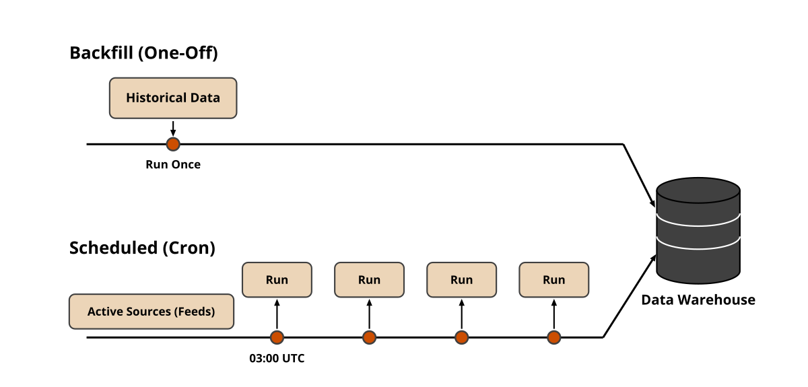

# Offline Batch Processing: Backfills and Crons

This is the tutorial used to run the data pipeline in offline batch mode, from Chapter 2, section `2.3.2 Offline Batch Processing: Backfills and Crons` of the book.

In our data layer, we will need both offline modes: backfill and cron jobs. The backfill mode, which will be run once "manually" by an engineer or an agent via the CLI. The cron jobs will be configured to run each night at 3 AM via Prefect's scheduled jobs.



## Running the Backfill

To manually trigger the backfill for the sources defined in `sources/backfill.yaml`, we must run the command below, which spins up the Prefect flow runs, the coordinator, the workers, and the ETLs. That will ingest Substack articles, YouTube videos, arXiv papers, and custom web links from all the hardcoded URLs defined in the YAML file.

```bash
make memory-run-data-pipeline SOURCE_FILE="sources/backfill.yaml"
```

Note that the run executes on Prefect's workers (even when running locally). Thus, you can even close the terminal, and the ingestion won't stop. Open the local Prefect dashboard to see the flow runs in action. You can easily point to a new source just by changing the `SOURCE_FILE`.


## The Ingested Data

After running only the backfill job, the table below shows the distribution of our ingested data. As we ingested only the abstracts from the arXiv papers, we have only ~200 latent documents.

| Source Type | Documents |
| :-- | --: |
| Hugging Face arXiv papers | 10,000 |
| Substack articles | 10 |
| Web | 9 |
| Youtube Videos | 3 |
| **Ingested from the backfill** | **10,022** |
| latent | 217 |
| **Total in `documents`** | **10,239** |
