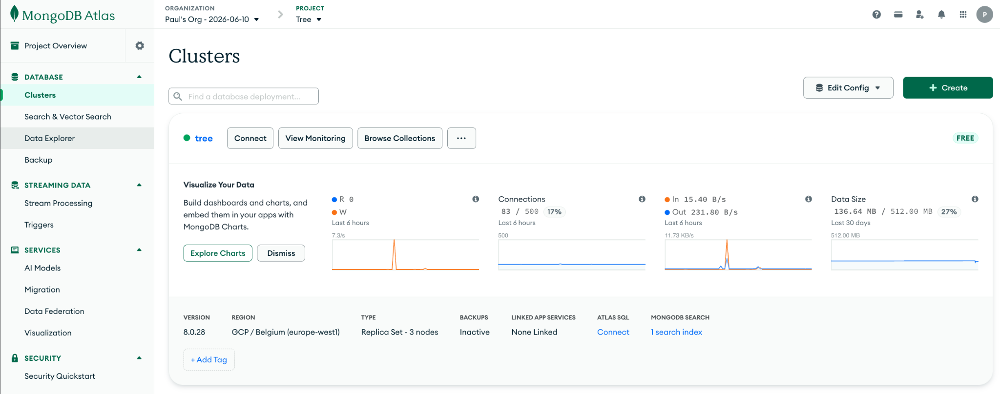
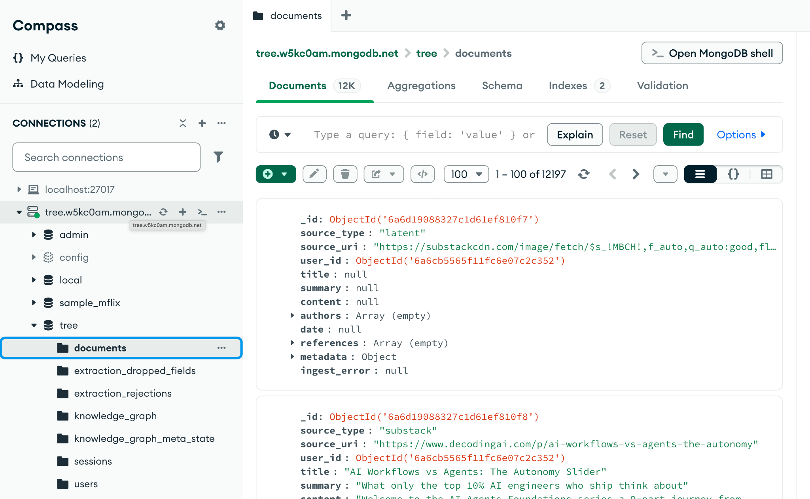
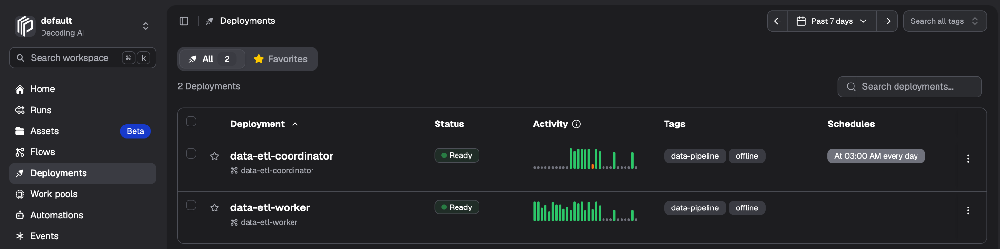
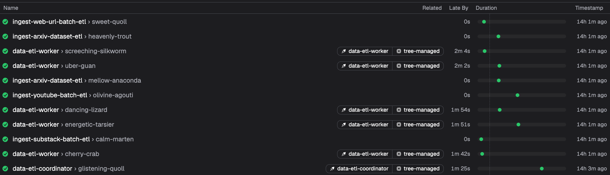

# Deploying the Database & Pipelines

This is the tutorial used to deploy the MongoDB database and Prefect pipelines from Chapter 2, section `2.4 Deploying the Database & Pipelines` of the book.

## Managing Environment Variables

When working only locally, it's easy to keep all your environment variables in a single `.env` file. But as you keep adding environments, such as a staging or production one, you want to easily switch between the MongoDB, Prefect, or other credentials specific to that environment without manually overriding the `.env` file or commenting out what you don't need. That is cumbersome, not very secure, and you can easily introduce bugs by mixing credentials from different environments. The process became even more important when we started using coding agents for all our projects.

Thus, what we want is a single command that easily switches between environments, and a different environment file for each one. This allows us or the coding agent to easily experiment across local, staging, or production.

In our use case, we created a couple of Make commands that switch between environments:

```bash
make env-local
make env-prod
make env-status # print the current active environment
```

These switch between two files: `.env` and `.env.prod`. Both follow the interface defined in `.env.example` and are easily extensible to a staging environment.

The Make commands simply update a local `.env.target` file with the enum `local` or `prod`. Then, whenever we run a Make command, based on the state from the `.env.target` file, we load either `.env` or `.env.prod`.

Because we want this to work outside Make commands as well, we also leverage `direnv`, a small program that executes the code from `.envrc`. Our `.envrc` contains a `watch_file .env.target` command, so every time `.env.target` changes, `direnv` reloads the environment variables from either `.env` or `.env.prod`, based on the latest state from `.env.target`. Thus, whenever we change the state, all future terminal commands get injected with the environment variables of the currently active environment.

Using this strategy ensures that our code is modularized enough to easily switch environments, which means we can inject the same variables from different setups, such as our CI/CD pipelines or the Prefect Cloud deployment.

**Check:** confirm the right environment is active before deploying:

```bash
make env-status  # must print: "Env target: prod (.env.prod)"
```

If it prints `local`, every command that follows in this section runs against your local Docker stack instead of the cloud deployment. Run `make env-prod` to fix.

## MongoDB Atlas: The Warehouse, Managed

To deploy a MongoDB cluster to MongoDB Atlas, we created a Python script at [apps/memory/deploy/atlas_cluster.py](../apps/memory/deploy/atlas_cluster.py), callable via a couple of Make commands that allow us to easily create, update, or destroy the cluster.

```bash
make memory-atlas-up            # Creates a new MongoDB Atlas cluster.
make memory-atlas-update        # Updates the cluster specifications.
make memory-atlas-down          # Destroys the cluster.
make memory-atlas-status        # Print the cluster state and connection strings.
```

Within the [apps/memory/deploy/atlas_cluster.py](../apps/memory/deploy/atlas_cluster.py) script, to keep it simple, we avoided using infrastructure-as-code tools such as Terraform or Pulumi. Thus, we used Atlas's API via vanilla Python scripting to interface with the cluster.

To make this work, you first have to create an account on Atlas via MongoDB's main page (https://www.mongodb.com/), where they provide their M0 free tier with 512 MB of storage.

Next, the only manual steps you need to perform are to get the right credentials. To do so, you need to go to MongoDB's Atlas dashboard, create a project, then a service account, and ultimately add your IP to the allowed list. Each of these steps is documented officially by MongoDB:

- [Manage projects](https://www.mongodb.com/docs/atlas/tutorial/manage-projects/) — create a project named `Tree` (or whatever you pass through `--project`). The script looks the project up by name and never creates one, so `make memory-atlas-up` fails without it.
- [Service accounts overview](https://www.mongodb.com/docs/atlas/api/service-accounts-overview/) — Organization → **Identity & Access** → **Applications** → **Add new** → **Service Account**. Copy the client ID and secret; the secret is shown exactly once. Grant it Project Owner, or the three narrower roles the script actually uses: Cluster Manager, Database Access Admin, and Network Access Manager.
- [Configure IP access list entries](https://www.mongodb.com/docs/atlas/security/ip-access-list/) — add your IP to the **service account's API access list**. This is not the same list as the project IP access list that `atlas-up` manages. Instead it's used by the Admin API to manipulate the resources.

Next, you need to put the client ID and secret into `.env.prod` as the `MDB_MCP_API_CLIENT_ID` and `MDB_MCP_API_CLIENT_SECRET` env vars, which will be used by the script to create everything else. Note that even though we have `_MCP_` in the name, we don't use any MCP here. It's a constraint that comes from MongoDB, as they also provide an MCP server to interact with the cluster that requires these names, which we initially used as inspiration to create the script. So, even though you don't need their MCP server, if you install it, it will work.

Before you run the script, you also need to set up, only in your `.env.prod` file, the `MONGO_INITDB_ROOT_USERNAME` and `MONGO_INITDB_ROOT_PASSWORD` env vars, which the script will use to automatically create your admin user. To generate the password, you can run `make generate-password`, which emits only URL-safe characters.

Altogether, this is what `.env.prod` needs before the first run (start from `cp .env.example .env.prod` on a fresh clone):

| Variable | Purpose |
| --- | --- |
| `MDB_MCP_API_CLIENT_ID` | Service-account client ID |
| `MDB_MCP_API_CLIENT_SECRET` | Service-account secret |
| `MONGO_INITDB_ROOT_USERNAME` | Seed database user created on the cluster |
| `MONGO_INITDB_ROOT_PASSWORD` | Its password — generate with `make generate-password` |
| `MONGO_SCHEME=mongodb+srv` | Required to reach Atlas (TLS implied) |
| `MONGO_HOST` | The cluster hostname — unknown until the cluster is up, so leave it empty for now |
| `ATLAS_ACCESS_CIDRS` | *Optional*, comma-separated extra CIDRs for the project access list |

If `.envrc` has never been approved, run `direnv allow` once.



Now, let's run the script that will create the M0 cluster, seed the database user (the same `MONGO_INITDB_ROOT_USERNAME` / `MONGO_INITDB_ROOT_PASSWORD`), and open network access to Prefect Cloud:

```bash
make env-prod
make memory-atlas-up
```

Outputs:

```
Cluster tree state=CREATING
Cluster tree state=IDLE
mongodb+srv://tree.….mongodb.net
```

You can also customize your cluster via `ATLAS_ARGS`:

```bash
make memory-atlas-up ATLAS_ARGS="--cluster tree-staging --tier M10 --provider AWS --region US_EAST_1"
```

Ultimately, after the cluster is up, you need to take the MongoDB host name from the up command and add it as the `MONGO_HOST` environment variable in `.env.prod`. Atlas assigns that hostname at creation time — `tree.w5kc0am.mongodb.net`, where `tree` is the cluster name and `w5kc0am` is a random identifier you don't choose — which is why it can't be filled in ahead of time. Nothing writes it back to `.env.prod`; this step is manual by design, so the script never mutates your secrets file.

```bash
make env-prod
make memory-atlas-up  # prints mongodb+srv://tree.xxxxxxx.mongodb.net
# → take the host part (no scheme) into MONGO_HOST in .env.prod
# → ensure MONGO_SCHEME=mongodb+srv
make memory-check-db  # verifies the connection actually works
```

Strip the scheme before pasting. The Atlas API returns the connection string with the `mongodb+srv://` prefix, but the app prepends the scheme itself, so `MONGO_HOST` takes the bare host:

```bash
MONGO_SCHEME=mongodb+srv
MONGO_HOST=tree.w5kc0am.mongodb.net      # NOT mongodb+srv://tree.w5kc0am.mongodb.net
```

**Check:** verify the cluster is up and reachable before moving on:

```bash
make memory-atlas-status  # cluster state=IDLE + connection strings
make memory-check-db      # connects with your .env.prod credentials; exits non-zero on failure
```

`state=IDLE` means the cluster is provisioned and healthy (`CREATING` means Atlas is still working). A passing `check-db` proves the `MONGO_HOST` and credentials in `.env.prod` are correct by actually connecting.

As with the local setup, you can use MongoDB Compass GUI or mongosh CLI to look around the database by using the connection string from the `make memory-atlas-status` command.



<details>
<summary><strong>MongoDB Atlas gotchas</strong></summary>

**Missing seed-user variables are skipped silently.** The script only creates the database user when *both* `MONGO_INITDB_ROOT_USERNAME` and `MONGO_INITDB_ROOT_PASSWORD` are set, with no warning otherwise. The cluster reaches IDLE and prints a connection string, and the missing user surfaces much later as an auth failure. Catch it with `make memory-check-db`.

**Rotating the database password is not idempotent.** The user-creation call treats HTTP 409 as success, so changing `MONGO_INITDB_ROOT_PASSWORD` and re-running `atlas-up` leaves the Atlas user on the old password, silently. Rotate in the Atlas UI, then update `.env.prod`. Locally, `MONGO_INITDB_ROOT_*` only apply on the first init of an empty data directory.

**`0.0.0.0/0` is always on the project access list.** It's hardcoded because Prefect's managed runner has an unpinnable egress IP. Anything in `ATLAS_ACCESS_CIDRS` is added on top; it never narrows this. The database stays protected by SCRAM auth and TLS only.

**Don't point the test suite at Atlas.** M0 caps the number of Atlas Search (FTS) indexes, so index-creating tests fail with *"The maximum number of FTS indexes has been reached for this instance size"*. Run tests on `make env-local`.

</details>

The final step is to deploy our code to Prefect Cloud.

## Prefect Cloud: The Pipelines, Hosted

To create the Prefect deployments, you first need to create an account and workspace at Prefect Cloud (https://app.prefect.cloud). Similar to the MongoDB setup, we automated most of the process, while you only need to set up a few credentials.

From Prefect, you need to take the `PREFECT_API_URL` and `PREFECT_API_KEY` environment variables and add them to `.env.prod`. In case Prefect needs to clone a private repository from GitHub, you also need to set up an optional `GITHUB_PAT` (a personal access token) env var. The official docs for each credential are:

- [Manage workspaces](https://docs.prefect.io/v3/manage/cloud/workspaces) — creating the workspace and reading its `PREFECT_API_URL`.
- [Manage API keys](https://docs.prefect.io/v3/how-to-guides/cloud/manage-api-keys) — generating the `PREFECT_API_KEY`.
- [Managing your personal access tokens](https://docs.github.com/en/authentication/keeping-your-account-and-data-secure/managing-your-personal-access-tokens) — creating the optional `GITHUB_PAT`.

The Cloud API URL has a different shape from the local one. `.env.example` contains the local default (`http://127.0.0.1:4200/api`), which points at the Docker Prefect server, not Cloud:

```bash
PREFECT_API_URL=https://api.prefect.cloud/api/accounts/<account-id>/workspaces/<workspace-id>
PREFECT_API_KEY=pnu_...
```

For the `GITHUB_PAT`, either a **classic** PAT with the `repo` scope or a **fine-grained** PAT whose resource owner is the repository owner, with this repository selected and **Contents: Read-only**, works. The setup script probes the token against the GitHub API before doing anything, because an unauthorized token otherwise surfaces as a cryptic `git clone ... exit code 128` deep inside the deployment build. The token is stored as a secret within the Prefect Cloud, so the CI/CD path never needs the PAT itself.

Beyond the Prefect and GitHub credentials, the setup script copies the pipelines' runtime configuration out of your environment into Prefect Secret blocks (secrets) or Variables (non-secret config), so the managed workers get them at run time. All of these must hold their production values in `.env.prod` before you run it — the MongoDB group in particular must point at the Atlas cluster, not `localhost`.

Altogether, this is what `.env.prod` needs before the first run:

| Variable | Purpose |
| --- | --- |
| `PREFECT_API_URL` | Your Cloud workspace API URL (not the local `127.0.0.1` default) |
| `PREFECT_API_KEY` | Cloud API key, `pnu_...` |
| `GITHUB_PAT` | *Optional*, read access to clone this repo — required if it's private |
| `MONGO_SCHEME`, `MONGO_HOST`, `MONGO_PORT` | The Atlas cluster from the previous section |
| `MONGO_INITDB_ROOT_USERNAME`, `MONGO_INITDB_ROOT_PASSWORD`, `MONGO_INITDB_DATABASE` | Database credentials + database name |
| `GOOGLE_API_KEY`, `VOYAGE_API_KEY` | LLM + embedding models |
| `BRIGHTDATA_API_KEY`, `BRIGHTDATA_UNLOCKER_ZONE`, `BRIGHTDATA_SERP_ZONE` | Crawling and scraping |
| `OPIK_API_KEY`, `OPIK_WORKSPACE`, `OPIK_PROJECT_NAME` | Observability |

Now, by running the [apps/memory/deploy/prefect_pipelines_setup.py](../apps/memory/deploy/prefect_pipelines_setup.py) script, we can create, update, or tear down a Prefect work pool containing all our deployments registered within `_DEPLOYMENT_SPECS` (from [apps/memory/src/tree/orchestrator.py](../apps/memory/src/tree/orchestrator.py)). The pool is a **managed** one, meaning Prefect hosts the workers, so flow runs execute without a self-hosted `serve` process of our own (the tradeoffs are in [docs/notes/prefect-execution-topologies.md](../docs/notes/prefect-execution-topologies.md)).

Before running the script, we must ensure that we have a user within our database by running the `make memory-signup` command. Additionally, through the `GROUPS` argument, we control whether we spin up only the data deployments, only the memory deployments, or all of them. At the moment we aim to deploy just the data pipelines.

```bash
make memory-signup USER_IDENTIFIER=you@example.com
make memory-deploy-prefect-setup-up GROUPS=data
make memory-deploy-prefect-setup-update GROUPS=data
make memory-deploy-prefect-setup-down GROUPS=data
make memory-deploy-prefect-setup-status
```

Outputs:

```
Seeded 14 runtime config store(s).
Created prefect:managed work pool 'tree-managed'.
Deployed 3 pipeline(s) to tree-managed: data-etl-worker, online-pipeline, offline-pipeline
```

`GROUPS=data` selects `data-etl-worker` plus the two end-to-end pipelines — `online-pipeline` and `offline-pipeline` carry BOTH the data and the memory identity tag, so they belong to BOTH groups (a `...-down GROUPS=data` deletes them too, and the next `...-up` puts them back). Unset `GROUPS` deploys all 5 core deployments: `data-etl-worker`, `memory-extract-etl-worker`, `memory-indexing-etl`, `online-pipeline`, `offline-pipeline`.

After running the setup-up command, you should see within your Prefect Cloud dashboard a setup similar to this:



> **Note — the screenshots predate the current topology.** Figure 2.24 and Figure 2.17 (plus the quoted `Deployed N pipeline(s)` transcript they were captured with) come from the pre-`free-tier-deployments` layout, where `data-etl-coordinator` and `memory-extract-etl-coordinator` were registered deployments of their own. They now show a **superseded** layout. The deployment names you will actually see are the ones written above: the coordinators are still flows, but they run as inline subflows of an `offline-pipeline` run instead of as separate deployments.

**Check:** verify the user and the deployments exist:

```bash
make memory-whoami                       # prints the current user (id, identifier, name)
make memory-deploy-prefect-setup-status  # work pool + each deployment's binding
```

The status command must list the `tree-managed` work pool with each deployment bound to it. A missing deployment means `setup-up` didn't finish.

<details>
<summary><strong>Prefect Cloud gotchas</strong></summary>

**The free tier allows one work pool per workspace.** The script reads before creating precisely because the create endpoint enforces that limit *before* the duplicate check, returning a 403 rather than a swallowable 409. If the workspace already has a pool from another project, `up` cannot add `tree-managed` — delete the other pool or use a fresh workspace.

**Empty env vars are seeded blank, with only a warning.** The script logs `Env <VAR> is empty; seeding <store> blank` and carries on, so `up` reports success and the gap surfaces much later as a managed run that can't authenticate. Scan the `up` output for `WARNING` lines before trusting it.

**Never run `make memory-serve-workflows` against the Cloud workspace.** Local serve and `up` register the same deployment names and clobber each other. A clobbered deployment shows as `work_pool=<none — clobbered, re-run up>` in `status`; re-run `up` or `...-update` to restore it. Local serve belongs against the local Prefect server from `make local-start`.

**Deployments track the `main` branch by default.** `--git-ref` (or `GIT_REF`) pins them to a branch or commit instead. Branch tracking means merges go live without a re-deploy, which is usually what you want, but it also means a bad merge reaches the managed workers immediately.

**`down` does not remove blocks or variables.** It deletes the deployments and, when unscoped, the work pool, then logs a reminder to delete `tree-github-pat` and the `tree-*` blocks and variables in the Prefect UI by hand.

**`up` is idempotent**, so re-running it after adding a missing key re-seeds the stores.

</details>

## Running the Backfill in the Cloud

The last step is to run the backfill within the cloud environment. If everything is set up correctly, just by pointing to the `.env.prod` file instead of the local `.env`, we can continue executing the exact same commands, as they will automatically switch from the local Docker setup to the cloud one:

```bash
make memory-run-data-pipeline SOURCE_FILE="sources/backfill.yaml"
```

After the flow successfully completes, within Prefect Cloud's flow tab, you should see something similar to the image below:



**Check:** confirm the backfill actually landed in the cloud database:

```bash
make memory-check-db  # lists databases + collection counts
```

Outputs something like this:

```text
tree.documents: 10242 docs
tree.sessions: 1 docs
tree.users: 1 docs
```

A non-zero `users` and `documents` count means the user was successfully created and the pipelines wrote to Atlas, not to your local Docker instance.

To sum up, to deploy the whole stack and run the backfill, you need to run the following 5 commands, in this order:

```bash
make env-prod
make memory-atlas-up
make memory-signup USER_IDENTIFIER=you@example.com
make memory-deploy-prefect-setup-up GROUPS=data
make memory-run-data-pipeline SOURCE_FILE="sources/backfill.yaml"
```
